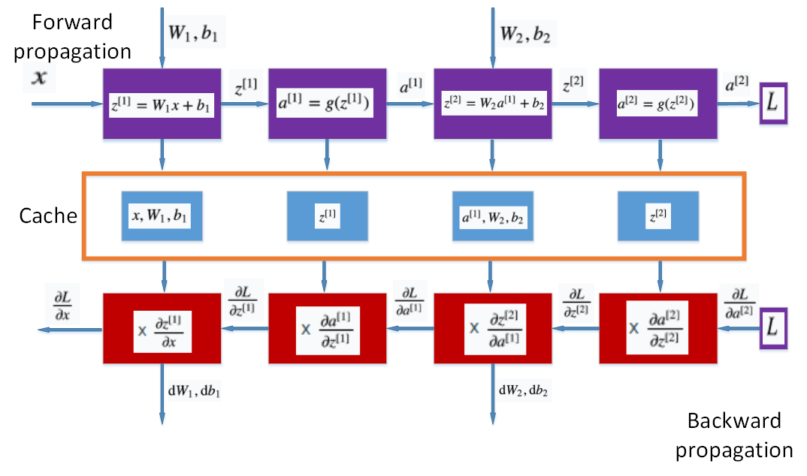
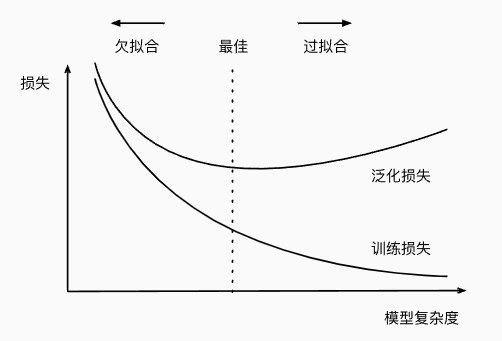

# 基本概念

## 前向/反向传播

前向传播：按顺序(从输入层到输出层)计算和存储神经网络中每层的结果

反向传播：指的是计算神经网络参数梯度的方法，根据链式法则按相反的顺序从输出层到输入层遍历网络

## 影响模型泛化的因素

1. **可调整参数的数量**：数量很大时，模型容易过拟合
2. **参数采用的值**：权重取值范围大时，容易过拟合
3. **训练样本的数量**

## 过拟合/欠拟合

## 梯度爆炸/梯度消失

1. **梯度消失**：参数更新过小，在每次更新时几乎不会移动，导致模型无法学习
2. **梯度爆炸**：参数更新过大，破坏了模型的稳定收敛

> 解决方式可以是：**参数初始化**