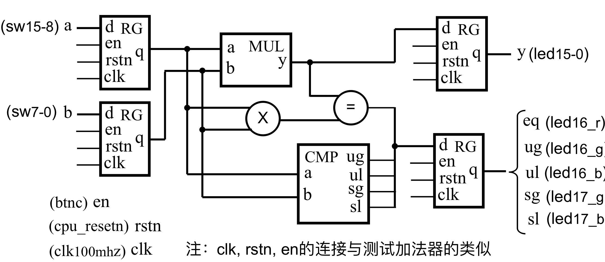
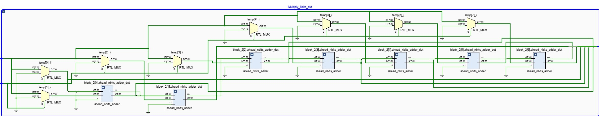
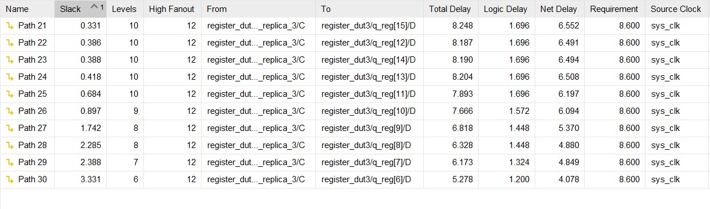
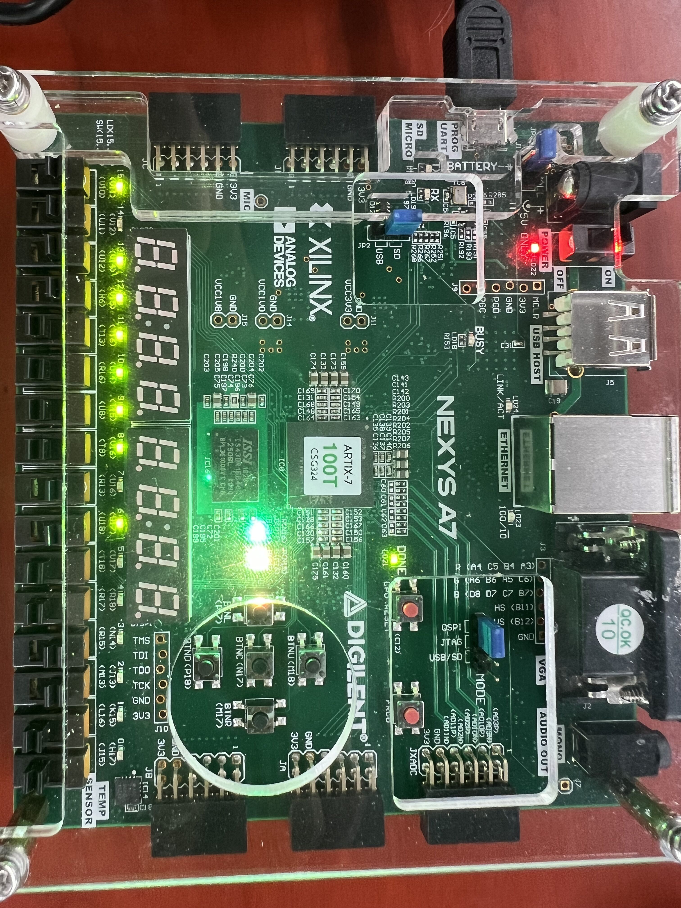
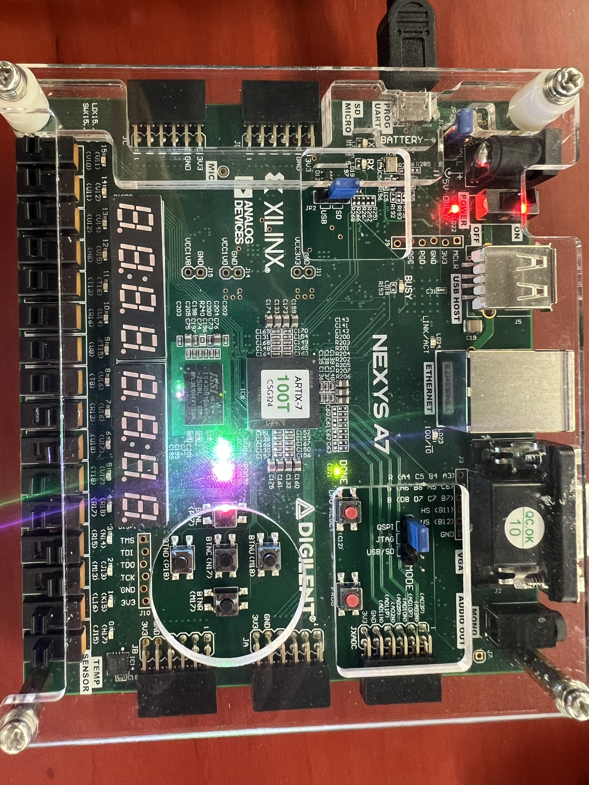
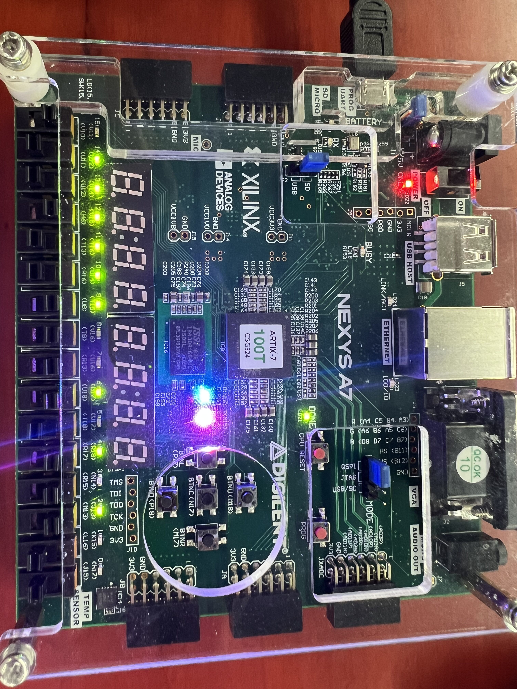

#
#
#
<font face="楷体" size=6><center>**Lab2——运算器与寄存器**</font></center>

<center>
    
</center>

<font face="楷体" size=5><center>
**姓名：王昱**
**学号：PB21030814**</font></center>

<div style="page-break-after: always;"></div>


<font face="楷体" size=6>**一.实验内容与目的**</font>
<font face="楷体" size=5>**①实现n位超前进位加法器，并利用超前进位加法器实现8位的乘法器、比较器。</br>②掌握查看生成电路及其性能和资源使用情况，学会测试组合逻辑电路的延迟。</br>③对综合电路进行仿真和下载测试。**</font>

<font face="楷体" size=6>**二.逻辑设计**</font>
<font face="楷体" size=5>
* **乘法器、比较器综合电路图如下**</font>

<font face="楷体" size=5>
* **核心代码**

>**n位超前进位加法器如下**
>>**采用参数化的模块，方便之后的调用。同时采用generate语句实现循环。**
```
module ahead_nbits_adder #(parameter WIDTH=8)(
    input [WIDTH-1:0] a,b,
    input ci,
    output [WIDTH-1:0] s,
    output co
    );
    wire [WIDTH-1:0] G,P,C;
    assign P = a ^ b;   //Pi是ai和bi的异或
    assign G = a & b;   //Gi是ai和bi的与
    genvar i;
    assign C[0] = G[0] | (P[0] & ci);
    assign s[0] = P[0] ^ ci;
    generate
        for(i=1;i<WIDTH;i=i+1)begin:block
            assign C[i] = G[i] | (P[i] & C[i-1]);
            assign s[i] = P[i] ^ C[i-1];
        end
    endgenerate
    assign co=C[WIDTH-1];
endmodule
```
>**8位乘法器如下**
>>**乘法器加法采用8位超前进位，但和的进位采用的是串行进位**
```
module Multiply_8bits (y,a,b);
    //shift and add multiply
    parameter WIDTH = 8;
    output reg[2*WIDTH-1:0] y;
    input [WIDTH-1:0] a;
    input [WIDTH-1:0] b;

    wire [7:0] temp[7:0],bit[7:0];
    wire co[7:0];
    assign temp[0] = b[0]?a:8'b0000_0000,
           temp[1] = b[1]?a:8'b0000_0000,
           temp[2] = b[2]?a:8'b0000_0000,
           temp[3] = b[3]?a:8'b0000_0000,
           temp[4] = b[4]?a:8'b0000_0000,
           temp[5] = b[5]?a:8'b0000_0000,
           temp[6] = b[6]?a:8'b0000_0000,
           temp[7] = b[7]?a:8'b0000_0000;
    assign bit[0] = temp[0];
    assign co[0] = 1'b0;
    genvar i;
    generate
        for(i=0;i<WIDTH-1;i=i+1)begin:block
            ahead_nbits_adder#(.WIDTH(WIDTH)) ahead_nbits_adder_dut(
                .a({co[i],bit[i][7:1]}),
                .b(temp[i+1]),
                .ci(1'b0),
                .s(bit[i+1]),
                .co(co[i+1])
            );
        end
    endgenerate

  always @(*) begin
    y[0] = bit[0][0];
    y[1] = bit[1][0];
    y[2] = bit[2][0];
    y[3] = bit[3][0];
    y[4] = bit[4][0];
    y[5] = bit[5][0];
    y[6] = bit[6][0];
    y[14:7] = bit[7];
    y[15] = co[7];
  end
endmodule
```
>**8位比较器如下**
>>**比较器主要考虑到要自己“认定”有符号、无符号数，所以将程序分开，先比较无符号数，再比较有符号数。具体实现思路注释中有体现。**
```
module Comparer_8bits(
    input [7:0] a,b,
    output reg ug,ul,sg,sl
    );
    wire [7:0] sum;
    wire c;
    integer i;
    //利用8位超前进位加法器实现a-b
    ahead_nbits_adder #(.WIDTH(8)) ahead_8bits_adder_dut(
        .a(a),
        .b(~b),
        .ci(1),
        .s(sum),
        .co(c)
    );
  always @(*) begin
    ug=0;
    ul=0;
    sg=0;
    sl=0;
    //c的非是无符号数相减结果的符号位
    if(!c) begin
        ug=0;
        ul=1;
    end
    else begin
        for(i=0;i<8;i=i+1)begin
            if(sum[i]) begin
                ug=1;
                ul=0;
            end
        end
    end
    //这之后用来判断有符号数的大小
    //首先看符号位是否相同，若不相同直接出结果
    //若相同则相减之后的结果不会产生溢出，直接判断sum中的结果即可
    if(a[7]&&!b[7]) begin
        sg=0;
        sl=1;
    end
    else if(!a[7]&&b[7]) begin
        sg=1;
        sl=0;
    end
    else begin
        if(sum[7]) begin
            sg=0;
            sl=1;
        end
        else begin  
            for(i=6;i>=0;i=i-1)begin
            if(sum[i]) begin
                sg=1;
                sl=0;
            end
        end
        end
    end
  end
endmodule
```
</font>

<font face="楷体" size=6>**三.仿真结果与分析**</font>

<font face="楷体" size=5>

* **综合电路的仿真代码与结果如下**
```
module code_tb();
        wire [15:0] y;
        wire [4:0] q;
        reg en,rstn,clk;
        reg [7:0] a,b;
        code code_test(
            .a(a),
            .b(b),
            .en(en),
            .rstn(rstn),
            .clk(clk),
            .q(q),
            .y(y)
        );
        initial begin
            clk = 1;
            forever #50 clk = ~clk;
        end
        initial begin
            rstn = 1; en = 1 ; a = 8'b0000_1100; b = 8'b0000_0110;
            #100  a = 8'b1111_1100; b = 8'b1001_1011;
            #100  rstn = 0;
            #100  rstn = 1; a = 8'b1010_1101; b = 8'b1101_1000;
            #200  a = 8'b0111_1001; b = 8'b1101_1010;
        end
endmodule
```

>**对仿真结果的解释说明**
>>**时钟周期设为100ns，上升沿触发。一开始a，b被赋值为0000_1100和0000_0110。过了一个时钟周期之后乘法器和比较器的运算结果传到另外两个寄存器中,于是看到计算结果为0000_0000_0100_1000，比较器为1010；在这之后rstn被设为0，复位，故存储乘法器结果的寄存器中是0000_0000_0000_0000,存储比较器结果的寄存器中是0000；再过一个时钟周期，上一期复位的a，b的计算结果传到另外两个寄存器中，得到的计算结果为0000_0000_0000_0000，比较器结果是0000；再过一个周期，a=1010_1101，b=1101_1000的计算结果传到另外两个寄存器中，得到的计算结果为1001_0001_1111_1000，比较器的结果为0101，之后的一段也是类似。**

* **其他模块的仿真**
**由于其他模块的仿真相对来说比较简单，在这里就不在报告中展示了，源码都在工程当中。**
</font>

<font face="楷体" size=6>**四.电路设计与分析**</font>

<font face="楷体" size=5>

* **综合电路的RTL如下**

* **乘法器模块RTL如下**

* **比较器模块RTL如下**


* **乘法器的资源使用情况以及延迟**



<font face="楷体" size=6>**五.测试结果与分析**</font>
* **综合电路的运行结果如下**





>**结果分析**
>>**第一组测试数据为1111_0000和1100_1100</br>第二组测试数据为0000_0000和1100_1100</br>第三组测试数据为1001_0011和1101_1100</br>第四组测试数据为0000_0011和0101_1100</br>经计算得到的乘积与亮的灯一致，比较器亮的灯也与实际结果一致。**

<font face="楷体" size=6>**六.实验总结**</font>
<font face="楷体" size=5>**①本实验在乘法器设计实现的时候遇到的问题较多，由于经验不足写出了好多“多驱动”的代码。</br>②比较器最开始没有理解题目的意思，导致不知道如何实现，以及有符号数相加可能产生溢出的问题等等。</br>③综合电路的tb文件最初不知道怎么写，后经过查询解决</br>④建议：每次实验把要实现的东西，要检查的东西在ppt上精准、集中地呈现。**</font>
</font>
