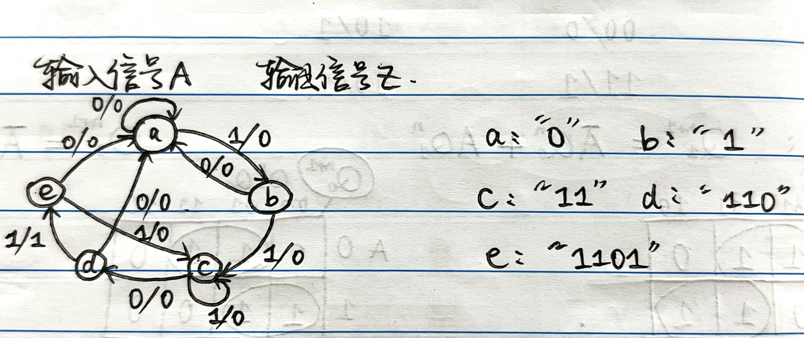
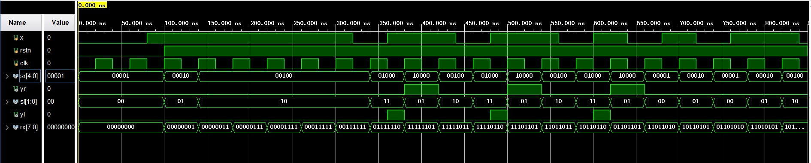
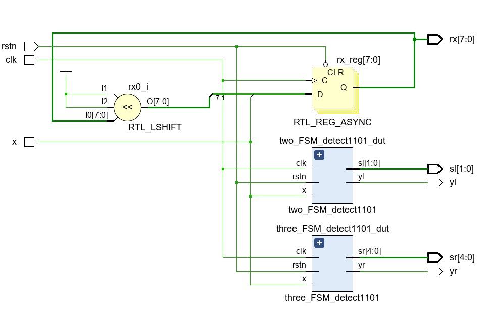
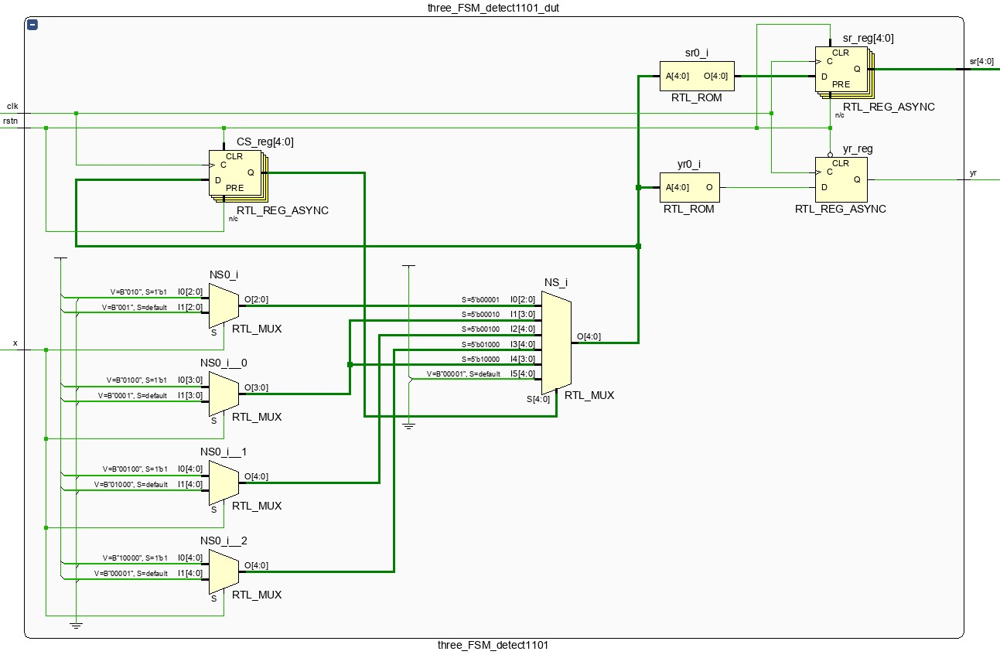
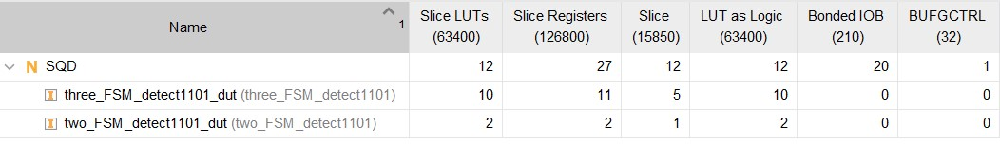

#
#
#
<font face="楷体" size=6><center>**Lab3——有限状态机**</font></center>

<center>
    
</center>

<font face="楷体" size=5><center>
**姓名：王昱**
**学号：PB21030814**</font></center>

<div style="page-break-after: always;"></div>

<font face="楷体" size=5>

**一.实验内容与目的
①$Mealy$、$Moore$型电路的区别
②两种方式描述$FSM$——两段式、三段式
③设计序列检测器，监测$1101$**</font>

<font face="楷体" size=5>

**二.逻辑设计**
* 有限状态机
* 两段式$Mealy$型的状态转换图($4$种状态)

* 三段式$Moore$型的状态转换图($5$种状态)

> **这里注意$Moore$型的$FSM$输出仅与状态有关，与输入无关，所以要用五位独热码来表示。**

* **核心代码**

```
//两段式
module two_FSM_detect1101(
    input x,
    input rstn,
    input clk,
    output reg yl,
    output reg [1:0] sl
    );
    //顺序码
    parameter s0 = 2'b00,
              s1 = 2'b01,
              s2 = 2'b10,
              s3 = 2'b11;
    //存放状态的两个变量
    reg [1:0] NS,CS;
  always @(posedge clk or negedge rstn) begin
    if(!rstn)
        CS <= s0;
    else
        CS <= NS;
  end
  always @(*) begin
    yl = 0;
    sl = 2'b00;
    NS = s0;
    case(CS)
    s0:begin
        sl = 2'b00;
        yl = 0;
        NS = x ? s1 : s0; 
    end
    s1:begin
        sl = 2'b01;
        yl = 0;
        NS = x ? s2 : s0;
    end
    s2:begin
        sl = 2'b10;
        yl = 0;
        NS = x ? s2 : s3;
    end
    s3:begin
        sl = 2'b11;
        yl = x ? 1 : 0;
        NS = x ? s1 : s0; 
    end
    default:begin
        yl = 0;
        sl = 2'b00;
        NS = s0;
    end
    endcase
  end
endmodule
```
> **两段式$Mealy$型用两个$always$块实现，其中组合逻辑电路部分用了大量的条件运算符，使得代码简洁易读。$case$语句的功能是根据$CS$(现态)和$x$(输入变量)来决定输出。**

```
//三段式
module three_FSM_detect1101(
    input x,
    input rstn,
    input clk,
    output reg yr,
    output reg [4:0] sr
    );
    //独热码
    parameter s0 = 5'b00001,
              s1 = 5'b00010,
              s2 = 5'b00100,
              s3 = 5'b01000,
              s4 = 5'b10000;
    //存放状态的两个变量
    reg [4:0] NS,CS;
  always @(posedge clk or negedge rstn) begin
    if(!rstn)
        CS <= s0;
    else 
        CS <= NS;
  end
  always @(*) begin
    NS = s0;
    case(CS)
    s0: NS = x ? s1 : s0;
    s1: NS = x ? s2 : s0;
    s2: NS = x ? s2 : s3;
    s3: NS = x ? s4 : s0;
    s4: NS = x ? s2 : s0;
    default: NS = s0;
    endcase
  end
  always @(posedge clk or negedge rstn) begin
    if(!rstn)
        {yr,sr} <= 6'b000001;
    else begin
        {yr,sr} <= 6'b000001;
        case(NS)
        s0: {yr,sr} <= 6'b000001;
        s1: {yr,sr} <= 6'b000010;
        s2: {yr,sr} <= 6'b000100;
        s3: {yr,sr} <= 6'b001000;
        s4: {yr,sr} <= 6'b110000;
        default: {yr,sr} <= 6'b000001;
        endcase
    end
  end
endmodule
```
> **三段式$Moore$型用三个$always$块实现，同样组合逻辑电路部分使用了大量的条件运算符使得代码简洁易读。使用拼接运算符简化了代码。**
</font>


<font face="楷体" size=5>

**三.仿真结果与分析**

* 这里仅展示序列检测器的仿真结果
* 代码部分
```
module SQD_tb();
    reg x,rstn,clk;
    wire [4:0] sr;
    wire yr;
    wire [1:0] sl;
    wire yl;
    wire [7:0] rx;
    SQD SQD_test(
        .x(x),
        .rstn(rstn),
        .clk(clk),
        .sr(sr),
        .yr(yr),
        .sl(sl),
        .yl(yl),
        .rx(rx)
    );
    initial begin
        clk = 1'b0;
        rstn = 1'b0;
        x = 1'b0;
        # 100 rstn = 1'b1;
    end
    always #20 clk = ~clk;
    always #40 x = {$random} % 2;
endmodule
```
* 仿真结果截图


> **由截图可以看到，$rx$代表的最近输入的$8$位序列与模拟的输入结果一致。独热码$sr$和顺序码$sl$也与实际结果(状态转换图)一致。同时可以观察到组合逻辑电路与时序逻辑电路的区别：在$350ns$到$450ns$之间检测到了$1101$序列，但是二段式$Mealy$型在一输入$1$的时候$yl$立刻变为$1$而三段式$Moore$型等到时钟上升沿到来之后$yr$才变为$1$。这是因为$yl$在组合电路中输出而$yr$在时序电路中输出。**
</font>


<font face="楷体" size=5>

**四.电路设计与分析**

* **$RTL$电路图**





* **资源使用情况**



</font>

<font face="楷体" size=5>

**五.测试结果与分析**


> **该结果与状态转换图以及仿真结果一致**
</font>

<font face="楷体" size=5>

**六.总结**
**①在实验中出现了抖动现象，一开始并不知道，以为开发板出现了问题。后来询问助教之后解决了该问题。</br>②一开始独热码采用了四位，忽略了$Moore$型时序电路的特点——只与状态有关而与输入无关。后经修改解决该问题。</br>③收获：学会了用两段式、三段式方法描述$FSM$</br>④$Tips$：助教能不能每次把测试用例发一下来验证我们做的是否正确。**
</font>