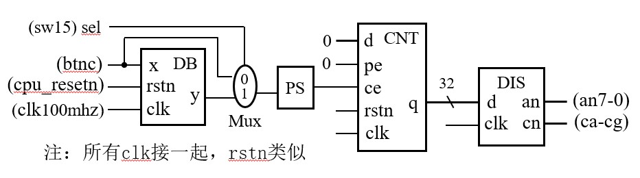
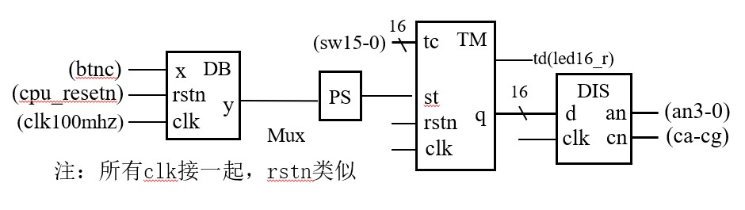
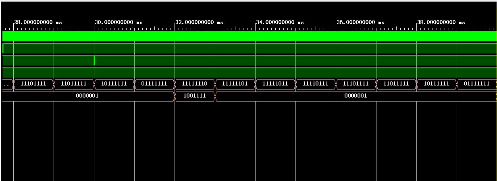
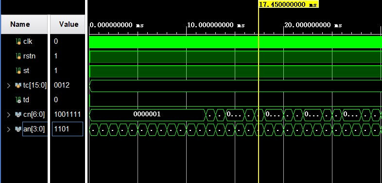
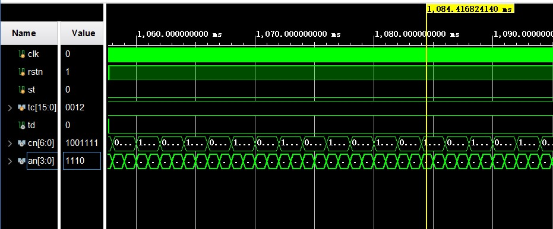
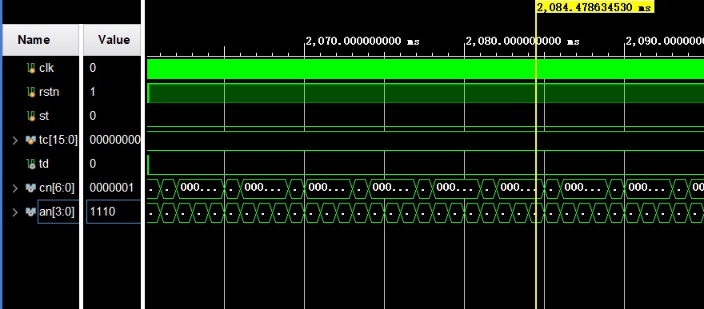
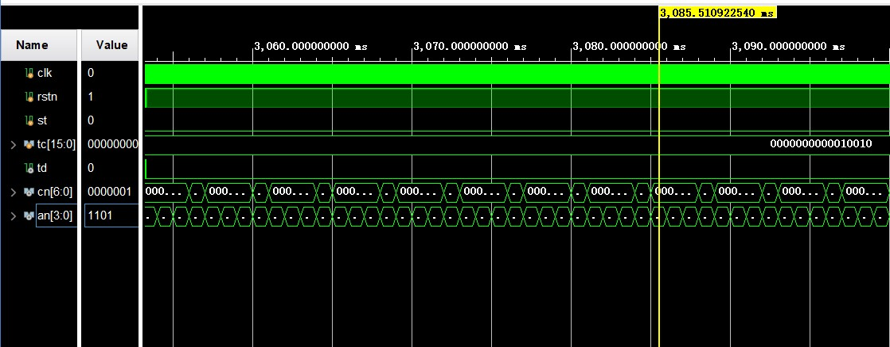
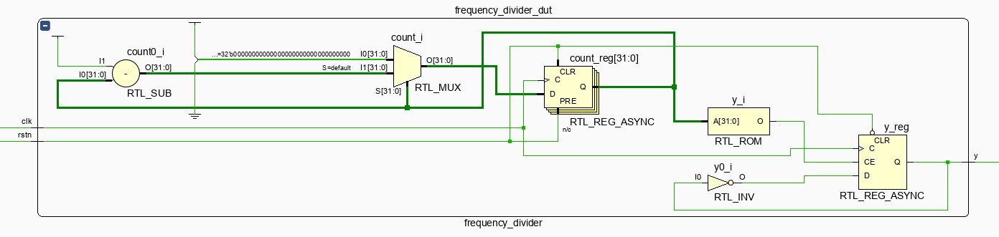
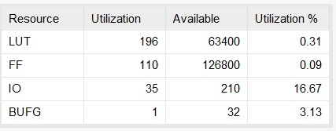

#

#

#

<font face="楷体" size=6><center>**Lab4——计数器**</font></center>

<center>
    
</center>

<font face="楷体" size=5><center>
**姓名：王昱**
**学号：PB21030814**</font></center>

<div style="page-break-after: always;"></div>


<font face="楷体" size=6>

**一.实验目的与内容**</font>
<font face="楷体" size=5>

**①掌握计数器的写法</br>②计数器的多种应用:</br>分频器，定时器，开关输入去抖动，数码管的动态扫描</br>③不同时钟信号的使用，以及ms级、s级的行为仿真**</font>

<font face="楷体" size=6>

**二.逻辑设计**</font>

<font face="楷体" size=5>

* 数码管的动态显示逻辑设计
  


* 定时器的逻辑设计
  
  

* 核心代码(计数器、取边沿模块较为简单，不赘述)

```
module coder_lab4_1(
    input sel,x,rstn,clk,
    output [7:0] an,
    output [6:0] cn
    );
    wire y,p,q;
    wire [31:0] data;

    Debounce Debounce_dut(
        .x(x),
        .clk(clk),
        .rstn(rstn),
        .y(y)
    );
    
    assign p = sel ? y : x;

    syn_ps syn_ps_dut(
        .clk(clk),
        .rstn(rstn),
        .a(p),
        .p(q)
    );

    counter counter_dut(
        .clk(clk),
        .rstn(rstn),
        .d(32'b0),
        .pe(1'b0),
        .ce(q),
        .q(data)
    );

    Display Display_dut(
        .d(data),
        .clk(clk),
        .rstn(rstn),
        .an(an),
        .cn(cn)
    );
    
endmodule
```
>第一个实验的综合模块

```
module Debounce(
    input clk,rstn,x,
    output reg y
    );
    reg [19:0] count;   //用于计数
    reg [1:0] x_pre_now;    //用于检验什么时候开始计数

  always @(posedge clk or negedge rstn) begin
    if(!rstn)
        x_pre_now <= 2'b00;
    else
        x_pre_now <= {x_pre_now[0],x};
  end
  
  always @(posedge clk or negedge rstn) begin
    if(!rstn)
        count <= 20'h0;
    else if(x_pre_now[1]^x_pre_now[0])  //还在抖动的情况
        count <= 20'h0;
    else if(count == 20'hf4340)         //达到稳定后count保持不变
        count <= count;
    else 
        count <= count + 1'h1;
  end

  always @(posedge clk or negedge rstn) begin
    if(!rstn)
        y <= 1'b0;
    else if(count == 20'hf4340 && x_pre_now[1] == 1'b1) //按键被按下
        y <= x;
    else
        y <= 1'b0;
  end
endmodule
```
>开关去抖动模块,实现的主要思想就是用两个变量存储**前一个输入的值和现在输入的值**，通过**异或**运算判断这两个值是否相等。如果这两个值不相等说明还在抖动，计数器置为0；如果这两个值相等，则开始计数。当计数达到一定数目后停止计数，如果输入的还是1说明开关还是被按下的，则赋值给输出变量。
```
module frequency_divider#(
    parameter k = 100000
)
(
    input clk,rstn,
    output reg y
    );
    reg [31:0] count;
    reg [31:0] pre_odd_cnt;
    reg [31:0] now_odd_cnt;    
  always @(posedge clk or negedge rstn) begin
    if(!rstn)begin
        count <= k>>1 - 1;
        pre_odd_cnt <= (k>>1) - 1;
        now_odd_cnt <= k[0] ? k>>1 : (k>>1)-1;
    end
    else if(count == 0)begin
        count <= (k[0] ? pre_odd_cnt : (k>>1)-1);
        pre_odd_cnt <= now_odd_cnt;
        now_odd_cnt <= pre_odd_cnt;
    end
    else
        count <= count - 1;
  end
  always @(posedge clk or negedge rstn) begin
    if(!rstn)
        y <= 0;
    else if(count == 0)
        y <= ~y;
    else    
        y <= y;
  end
endmodule
```
>分频器模块：考虑到奇偶分频的不同，故这里设置了两个变量**pre_odd_cnt和now_odd_cnt**，因为在奇分频的时候高低电平的计数次数不一样(根据ppt要求，低电平比高电平多占一个clk周期)。当cnt到0的时候，输出变量进行翻转，实现分频。
```
module Display(
    input [31:0] d,
    input clk,rstn,
    output  [7:0] an,
    output  [6:0] cn
    );
    wire clk_div;
    reg [2:0] cnt;
    wire [3:0] data;
    
    frequency_divider frequency_divider_dut(
        .clk(clk),
        .rstn(rstn),
        .y(clk_div)
    );
    //clk_div是分频后的时钟信号
  always @(posedge clk_div or negedge rstn) begin
    //对cnt循环计数达到动态显示的效果
    if(!rstn)
        cnt <= 3'b000;
    else if(cnt < 3'b111)
        cnt <= cnt + 1'b1;
    else 
        cnt <= 3'b000;
  end

  
    decoder3_8 decoder3_8_dut(
        .d(cnt),
        .y(an)
    );

    mux8_1 mux8_1_dut(
        .s(cnt),
        .d(d),
        .y(data)
    );

    seven_disp_decoder seven_disp_decoder_dut(
        .d(data),
        .yn(cn)
    );
    
endmodule
```
>数码管动态显示模块：八个数码管的刷新周期要求是1-20ms,这里让数码管的刷新周期为8ms，**分频后的时钟信号作为always块的时钟信号**循环cnt的值(**cnt用于译码器输入和多路选择器的选择信号**)。同时要注意**译码器输出要求低电平有效($a_n$)**
```
module timer#(parameter k =100000000)(
    input [15:0] tc,
    input st,clk,rstn,
    output reg td,
    output  [6:0] cn,
    output  [7:0] an
    );

    wire st_now_1,st_now;
    reg [15:0] q;
    assign an[7:4] = 4'b1111;
    //ce当做计数使能信号
    reg ce;
    //count在这里用于计数
    reg [31:0] count;
    //st_pre用于记录前一个st的值
    reg  st_pre;


    Debounce Debounce_dut(
        .x(st),
        .clk(clk),
        .rstn(rstn),
        .y(st_now_1)
    );

    syn_ps syn_ps_dut(
        .a(st_now_1),
        .clk(clk),
        .rstn(rstn),
        .p(st_now)
    );

  always @(posedge clk or negedge rstn) begin
    if(!rstn)begin
        q <= 16'h0000;
        st_pre <= 1'b0;
    end
    else if(st_now)begin 
        q <= tc;
    end
    else if(ce && q > 16'h0000)begin
        q <= q - 16'h0001;
        st_pre <= 1'b0;
    end
    else begin
        q <= q; 
        st_pre <= 1'b0;
    end
  end
  
  always @(posedge clk or negedge rstn) begin
    if(!rstn)begin
        count <= k>>1 - 1;
    end
    //st_pre与st不相同时(也就是计数未到零st再次变高)需要对计数器重新计数
    else if(st_pre ^ st_now)
        count <= k>>1 - 1;
    else if(count == 32'h00000000)begin
        count <= k>>1 - 1;
    end
    else
        count <= count - 1;
  end

  always @(posedge clk or negedge rstn) begin
    if(!rstn)
        ce <= 1'b0;
    else if(count == 32'h00000000)
        ce <= ~ce;
    else 
        ce <= 1'b0;
  end


    //组合逻辑实现不会出现延迟
  always @(*) begin
    if(st) 
        td = 1'b0;
    else if(q == 16'h0000)
        td = 1'b1;
    else 
        td = 1'b0;
  end


    display_time display_time_dut(
        .d(q),
        .clk(clk),
        .rstn(rstn),
        .cn(cn),
        .an(an[3:0])
    );

endmodule
```
>定时器模块：写这个模块的时候一开始直接将分频后的时钟信号(T=1s)用在always块，这样导致必须要等上升沿来了之后才能置数，也就是说要长按btnc这个button才能置数，是错误的写法。后来**将100MHz的时钟用在always块，用T=1s的时钟控制ce(也就是使能信号)，再用ce信号控制计数器的递减实现了定时器的功能**。这样还是有一点小瑕疵(尽管助教说是没问题)，就是长按btnc的时候不计数，于是进行了取边沿操作，实现了一按下btnc就计数。
</font>

<font face="楷体" size=6>

**三.仿真结果与分析**</font>

<font face="楷体" size=5>

* 动态显示数码管的仿真：



```
module coder_lab4_tb();

    reg clk,rstn,x,sel;
    wire [7:0] an;
    wire [6:0] cn;
    initial begin
        clk = 1'b0;
        rstn = 1'b0;
        x = 1'b1;
        sel = 1'b1;
        #5 rstn = 1'b1;
        #10000000 x = 1'b0;
        #5 x = 1'b1;
        #20000000 x = 1'b0;
        #1 x = 1'b1;
        #2 x = 1'b0;
        #2 x = 1'b1;
    end

    always #5 clk = ~clk;

    coder_lab4_1 coder_lab4_1_test(
        .clk(clk),
        .rstn(rstn),
        .x(x),
        .sel(sel),
        .an(an),
        .cn(cn)
    );
endmodule
```
>这里人为制造抖动(让输入x短时间内变化)，并按照实际的周期仿真


* 定时器的仿真

* 初始状态


* 过一秒之后


>可以观察到由12(16进制)变为11(16进制)
* 再过一秒之后


>可以观察到由11(16进制)变为10(16进制)
* 再过一秒之后


>可以观察到由10(16进制)变为0F(16进制)

```
module timer_tb();
    reg clk,rstn,st;
    reg [15:0] tc;
    wire td;
    wire [6:0] cn;
    wire [3:0] an;

    initial begin
        clk = 1'b0;
        rstn = 1'b0;
        tc = 16'h0012;
        st = 1'b0;
        #10 rstn = 1'b1;

        #10 st = 1'b1;
        #100000000 st = 1'b0;
    end

    always #5 clk = ~clk;

    timer timer_test(
        .clk(clk),
        .rstn(rstn),
        .st(st),
        .td(td),
        .tc(tc),
        .cn(cn),
        .an(an)
    );
endmodule
```
</font>

<font face="楷体" size=6>

**四.电路设计与分析**</font>

<font face="楷体" size=5>

* 第一个实验的RTL电路图


* 去抖动
  


* 计数器


* 动态显示数码管


* 分频器



* 第二个实验(定时器)的RTL电路图


* 第一个实验的资源使用情况


* 第二个实验的资源使用情况


</font>


<font face="楷体" size=6>

**五.测试结果与分析**</font>

<font face="楷体" size=5>

* 第一个实验


>左边的图是没有去抖动的情况，可以看到第一次输出的是2而不是1；右边的图去抖动了，故第一次输出1。

* 第二个实验


</font>

<font face="楷体" size=6>

**六.总结**</font>
<font face="楷体" size=5>

①实验刚开始遇到很大的问题:综合不报错。在查询各大网站以及赛灵思社区之后仍然未解决，后来一步一步对着程序看，发现是**有个变量的位数定义的过于大**，修改之后可以正常综合</br>②模块化编程这方面做的还是不够好</br>③编程的习惯不太好，没有进行细致的仿真就上板测试，经常导致了很多错误。</br>④编程时没有意识到数码管的$a_n$高电平还是低电平有效这回事，导致debug的难度大大增加</font>
