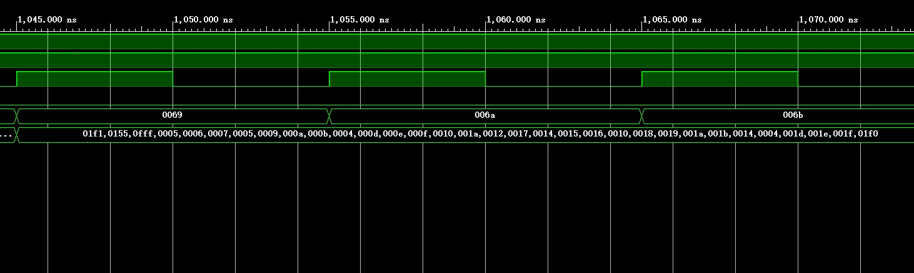
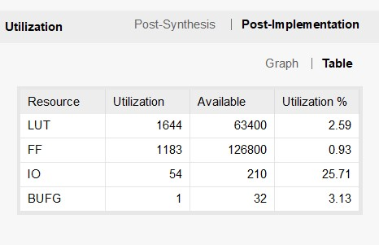
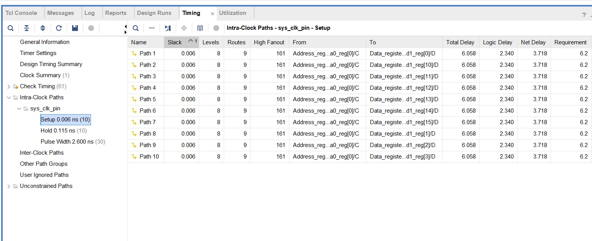
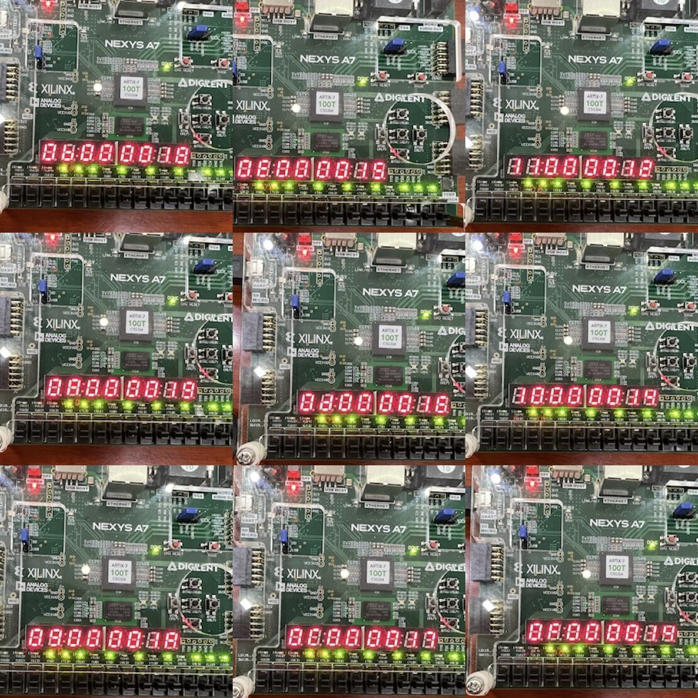
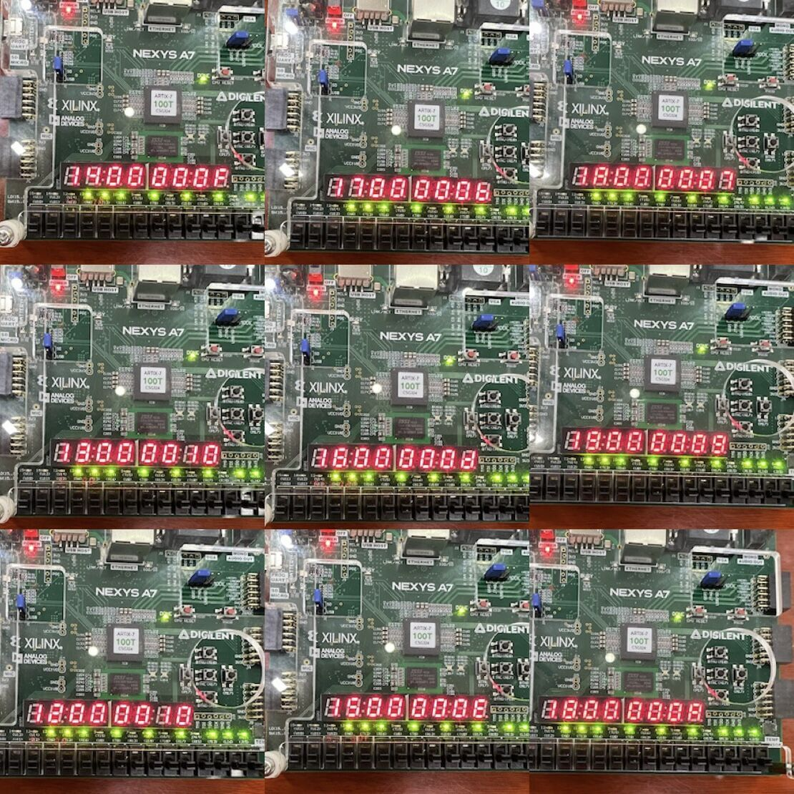
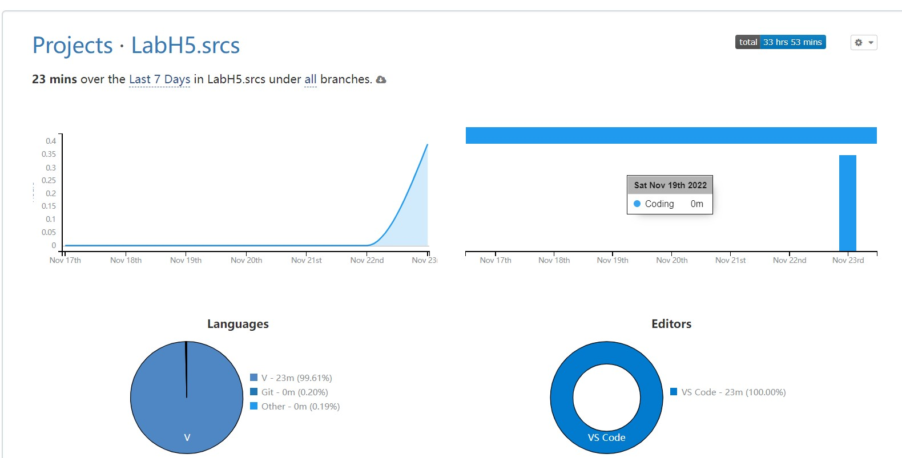

#

#

#

<font face="华文新魏" size=6><center>**Lab5——寄存器堆**</font></center>

<center>
    
</center>

<font face="华文新魏" size=5><center>
**姓名：王昱**
**学号：PB21030814**</font></center>

<div style="page-break-after: always;"></div>


<font face="华文新魏" size=5>

**一.实验目的与内容**
①掌握寄存器堆的使用</br>②学习数字系统设计中数据通路与控制单元(FSM)的设计</br>③排序算法的设计以及基于算法的FSM的设计</br>④时序问题的处理
</font>

<font face="华文新魏" size=5>

**二.逻辑设计**
* **IO模块**


* **SRT模块**


* **核心代码**

```
module control_unit#(
    parameter WIDTH = 16
)
(
    input clk,rstn,nxt,pre,del,load,
    output reg [1:0] sel1,sel2,
    output reg we
);
    parameter s0 = 9'b000000001,
              s1 = 9'b000000010,
              s2 = 9'b000000100,
              s3 = 9'b000001000,
              s4 = 9'b000010000,
              s5 = 9'b000100000,
              s6 = 9'b001000000,
              s7 = 9'b010000000,
              s8 = 9'b100000000;
    reg [8:0] NS,CS;

  always @(posedge clk or negedge rstn) begin
    if(!rstn)
        CS <= s0;
    else 
        CS <= NS;
  end

  always @(*) begin
    case(CS)
        s0: NS = s1;
        s1: NS = s2;
        s2:begin
            NS = s2;
            if(nxt) NS = s5;
            else if(pre) NS = s6;
            else if(del) NS = s4;
            else if(load) NS = s3;
        end
        s3: NS = s2;
        s4: NS = s2;
        s5: NS = s7;
        s6: NS = s8;
        s7: NS = s1;
        s8: NS = s1;
        default: NS = s2;
    endcase
  end

  always @(posedge clk or negedge rstn) begin
    if(!rstn)begin
        sel1 <= 2'b00;
        sel2 <= 2'b11;
        we <= 1'b0;
    end
    //sel信号到下一个状态应该“清除”掉,否则原有的信号一直起作用
    else begin
        case(NS)
            s1: begin
                sel2 <= 2'b10;
                sel1 <= 2'b11;
            end
            s2: sel2 <= 2'b11;
            s3: sel2 <= 2'b01;
            s4: sel2 <= 2'b00;
            s5: begin
                we <= 1;            //RF[AR] = DR
            end
            s6: begin
                we <= 1;            //RF[AR] = DR
            end
            s7: begin
                sel1 <= 2'b01;
                we <= 0;
            end
            s8: begin
                sel1 <= 2'b10;
                we <= 0;
            end
            default: begin
                sel1 <= 2'b11;
                sel2 <= 2'b11;
                we <= 1'b0;
            end
        endcase
    end
  end
endmodule

```
>IO模块的FSM，采用三段式的方式并用独热码对状态编码。在这个FSM中遇到的最主要的问题就是sel信号没有及时地“复位”，这会导致原来的sel信号一直起作用导致程序出问题。

```
module control_unit_sort(
    input exe,clk,rstn,cmp,                     //cmp是用于判断是否需要交换        
    output reg [15:0] delay,
    output reg [1:0] sel,
    //output reg sel1,
    output reg we1,we2,busy
    );
    parameter   s0 = 7'b0000001,
                s1 = 7'b0000010,
                s2 = 7'b0000100,
                s3 = 7'b0001000,
                s4 = 7'b0010000,
                s5 = 7'b0100000,
                s6 = 7'b1000000;

    reg [6:0] CS,NS;
    reg [4:0] cycle_external,cycle_internal;   //内层循环，外层循环
  always @(posedge clk or negedge rstn) begin
    if(!rstn)
        CS <= s0;
    else 
        CS <= NS;
  end

  always @(*) begin
    NS = s1;
    if(exe) begin
    case(CS)
        s0: NS = s1;
        s1: begin
            if(cycle_external > 0)      //外层循环
                NS = s2;
            else
                NS = s6;
        end
        s2: begin
            if(cycle_internal > 0)      //内层循环
                NS = s3;
            else 
                NS = s1;
        end 
        s3: begin
            if(cmp)
                NS = s4;
            else
                NS = s5;
        end 
        s4: NS = s5;
        s5: NS = s2;
        s6: ;
        default: NS = s6;
    endcase
    end
  end   

  always @(posedge clk or negedge rstn) begin
    if(!rstn)begin
        delay <= 16'h0000;
        sel <= 2'b11;   
        //sel1 <= 1'b0;
        we1 <= 1'b0;
        we2 <= 1'b0;
        busy <= 1'b0;
        cycle_external <= 0;
        cycle_internal <= 0;
    end
    else if(exe) begin
    case(NS)
        s0: begin
            busy <= 1'b1;
            cycle_external <= 32;
            delay <= delay + 1;
        end
        s1: begin
            cycle_external <= cycle_external - 1;
            cycle_internal <= cycle_external - 1;
            delay <= delay + 1;
            sel <= 2'b00;
            //ra0 = 31 - cycle_external; ra1 = 32 - cycle_external; 
        end
        s2: begin
            sel = 2'b11;
            delay <= delay + 1; 
            // rd0 = rf[ra0]; rd1 = rf[ra1];
        end
        s3: begin
            delay <= delay + 1;
        end
        s4: begin
            delay <= delay + 1;
            we1 <= 1'b1;
            we2 <= 1'b1;
            //we1 = 1; we2 = 1; rd0 = rf[ra1]; rd1 = rf[ra0]; 
        end
        s5: begin
            cycle_internal <= cycle_internal - 1; 
            delay <= delay + 1;
            sel <= 2'b01;
            we1 <= 1'b0;
            we2 <= 1'b0;
            //地址加一，相当于寄存器堆后移
            //ra0 = ra0 + 1; ra1 = ra1 + 1; 
        end
        s6: begin
            busy <= 1'b0; 
            delay <= delay + 1;
            sel <= 2'b11;
        end
        default: ;
    endcase
  end
  end
endmodule
```

>SRT模块的FSM，同样采用三段式的写法，并用独热码对状态进行编码。排序算法选择的是冒泡排序(当然我研究了一些别的算法，但是很多都不满足空间复杂度是O(1)的条件，所以最后选择了冒泡排序)。用cycle_external,cycle_internal来控制内外循环的次数。这个模块遇到的主要问题是组合逻辑出现了锁存器，当时由于经验不足一直写出latch，所以在上板测试的时候出现没有任何反应的情况。

```
module Data_register#(
    parameter WIDTH = 16
)(
    input [1:0] sel,
    input [3:0] hd,
    input [15:0] data,
    input clk,
    input exe,
    output [WIDTH-1:0] y
);
    reg [WIDTH-1:0] dr;
  always @(posedge clk) begin
    case(sel)
        2'b00: dr <= dr >> 4;   //del
        2'b01: dr <= (dr << 4) + hd;     //输入一个数
        2'b10: dr <= data;      //DR = RF[AR] 
        default: dr <= exe ? data : dr;  
    endcase
    
  end
    assign y = dr;
endmodule
```

```
module Address_register#(
    parameter AW = 5
)
(
    input [1:0]sel,
    input clk,
    output [AW-1:0] ar
);
    reg [AW-1:0] AR;
    always @(posedge clk) begin
        case(sel)
            2'b00: AR <= 0;
            2'b01: AR <= AR + 1;
            2'b10: AR <= AR - 1;
            default: AR <= AR;
        endcase
    end
        assign ar = AR;
endmodule
```

```
module Data_register_sort#(
    parameter WIDTH = 16
)(
    input [WIDTH-1:0] data1,data2,
    input clk,
    output reg cmp,
    output reg [WIDTH-1:0] wd1,wd2
    );
  always @(posedge clk) begin
    if(data1 < data2)begin
        cmp <= 1'b1;
        wd1 <= data2;
        wd2 <= data1;
    end
    else begin
        cmp <= 1'b0;
        wd1 <= data1;
        wd2 <= data2;
    end
    end
endmodule
```

```
module Address_register_sort#(
    parameter AW = 5
)(
    input clk,
    input [1:0] sel, 
    output [AW-1:0] WA0,WA1
);
    reg [AW-1:0] wa0,wa1;
  always @(posedge clk) begin
    case(sel)
        2'b00: begin
            wa0 <= 1'b0;
            wa1 <= 1'b1;
        end
        2'b01: begin
            wa0 <= wa0 + 1;
            wa1 <= wa1 + 1;
        end
        default: begin
            wa0 <= wa0;
            wa1 <= wa1;
        end
    endcase
  end
    assign WA0 = wa0;
    assign WA1 = wa1;
endmodule

```

>上面这四个模块分别是与IO模块交互的数据寄存器、地址寄存器以及与SRT模块交互的数据寄存器、地址寄存器。分开写的原因是我之前分开实现了输入输出和排序，但是这样的一个问题就是例化了两个寄存器堆，最后综合模块出现问题。解决方法是在综合模块只例化一个寄存器堆，但是通过二选一的选择器选择来自IO模块和SRT模块的信号，最终实现排序的功能。
</font>

<font face="华文新魏" size=5>

**三.仿真结果与分析**
这里对排序模块进行仿真，结果如下:


>可以看到原本无序的数排序后呈降序排列

* **SRT模块的仿真代码**
```
module SRT_tb();
    reg exe,rstn,clk;
    wire busy;
    wire [15:0] delay;
    initial begin
        clk = 1'b0;
        rstn = 1'b0;
        exe = 1'b1;
        #5 rstn = 1'b1;
    end
    always #5 clk = ~clk;
    SRT SRT_test(
        .busy(busy),
        .clk(clk),
        .delay(delay),
        .exe(exe),
        .rstn(rstn)
    );
endmodule
```
>其他模块的仿真均在srcs文件夹中，在此不再赘述
</font>

<font face="华文新魏" size=5>

**四.电路设计与分析**

* **综合模块的RTL**


* **IO模块FSM的RTL**


* **SRT模块FSM的RTL**


* **资源使用情况**


* **最高时钟频率**

</font>

<font face="华文新魏" size=5>

**五.测试结果与分析**

* 寄存器堆中的初始值：
```
        rf[0] = 16'h0155;
        rf[1] = 16'h01F1;
        rf[2] = 16'h0005;
        rf[3] = 16'h0FFF;
        rf[4] = 16'h0005;
        rf[5] = 16'h0006;
        rf[6] = 16'h0007;
        rf[7] = 16'h0004;
        rf[8] = 16'h0009;
        rf[9] = 16'h000A;
        rf[10] = 16'h000B;
        rf[11] = 16'h0004;
        rf[12] = 16'h000D;
        rf[13] = 16'h000E;
        rf[14] = 16'h000F;
        rf[15] = 16'h0010;
        rf[16] = 16'h001A;
        rf[17] = 16'h0012;
        rf[18] = 16'h0017;
        rf[19] = 16'h0014;
        rf[20] = 16'h0015;
        rf[21] = 16'h0016;
        rf[22] = 16'h0010;
        rf[23] = 16'h0018;
        rf[24] = 16'h0019;
        rf[25] = 16'h001A;
        rf[26] = 16'h001B;
        rf[27] = 16'h0014;
        rf[28] = 16'h001D;
        rf[29] = 16'h001E;
        rf[30] = 16'h001F;
        rf[31] = 16'h01F0;
```

* 上板结果
  





</font>

<font face="华文新魏" size=5>

**六.总结**
①本次实验难度较大，耗时较长

光是写代码、debug就花了30多小时，甚至一度有想退出提高班的想法。但是最后还是坚持了下来，也算是对自己的一个小突破。</br>②debug时间很长的原因大部分来源于经验不足：不会很有效的仿真、对于message中的信息没有很好地处理、组合逻辑出现latch、FSM的描述掌握的不够牢固以及状态转换过程变量的变化没有控制好、时序问题的处理(这一点通过仿真可以很明显的看出)</br>③通过这次实验我自认为很大程度上提高了我写verilog的能力，但同时也让我对它有些畏惧，希望自己再接再厉，在综合设计实验中能设计出更好、更有创新的项目。
</font>