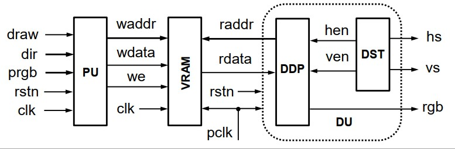
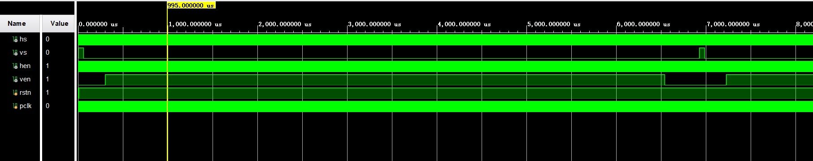
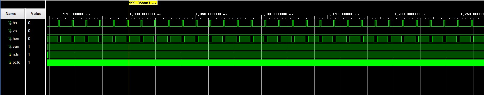
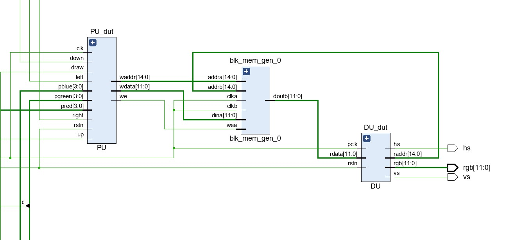
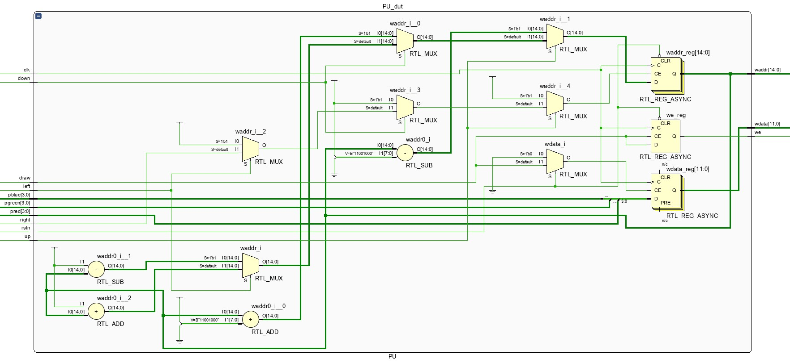

#

#

#

<font face="华文新魏" size=6><center>**Lab6——存储器**</font></center>

<center>
    
</center>

<font face="华文新魏" size=5><center>
**姓名：王昱**
**学号：PB21030814**</font></center>

<div style="page-break-after: always;"></div>

<font face="华文新魏" size=5>

**一.实验目的与内容**
①掌握存储器IP核的使用、存储器的读写时序</br>②学习并掌握VGA显示原理、VGA显示接口与定时时序
</font>

<font face="华文新魏" size=5>

**二.逻辑设计**


* **核心代码**
```verilog
module DST(
    input rstn,pclk,
    output reg hs,vs,hen,ven
    );

    reg [10:0] hcnt,vcnt;        //  用于计数,行计数器最大到1040,场计数器最大到666
//行计数器
  always @(posedge pclk or negedge rstn) begin
    if(!rstn)
        hcnt <= 11'd0;
    else if(hcnt == 11'd1039)
        hcnt <= 11'd0;
    else    
        hcnt <= hcnt + 1'd1;
  end
//场计数器
  always @(posedge pclk or negedge rstn) begin
    if(!rstn)
        vcnt <= 11'd0;
    else if(hcnt == 11'd1039 && vcnt == 11'd665)
        vcnt <= 11'd0;
    else if(hcnt == 11'd1039)
        vcnt <= vcnt + 1'd1;
    else
        vcnt <= vcnt;
  end
  always @(posedge pclk or negedge rstn) begin
    if(!rstn)
        hs <= 1'b1;
    else if(hcnt == 11'd119)
        hs <= 1'b0;
    else if(hcnt == 11'd1039)
        hs <= 1'b1;
    else 
        hs <= hs;
  end
  always @(posedge pclk or negedge rstn) begin
    if(!rstn)
        vs <= 1'b1;
    else if(vcnt == 11'd5 && hcnt == 11'd1039)
        vs <= 1'b0;
    else if(vcnt == 11'd665 && hcnt == 11'd1039)
        vs <= 1'b1;
    else 
        vs <= vs;
  end
  always @(posedge pclk or negedge rstn) begin
    if(!rstn)
        hen <= 1'b0;
    else if(hcnt == 11'd183)
        hen <= 1'b1;
    else if(hcnt == 11'd983)
        hen <= 1'b0;
    else 
        hen <= hen;   
  end
  always @(posedge pclk or negedge rstn) begin
    if(!rstn)
        ven <= 1'b0;
    else if(vcnt == 11'd29)
        ven <= 1'b1;
    else if(vcnt == 11'd629)
        ven <= 1'b0;
    else    
        ven <= ven;
  end
endmodule
```

>DST模块，是本实验的一个关键模块，要想画图首先要显示白屏。这里关键在于hs、vs、hen、ven的逻辑给对，需要通过不断地仿真来检验。


```
module DDP(
    input hen,ven,pclk,rstn,
    input [11:0] rdata,
    output [14:0] raddr,        //0-29999这些数
    output [11:0] rgb
    );
    reg [10:0] hcnt,vcnt;
    reg [10:0] x,y;
  always @(posedge pclk or negedge rstn) begin
    if(!rstn)begin
        hcnt <= 11'd0;
        vcnt <= 11'd0;
        x <= 11'd0;
        y <= 11'd0;
    end
    else begin
        if(hen && ven)begin
            if(hcnt < 11'd799)
                hcnt <= hcnt + 1;
            else begin
                hcnt <= 11'd0;
                if(vcnt < 11'd599)
                vcnt <= vcnt + 1;
                else    
                vcnt <= 11'd0;
            end
        end
        else begin
            hcnt <= hcnt;
            vcnt <= vcnt;
        end
    end
    x <= hcnt >> 2;
    y <= vcnt >> 2;
    end
    assign rgb = (hen && ven) ? rdata : 12'd0;
    assign raddr = 200 * y + x;
endmodule
```

>DDP模块，这个我认为可以跟DST模块进行合并，因为这两个同时都需要用到计时器。在这个模块中用hcnt、vcnt对行和列进行计数，用x、y记录200*150分辨率的行和列，通过右移两位即可实现。

```
module PNT(
    input [3:0] dir,        //控制上下左右移动
    input [11:0] prgb,      //控制画笔颜色
    input draw,clk,rstn,
    output [11:0] rgb,      //像素颜色
    output hs,vs            //行同步、场同步
    );

    wire [3:0] dir_now,dir_middle;
    wire [11:0] prgb_now;
    wire draw_now;
    wire [14:0] waddr,raddr;
    wire [11:0] wdata,rdata;
    wire we,pclk;
    clk_wiz_0 clk_wiz_0(
        .clk(clk),
        .pclk(pclk)
    );
    blk_mem_gen_0 blk_mem_gen_0(
        .clka(pclk),    // input wire clka
        .wea(we),      // input wire [0 : 0] wea
        .addra(waddr),  // input wire [14 : 0] addra
        .dina(wdata),    // input wire [11 : 0] dina
        .clkb(pclk),    // input wire clkb
        .addrb(raddr),  // input wire [14 : 0] addrb
        .doutb(rdata)  // output wire [11 : 0] doutb
    );
    genvar i,j;
    generate
        for(i = 0 ; i < 4 ; i = i + 1)
        begin : block1
          debounce debounce_dut(
            .clk(pclk),
            .rstn(rstn),
            .x(dir[i]),
            .y(dir_middle[i])
          );
          PS PS_dut(
            .clk(pclk),
            .rstn(rstn),
            .a(dir_middle[i]),
            .p(dir_now[i])
          );
        end
    endgenerate

    generate
        for(j = 0 ; j < 12 ; j = j + 1)
        begin : block2
            debounce debounce_dut(
                .clk(pclk),
                .rstn(rstn),
                .x(prgb[j]),
                .y(prgb_now[j])
            );
        end
    endgenerate

    debounce debounce_DUT(
        .clk(pclk),
        .rstn(rstn),
        .x(draw),
        .y(draw_now)
    );
    PU PU_dut(
        .clk(pclk),
        .rstn(rstn),
        .up(dir_now[3]),
        .down(dir_now[2]),
        .left(dir_now[1]),
        .right(dir_now[0]),
        .pblue(prgb_now[11:8]),
        .pgreen(prgb_now[7:4]),
        .pred(prgb_now[3:0]),
        .waddr(waddr),
        .wdata(wdata),
        .we(we),
        .draw(draw_now)
    );
    DU DU_dut(
        .hs(hs),
        .pclk(pclk),
        .raddr(raddr),
        .rdata(rdata),
        .rgb(rgb),
        .rstn(rstn),
        .vs(vs)
    );

endmodule
```

>综合的PNT模块，这里主要是对IP核(VRAM和clk)的例化。对所有的输入都进行去抖动，对up、down、left、right进行取边沿，没有实现连续输入。
</font>


<font face="华文新魏" size=5>

**三.仿真结果与分析**


* 对DST模块的仿真




>如上图所示，hs、vs的逻辑大致是正确的。

* 对DDP模块的仿真


>如上图所示，x、hcnt和y、vcnt的逻辑关系是正确的。满足x = hcnt >> 2和y = vcnt >> 2

* 仿真代码

```
module DDP_tb();
    wire [14:0] raddr;
    wire [11:0] rgb;
    reg [11:0] rdata;
    reg hen,ven,pclk,rstn;
    initial begin
        rdata = 12'h123;
        hen = 1'b1;
        ven = 1'b1;
        pclk = 1'b0;
        rstn = 1'b0;
        #5 rstn = 1'b1;
    end
    always #5 pclk = ~pclk;
    DDP DDP_test(
        .pclk(pclk),
        .hen(hen),
        .ven(ven),
        .rstn(rstn),
        .raddr(raddr),
        .rgb(rgb),
        .rdata(rdata)
    );
endmodule
```

```
module DST_tb();
    wire hs,vs,hen,ven;
    reg rstn,pclk;
    initial begin
        rstn = 1'b0;
        pclk = 1'b0;
        #1 rstn = 1'b1;
    end
    always #5 pclk = ~pclk;
    DST dst_test(
        .hen(hen),
        .hs(hs),
        .pclk(pclk),
        .rstn(rstn),
        .ven(ven),
        .vs(vs)
    );
endmodule
```
>这里DDP和DST的仿真代码都很简单，不再赘述。
</font>

<font face="华文新魏" size=5>

**四.电路设计与分析**

* PNT综合模块的RTL



* DU模块的RTL


* PU模块的RTL



* 资源使用情况


</font>

<font face="华文新魏" size=5>

**五.测试结果与分析**


>在屏幕上画了自己的学号PB21030814

</font>

<font face="华文新魏" size=5>

**六.总结**
这次实验的基础部分比较简单，但还是遇到了很多问题。主要是：对vga显示原理的不理解，时序问题，存储器ip核的使用不太清楚。但是通过后来的学习以及助教的解答，这些问题都被解决。

</font>