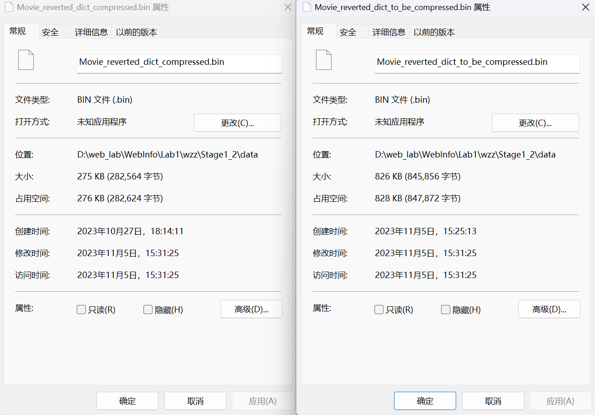
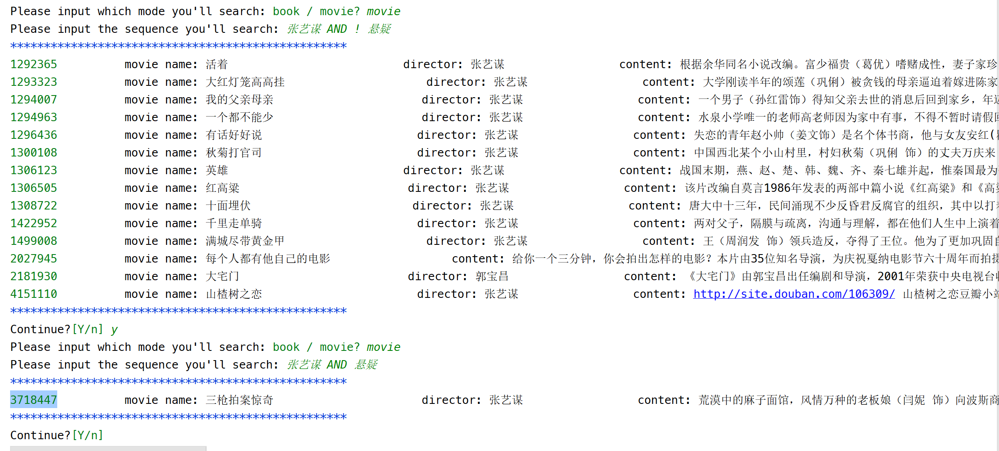
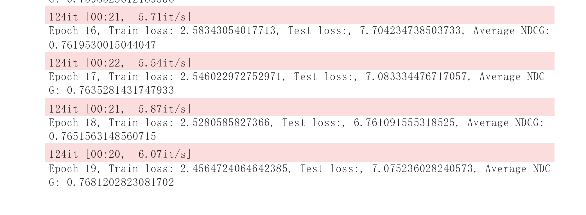
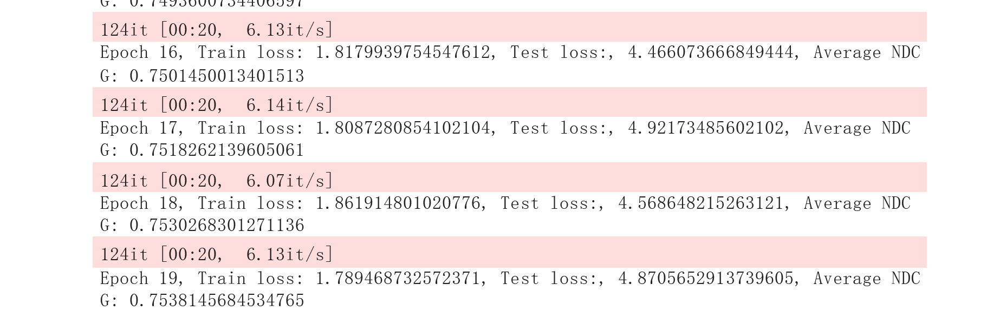
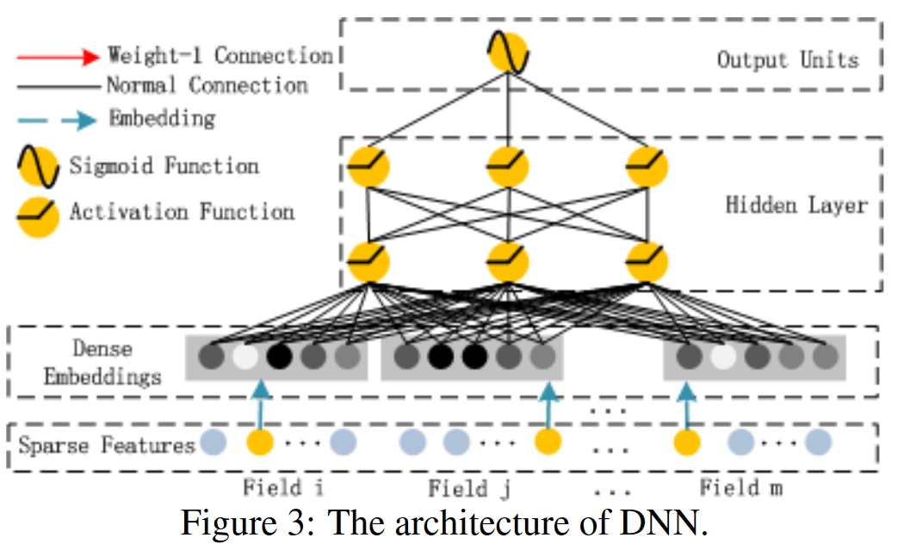
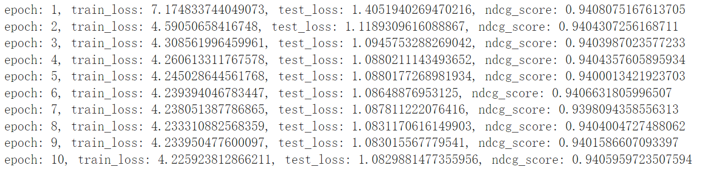

# Web信息处理与应用Lab1

## 目录

[TOC]

## 简介

### 小组成员

> 组长：王道宇  PB21030794

>  组员：王   昱  PB21030814
> 
> ​          吴泽众  PB21030802

### 实验环境

> System:  Win 11 
> 
> IDE / Editor:  Pycharm community ,  Visual Studio Code
> 
> Language:  python3 ,  Jupyter Notebook
> 
> Environment / tool:  Anaconda ,  git
> 
> Repository:  [WebInfo](https://github.com/Melmaphother/WebInfo)    ( private now)

## 实验内容简介

### **Stage1：** 豆瓣数据的爬取和检索

#### 爬虫

1. 电影数据，至少爬取其基本信息、剧情简介、演职员表，本次实验额外爬取的信息有：看过该电影的人数、想看电影该电影的人数。

2. 书籍数据，至少爬取其基本信息、内容简介、作者简介，本次实验额外爬取的信息有：正在看、想看、看过该书籍的人数。

3. 爬取方式：API 爬取或网页爬取，本次实验采取网页爬取方式来获取 html 信息，并采用 `beautifulsoup` 以及正则表达式匹配的方式来解析。

4. 应对平台反爬措施的策略：随机化爬取的等待时间、伪造 User-Agent 、加入 cookie 等。

#### 检索

1. 分词：采用jieba分词中的精确模式对book和movie的简介进行分词，并将其他包含单个词的信息（例如作品名称、作者姓名、作品类型）分别进行分词和不分词处理加入到分词结果中。

2. 去停用词处理。采用链接 [停用词](https://github.com/guotong1988/chinese_dictionary) 中的停用词词典进行去停用词处理

3. 同义词替换。应用 synonyms 库中的 compare 函数，使用 word2vec 模型来替换同义词。

4. 倒排表的生成。根据分词结果，把原先以id索引词项的字典修改为以词项索引 id 列表的倒排表。

5. 跳表指针。在倒排表的基础上添加跳表指针，加速查询过程。

6. 压缩存储。采用可变长度编码的方式压缩 id 列表

7. 布尔查询。设计自底向上的文法匹配布尔表达式，并实现 AND、NOT、OR 三种布尔匹配的操作。

### **Stage2：** 使用豆瓣数据进行推荐

1. 根据第一阶段以及第二阶段提供的数据，使用传统推荐模型进行推荐，并对应地计算 `MSE` 以及平均 `NDCG`作为模型的评测指标。
2. 利用TA提供的代码对文字`Tag`进行处理，作为特征用于模型训练。

## 实现过程介绍

### **Stage1_1：** 爬虫部分：豆瓣数据的爬取

#### 爬取数据集的设计

实验的最开始本小组先调研了豆瓣读书和豆瓣电影的作品条目网页里的元素，选取其中的作品基本信息作为构建数据集的主要对象。同时还注意到了网页左下角“$\cdots$人看过”和“$\cdots$人想看”的数据，意识到这些信息对 Stage2 中推荐环节的作用，故加入数据集中。


#### 请求头的构造

调用fake_useragent库，将虚构的用户代理添加进用户代理池中，每爬取一个网页就换用用户代理池中其他User Agent，其中用户代理池中包含chrome、safari、firefox、edge四类虚假的User Agent，不容易被豆瓣平台的反爬策略监测出来。

#### 网页爬虫算法结构的设计

1. 解析
   
   使用 soup.find 函数解析获取的 html 内容。在网页源代码中找到需要爬取的信息，根据其在 html 内容中对应的网页元素、属性和   值来解析出需要的信息，下面两个表分别展现了 Movie 和 Book 解析网页的方式
   
   | Movie Parse | 影片名            | 导演，主演等信息 | 简要介绍                  | 想看的人   数                                                          | 看过的人   数                                                       |
   | ----------- | -------------- | -------- | --------------------- | ----------------------------------------------------------------- | -------------------------------------------------------------- |
   | 网页元素        | span           | div      | span                  | a                                                                 | a                                                              |
   | 属性          | property       | id       | class/ property       | href                                                              | href                                                           |
   | 属性的值        | v:itemreviewed | info     | all hidden/ v:summary | https://movie.douban.com/subject/    {movie_id}/comments?status=P | https://movie.douban.com/subject/ {movie_id}/comments?status=F |
   
   表注：简要介绍信息在所有的电影中有两种形式，一种放在 property=“ v:summary” 中；另一种由于信息长度过长，需要用户点击**展开全部**来看到完整的简介，其完整的信息放在 class=“all hidden”中。
   
   | Book Parse | 书名             | 作者、出版社等信息 | 简要介绍  | 想看、在看、看过的人数 | 评分                   |
   | ---------- | -------------- | --------- | ----- | ----------- | -------------------- |
   | 网页元素       | span           | div       | div   | div         | div                  |
   | 属性         | property       | id        | class | id          | class                |
   | 属性的值       | v:itemreviewed | info      | intro | collector   | rating_self clearfix |
   
   表注：如果记录书籍介绍的部分(`book_intro`)不为空，则判断是否含有(**展开全部**)，如果有则对应的信息在`book_intro`的下一个索引处；如果没有则对应的信息就在`book_intro`的当前索引处。

2. 反爬虫
   
   由于在解析程序把解析失败的错误信息输出到了文件中（ Movie_error.json 和 Book_error.json ），所以能够在爬虫过程中发现大概三十个豆瓣的电影 id 找不到对应的资源。经过检查后发现部分电影和书籍只有在登录过豆瓣账号后才能访问，因此需要请求头中包含 cookie 信息。但测试后发现豆瓣的 cookie 属于 session cookies ，只有在保持网页端页面的会话不关闭的情况下才能生效，有效期较短。
   
   本小组最后采用的措施是：先将不需要cookie信息的电影和书籍信息使用简单的 user-agent 爬取，再根据程序内部的提示找到爬取失败的 id 并用小组成员的豆瓣登录 cookie 以及用户代理构造请求头爬取。
   
   有效 cookie 信息后发现 Movie 部分仍有 id：1309046无法在豆瓣中索引到资源，手动输入 id 对应网址后发现豆瓣未收录条目，猜测可能是涉及到了敏感信息而遭到封禁。

### **Stage1_2：** 检索部分：使用数据进行布尔检索

#### 分词

1. 分词方面选取的是jieba库作为分词工具。
   
   jieba提供了两种分词模式：精确模式和全模式，分别代表唯一结果分词和多结果分词。本小组最开始采用的是全模式进行分词，但这样做产生了两个问题：一是全模式提供的多结果分词中会有大量词汇的前缀，在下一步的去同义词步骤中会被当做同义词去掉，最后只留下了词汇的前缀，而正确的词汇本身在这一步被替换；二是全模式产生的多结果会对词汇在文档中的 tf 的计算产生干扰，影响实验结果。

2. 多种分词方式的选择
   
   分词工具我们这里选择了两种：[jieba](https://github.com/fxsjy/jieba)、[pkuseg](https://github.com/lancopku/PKUSeg-python)。
   
   ```py
   def split_info(*self*, *text*: str, *mode*="jieba") -> List:
   ​    if mode == "jieba":
   ​      seg_list = jieba.lcut(re.sub(pattern, '', text), *cut_all*=False)
   ​    else:
   ​      seg_list = pkuseg.pkuseg().cut(text)
   ```
   
   我们在这里提供了分词选择项：如果 mode 是 `"jieba"` 那么选用 jieba 分词，否则选用 pkuseg。
   
   实际处理中我们并未发现 jieba 分词工具与 pkuseg 分词工具的具体差别，但从理论上来说 pkuseg 分词工具比 jieba 分词工具表现更优异。
   
3. 去同义词和停用词
   
   - 停用词部分我们是采用了读取[中文停用词表](https://github.com/goto456/stopwords/blob/master/cn_stopwords.txt)，对比分词后的每个词项与停用词表，如果词项在停用词表中则不加入到最后结果中。
   
   - 同义词部分我们是调用了`synonyms`库的`compare`函数实现的。

#### 倒排表及压缩

1. 倒排表生成和跳表指针的建立
   
   遍历生成的 `id-词项` 字典，生成倒排索引字典。遇到新的词项就创建 `词项-id`  列表键值对，遇到已经存在于倒排表中的词项就有序插 入词项的 id 列表。生成完倒排表后根据每个 id 列表(假设长为 L )都生成一层跳表指针，每隔 $\sqrt{L}$ 放置一个跳表指针，并让 最后一个跳表指针指向列表末尾

2. 压缩存储和解压
   
   采用可变长度编码存储倒排表中的 id 列表用可变长度编码压缩，同时将 id 列表的长度记录到词项中，方便解压缩时重新构建倒排表。压缩前先用文档 id 的间距替代文档 id，大大减小了需要存储的字节数。压缩时每个字节的最高位都设置成延续位，剩余7个 bit 用于对 id 的低 7 位进行编码，将其延续位置为 1。如果此时还有字节没有编码完成，则左移 7 位，重复如上操作操作，并把延续位置为 0。
   
   
   
   左图为经过压缩过后的倒排表文件，右图为未经过压缩过后的倒排表，可以看到：压缩算法将倒排表从 826KB压缩至 275KB，效果较好。
   
   解压即为可变长度编码的逆过程。

#### 布尔查询操作和展示

1. 基本操作符
   
   基于倒排表的布尔查询过程，本质上是倒排表的合并过程
   
   - `AND`
     
     转换成有序链表寻找相同元素的问题。在两个列表的开头分别放置指针，若对应的值相同则两个指针都后移并将值加入结果的列 表中，若不同则将较小的值对应的指针后移，直到其中一个指针指向列表的末尾。
   
   - `OR`
     
     转换成有序链表合并的问题。在两个列表的开头分别放置指针，若对应的值相同则两个指针都后移并将值加入结果的列表中，若不 同则先将较小的值加入结果列表中，对应的指针后移，直到其中两个指针都指向列表的末尾。
   
   - `NOT`
     
     对单个操作 op ，取全集的补集即可。
   
   - `AND NOT`（优化）
     
     根据长尾效应，绝大部分词项在文档中出现频率较小，一旦用 NOT 取补集，空间复杂度就会极大(通常接近全集的长度)。通过优化 AND 后面立刻跟上的 NOT 这一情况可以减小程序的空间复杂度。在这种情况下，如果不采取优化，不仅空间复杂度接近全集的长度 ，而且在 AND 操作时由于其中一个列表由 NOT 生成，时间复杂度也接近全集的长度。采取的优化方案的伪代码如下：
     
     ```py
     Id_List AND_NOT(Id_List op1, Id_List op2){
         p1 = p2 = i =0;
         while(p1 != op1.len || p2 != op2.len){
             if(op1[p1] == op2[p2]){
                 Jump_op1(p1);    //考虑到跳表指针的跳转
                 Jump_op2(p2);
             }
             else if(op1[p1] > op2[p2]){
                 Jump_op1(p1);
                   result[i] = p1;
                 i++;
             }
             else
                 Jump_op2(op2);
         }
         return result;
     } 
     ```
     
     优化后，代码的时间复杂度为 $O(op1.len+op2.len)$，空间复杂度为 $O(min\{op1.len,op2.len\})$，相比原先的方式有明显优化

2. 文法设计
   
   本次实验的布尔查询提供 AND、OR、NOT 和 () 四种运算符，设计出左递归的非二义性文法来匹配查询内容。其中 E、T、F、G 为非终结符，word 为终结符，用于匹配查询输入的词项。
   
   $$
   \begin{align}
E &\rightarrow E\ OR\ T\\
&\ \ |\ \ T\\
T &\rightarrow T\ AND\ F\\
&\ \ |\ \ F\\
F &\rightarrow NOT\ G \\
&\ \ |\ \ F\\
G &\rightarrow (E)\\
&\ \ |\ \ word\\
\end{align}
   $$
   
   由于用户在布尔查询时的输入通常不会太复杂，如果将上述文法设计成 LR(1) 文法每次程序启动都需要先花时间构造 LR 分析表，但考虑到实际情况里用户的查询间断性较强，这样的文法设计可能会花更多的时间在 LR 分析表的生成上。本小组采用括号匹配的思想，先递归地匹配左括号，找到其对应的右括号并根据产生式将括号内部的内容用非终结符 E 表示，直到所有括号都被拆除后再自顶向下递归地先后匹配字符串 OR、AND 和 NOT（匹配操作符而不是文法符号，这样能够避免处理左递归文法），并用对应的布尔操作作用于词项对应的倒排表，将 id 列表作为结果返回。

3. 查询示例
   为了查询的便捷化，我们允许查询条目中出现类似**中文表达或中文符号**，查询条目对操作符的大小写不敏感，但对查询词项敏感。
   以下给出部分查询结果，以 movie 为例：
   
   - 多个操作符与括号的结合
     
   - AND NOT 的优化
     

### **Stage2：** 推荐部分：基于爬取数据以及给定数据集的推荐

#### 微调示例代码

第一步首先对助教所提供的代码进行小幅改动。考虑到时间因素的影响，我们采取了以下的修正方式。

可以理解的是，评分时间对用户评分的有效性有较为关键的影响因素。时间越久远的评分，其分数的可信度也有一定的下降。为了征这一下降幅度，我们给评分加入了时间权重：

- 取所有评分时间的最大值 $max$ 和最小值 $min$。
- 将评分时间 $time$ 做如下操作：
  
  $$
  time\_value = (time - min) / (max - min)
  $$
- 将 $time\_value$ 作为权重加入 $rate$ ：
  
  $$
  rating = rating * time
  $$

做出如上修正之后，训练结果中 $loss$ 和 $ndcg$ 分别有如下变化：

- 未作时间修正
  

- 时间修正
  

可以看到，加入时间修正之后，平均 $ndcg$ 有小幅降低，但是 $Train\space loss$ 和 $Test\space loss$ 有显著降低，明模 型的泛化能力得到了提高。

#### 调库实现推荐

在微调示例代码之后，我们先是通过调用`deepctr`库来实现使用`DeepFM`进行推荐。

代码如下：

```python
import pandas as pd
from sklearn.metrics import mean_squared_error
from sklearn.model_selection import train_test_split
from sklearn.preprocessing import LabelEncoder
from deepctr.models import DeepFM
from deepctr.feature_column import SparseFeat,get_feature_names
import numpy as np

data = pd.read_csv("Stage2/book_score.csv")

# 特征
sparse_features = ["User", "Book", "Time"]
# 标签
target = ['Rate']
# 把特征里的值从0到n开始编号
for f in sparse_features:
    transform = LabelEncoder()
    data[f] = transform.fit_transform(data[f])

# 生成词向量，计算每个特征中的不同特征值个数
fix_len_feature_column = [SparseFeat(feat, vocabulary_size=data[feat].nunique()) for feat in sparse_features]

linear_feature_columns = fix_len_feature_column
dnn_feature_columns = fix_len_feature_column
feature_names = get_feature_names(linear_feature_columns + dnn_feature_columns)


train, test = train_test_split(data, test_size=0.2)
train_model_input = {name:train[name].values for name in feature_names}
test_model_input = {name:test[name].values for name in feature_names}

print(test['Rate'].values)

# 使用DeepFM训练
# linear_feature_columns用FM，dnn_feature_columns用DNN
model = DeepFM(linear_feature_columns, dnn_feature_columns, task='regression')
# 评价指标用mse，优化器用adam
model.compile("adam", "mse", metrics=['mse'])
history = model.fit(train_model_input, train['Rate'].values, batch_size=256, epochs=6, verbose=True, validation_split=0.2 )


predict_ = model.predict(test_model_input, batch_size=256)
predict_true = []
for value in predict_.values:
    predict_true.append(value)
predict_ = predict_.ravel()
print(predict_)
print(test['Rate'].values)

mse = round(mean_squared_error(test['Rate'].values, predict_), 4)
print("mse:", mse)
```

但是为了加深对`DeepFM`的理解，我们最终还是选择基于`pytorch`手撸`DeepFM`实现ranking task

#### 使用 DeepFM 模型进行推荐

1. FM(特征交叉)
   
   
   
   > FM的结构大致是: 输入层$\rightarrow$Embedding层$\rightarrow$特征交叉FM层$\rightarrow$输出层
   > 
   > 交叉的部分是类别特征，数值特征不参与交叉。但是如果将数值特征离散化后加入Embedding层，就可以参与交叉。
   
   - FM模型的方程式为:$y=w_0+\sum\limits_{i=1}^{n}w_ix_i+\sum\limits_{i=1}^{n}\sum\limits_{j=i+1}^{n}<v_i,  v_j>x_ix_j$ ，时间复杂度为$O(kn^2)$,其中$v_i$是第$i$维特征的隐向量。经过化简得到: $y=w_0+\sum\limits{i=1}^ {n}w_ix_i+\frac{1}{2}\sum\limits_{f=1}^{k}[(\sum\limits_{i=1}^{n}v_{i,f}x_i)^2-\sum\limits{i=1}^{n}v_ {i,f}^2x_i^2]$，时间复杂度降为 $O(kn)$
   
   - FM用于ranking task的时候可以使用**成对分类函数**作为损失函数
   
   - FM训练算法可以是`SGD`(随机梯度下降法)
   
   - FM特征工程: 类别特征One-Hot化(比如实验给出的dataset里的User、Book)、Time可以根据天数离散化分桶
     代码实现如下：
     
     ```python
     class FM(nn.Module):
       # latent_dim是离散特征隐向量的维度, feature_num是特征的数量
       def __init__(self, feature_num, latent_dim):
           super(FM, self).__init__()
           self.latent_dim = latent_dim
           # 下面定义了三个矩阵
           self.w0 = nn.Parameter(torch.zeros([1, ]))
           self.w1 = nn.Parameter(torch.rand([feature_num, 1]))
           self.w2 = nn.Parameter(torch.rand([feature_num, latent_dim]))
     
       def forward(self, Input):
           # 一阶交叉
           order_1st = self.w0 + torch.mm(Input, self.w1)
           # 二阶交叉
           order_2nd = 1 / 2 * torch.sum(
               torch.pow(torch.mm(Input, self.w2), 2) - torch.mm(torch.pow(Input, 2), torch.pow(self.w2,2)), dim=1,
               keepdim=True)
           return order_1st + order_2nd
     ```

2. DNN
   
   
   
   DNN是深度神经网络，可理解成有多个隐藏层的神经网络。层与层全连接，有输入、隐藏、输出层。
   通过前向传播、反向传播得到很好的效果。
   
   
   代码实现如下：
   
   ```python
   class DNN(nn.Module):
       def __init__(self, hidden, dropout=0):
           super(DNN, self).__init__()
           # 相邻的hidden层, Linear用于设置全连接层
           # ModuleList可以将nn.Module的子类加入到List中
           self.dnn = nn.ModuleList([nn.Linear(layer[0], layer[1]) for layer in list(zip(hidden[:-1],hidden[1:]))])
           # dropout用于训练, 代表前向传播中有多少概率神经元不被激活
           # 为了减少过拟合
           self.dropout = nn.Dropout(dropout)
   
       def forward(self, x):
           for linear in self.dnn:
               x = linear(x)
               # relu激活函数
               x = F.relu(x)
           x = self.dropout(x)
           return x
   ```

3. DeepFM
   
   利用$DNN$部分学习高维特征交叉，$FM$部分学习低维特征交叉，二者的结合作为输出。
   
   代码实现如下：
   
   ```python
   class DeepFM(nn.Module):
       def __init__(self, hidden, feature_col, dropout=0):
           super(DeepFM, self).__init__()
           # 连续型特征和离散型特征
           self.dense_col, self.sparse_col = feature_col
           self.embedding_layer = nn.ModuleDict({"embedding" + str(i): nn.Embedding (num_embeddings=feature      ["feature_num"],
                                                                                    embedding_dim=feature ["embedding_dim"])
                                                 for i, feature in enumerate(self.sparse_col)})
   
           self.feature_num = len(self.dense_col) + len(self.sparse_col) * self.sparse_col[0]["embedding_dim"]
           # 将feature_num插入到hidden的开头
           hidden.insert(0, self.feature_num)
   
           self.fm = FM(self.feature_num, self.sparse_col[0]["embedding_dim"])
           self.dnn = DNN(hidden, dropout)
           # 最终输出, 将最后一层输入然后输出一维的结果
           self.final = nn.Linear(hidden[-1], 1)
   
       def forward(self, x):
           sparse_input, dense_input = x[:, :len(self.sparse_col)], x[:, len(self.sparse_col):]
           sparse_input = sparse_input.long()
           sparse_embed = [self.embedding_layer["embedding" + str(i)](sparse_input[:, i]) for i in range       (sparse_input.shape[1])]
           # 按照最后一个维度拼接
           sparse_embed = torch.cat(sparse_embed, dim=-1)
   
           x = torch.cat([sparse_embed, dense_input], dim=-1)
           wide_output = self.fm(x)
           deep_output = self.final(self.dnn(x))
           return F.sigmoid(torch.add(wide_output, deep_output)) * 5
   ```
   
   > 注意这里最后的实现：
   
   ```python
   return F.sigmoid(torch.add(wide_output, deep_output)) * 5
   ```
   
   这部分处理的目的是得到对得分的预测，所以归一化到$[0,1]$之间然后乘5处理。

4. 特征选择
   
   - 稀疏特征选取的是$User$、$Book/Movie$、$time$，在这里对时间戳进行了离散化处理(按天离散化)，对$User$、$Book$、$Movie$ 重新编码。
   - 稠密特征选择的是$raw-score$(豆瓣原始评分)、$be-reading$(在看)、$wanna-read$(想看)、$have-read$(读过)   每个特征进行归一化处理，输入到 model 当中。

5. 数据集划分
   
   - 我们这里采取训练集、测试集$8:2$的比例来划分数据集
   - label为**用户真实打分**、feature为上述的**稀疏特征+稠密特征**

6. 训练
   
   > 选用$MSE$作为loss，最后计算$NDCG$
   > 结果如下：
   
   **book:**
   
   **movie:**
   
   
   可以看到，训练结果的平均 `ndcg` 相较于示例代码有较大的提升，这说明我们的训练和推荐结果是有效且可行的。