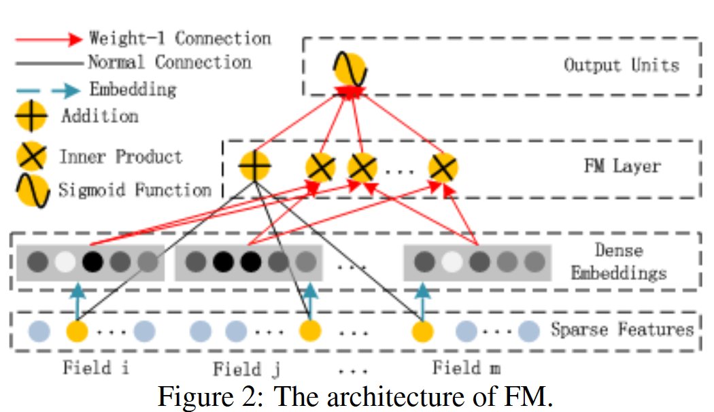
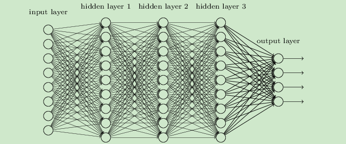
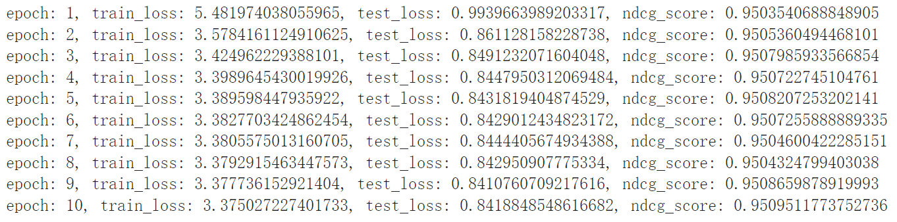

## 分词工具的选择

分词工具我们这里选择了两种：[jieba](https://github.com/fxsjy/jieba)、[pkuseg](https://github.com/lancopku/PKUSeg-python)。

```python
def split_info(self, text: str, mode="jieba") -> List:
        pattern = '[^A-Za-z0-9\u4e00-\u9fa5]'
        if mode == "jieba":
            seg_list = jieba.lcut(re.sub(pattern, '', text), cut_all=False)
        else:
            seg_list = pkuseg.pkuseg().cut(text)
```

我们在这里提供了分词选择项：如果mode是`"jieba"`那么选用jieba分词，否则选用pkuseg。
实际处理中我们并未发现jieba分词工具与pkuseg分词工具的具体差别，但从理论上了来说pkuseg分词工具比jieba分词工具表现更优异。

## 展开全部的处理

书籍部分的作者简介和主要内容简介都有可能出现未全部展开的情况，因此在爬虫的时候做如下处理：

```python
        if book_intro is None:
            error_msg = book_id + "没有介绍\n"
            print(error_msg)
            self.error.append(error_msg)
            book_content_intro = ''
            book_author_intro = ''
        else:
            # solve no author or no (展开全部) condition
            if len(book_intro) >= 2:
                if book_intro[0].text.find("(展开全部)") == -1:
                    book_content_intro = book_intro[0].text.replace('\n', '')
                    if book_intro[1].text.find("(展开全部)") == -1:
                        book_author_intro = book_intro[1].text.replace('\n', '')
                    else:
                        book_author_intro = book_intro[2].text.replace('\n', '')
                else:
                    book_content_intro = book_intro[1].text.replace('\n', '')
                    if len(book_intro) == 2:
                        book_author_intro = ''
                    else:
                        if book_intro[2].text.find("(展开全部)") == -1:
                            book_author_intro = book_intro[2].text.replace('\n', '')
                        else:
                            book_author_intro = book_intro[3].text.replace('\n', '')
            elif len(book_intro) == 1:
                book_content_intro = book_intro[0].text.replace('\n', '')
                book_author_intro = ''
            else:
                book_content_intro = ''
                book_author_intro = ''
```

> 如果记录书籍介绍的部分(`book_intro`)不为空，则判断是否含有(**展开全部**)，如果有则对应的信息在`book_intro`的下一个索引处；如果没有则对应的信息就在`book_intro`的当前索引处。

## 同义词、停用词处理部分

1. 停用词部分我们是采用了读取[中文停用词表](https://github.com/goto456/stopwords/blob/master/cn_stopwords.txt)，对比分词后的每个词项与停用词表，如果词项在停用词表中则不加入到最后结果中。
2. 同义词部分我们是调用了`synonyms`库的`compare`函数实现的。

具体实现代码如下：

```python
def split_info(self, text: str, mode="jieba") -> List:
        pattern = '[^A-Za-z0-9\u4e00-\u9fa5]'
        if mode == "jieba":
            seg_list = jieba.lcut(re.sub(pattern, '', text), cut_all=False)
            # seg_list = jieba.lcut(text, cut_all=False)
        else:
            # seg_list = pkuseg.pkuseg().cut(re.sub(pattern, '', text))
            seg_list = pkuseg.pkuseg().cut(text)
        extracted_word = []
        print(seg_list)
        for word in seg_list:
            if word not in self.stop_word_list:
                extracted_word.append(word)
        for i in range(len(extracted_word)):
            if extracted_word[i] not in self.single_id_info and extracted_word[i] != ' ':
                self.single_id_info.append(extracted_word[i])
            for j in range(i + 1, len(extracted_word)):
                if len(extracted_word[j]) > 0 and len(extracted_word[i]) > 0 and extracted_word[i] != ' ' and extracted_word[j] != ' ':
                    if extracted_word[j] not in self.single_id_info and synonyms.compare(extracted_word[i],
                                                                                         extracted_word[j],
                                                                                         seg=False) > 0.6:
                        extracted_word[j] = ' '
        return self.single_id_info
```

> 这里`seg_list`是初步分词的结果，经过停用词处理(不是停用词)之后加入到`extracted_word`当中。然后遍历`extracted_word`这个列表，如果发现两个词的意思相近则判定为同义词，对后出现的词进行赋值`' '`处理。

## 推荐部分

> 推荐模型选用了2017年华为诺亚方舟提出的**DeepFM**，是由**DNN+FM**组成的模型

### FM(特征交叉)



> FM的结构大致是: 输入层$\rightarrow$Embedding层$\rightarrow$特征交叉FM层$\rightarrow$输出层
>
> 交叉的部分是类别特征，数值特征不参与交叉。但是如果将数值特征离散化后加入Embedding层，就可以参与交叉。

1. FM模型的方程式为: $y=w_0+\sum\limits_{i=1}^{n}w_ix_i+\sum\limits_{i=1}^{n}\sum\limits_{j=i+1}^{n}<v_i,\ v_j>x_ix_j$，时间复杂度为$O(kn^2)$,其中$v_i$是第$i$维特征的隐向量。经过化简得到: $y=w_0+\sum\limits_{i=1}^{n}w_ix_i+\frac{1}{2}\sum\limits_{f=1}^{k}[(\sum\limits_{i=1}^{n}v_{i,f}x_i)^2-\sum\limits_{i=1}^{n}v_{i,f}^2x_i^2]$，时间复杂度降为$O(kn)$
2. FM用于ranking task的时候可以使用**成对分类函数**作为损失函数
3. FM训练算法可以是`SGD`(随机梯度下降法)
4. FM特征工程: 类别特征One-Hot化(比如实验给出的dataset里的User、Book)、Time可以根据天数离散化分桶

代码实现如下：

```python
class FM(nn.Module):
    # latent_dim是离散特征隐向量的维度, feature_num是特征的数量
    def __init__(self, feature_num, latent_dim):
        super(FM, self).__init__()
        self.latent_dim = latent_dim
        # 下面定义了三个矩阵
        self.w0 = nn.Parameter(torch.zeros([1, ]))
        self.w1 = nn.Parameter(torch.rand([feature_num, 1]))
        self.w2 = nn.Parameter(torch.rand([feature_num, latent_dim]))

    def forward(self, Input):
        # 一阶交叉
        order_1st = self.w0 + torch.mm(Input, self.w1)
        # 二阶交叉
        order_2nd = 1 / 2 * torch.sum(
            torch.pow(torch.mm(Input, self.w2), 2) - torch.mm(torch.pow(Input, 2), torch.pow(self.w2, 2)), dim=1,
            keepdim=True)
        return order_1st + order_2nd
```

### DNN


DNN是深度神经网络，可理解成有多个隐藏层的神经网络。层与层全连接，有输入、隐藏、输出层。
通过前向传播、反向传播得到很好的效果。


代码实现如下：

```python
class DNN(nn.Module):
    def __init__(self, hidden, dropout=0):
        super(DNN, self).__init__()
        # 相邻的hidden层, Linear用于设置全连接层
        # ModuleList可以将nn.Module的子类加入到List中
        self.dnn = nn.ModuleList([nn.Linear(layer[0], layer[1]) for layer in list(zip(hidden[:-1], hidden[1:]))])
        # dropout用于训练, 代表前向传播中有多少概率神经元不被激活
        # 为了减少过拟合
        self.dropout = nn.Dropout(dropout)

    def forward(self, x):
        for linear in self.dnn:
            x = linear(x)
            # relu激活函数
            x = F.relu(x)
        x = self.dropout(x)
        return x
```

### DeepFM

利用$DNN$部分学习高维特征交叉，$FM$部分学习低维特征交叉，二者的结合作为输出。

代码实现如下：

```python
class DeepFM(nn.Module):
    def __init__(self, hidden, feature_col, dropout=0):
        super(DeepFM, self).__init__()
        # 连续型特征和离散型特征
        self.dense_col, self.sparse_col = feature_col
        self.embedding_layer = nn.ModuleDict({"embedding" + str(i): nn.Embedding(num_embeddings=feature["feature_num"],
                                                                                 embedding_dim=feature["embedding_dim"])
                                              for i, feature in enumerate(self.sparse_col)})

        self.feature_num = len(self.dense_col) + len(self.sparse_col) * self.sparse_col[0]["embedding_dim"]
        # 将feature_num插入到hidden的开头
        hidden.insert(0, self.feature_num)

        self.fm = FM(self.feature_num, self.sparse_col[0]["embedding_dim"])
        self.dnn = DNN(hidden, dropout)
        # 最终输出, 将最后一层输入然后输出一维的结果
        self.final = nn.Linear(hidden[-1], 1)

    def forward(self, x):
        sparse_input, dense_input = x[:, :len(self.sparse_col)], x[:, len(self.sparse_col):]
        sparse_input = sparse_input.long()
        sparse_embed = [self.embedding_layer["embedding" + str(i)](sparse_input[:, i]) for i in range(sparse_input.shape[1])]
        # 按照最后一个维度拼接
        sparse_embed = torch.cat(sparse_embed, dim=-1)

        x = torch.cat([sparse_embed, dense_input], dim=-1)
        wide_output = self.fm(x)
        deep_output = self.final(self.dnn(x))
        return F.sigmoid(torch.add(wide_output, deep_output)) * 5
```

> 注意这里最后的实现：

```python
return F.sigmoid(torch.add(wide_output, deep_output)) * 5
```

这部分处理的目的是得到对得分的预测，所以归一化到$[0,1]$之间然后乘5处理。

### 特征选择

1. 稀疏特征选取的是$User$、$Book/Movie$、$time$，在这里对时间戳进行了离散化处理(按天离散化)，对$User$、$Book/Movie$重新编码。
2. 稠密特征选择的是$raw-score$(豆瓣原始评分)、$be-reading$(在看)、$wanna-read$(想看)、$have-read$(读过)。对每个特征进行归一化处理，输入到model当中。

### 数据集划分

1. 我们这里采取训练集、测试集$8:2$的比例来划分数据集
2. label为**用户真实打分**、feature为上述的**稀疏特征+稠密特征**

### 训练

> 选用$MSE$作为loss，最后计算$NDCG$
> 结果如下：

**book:**

**movie:**

