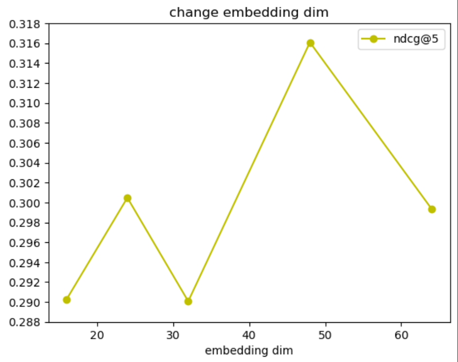
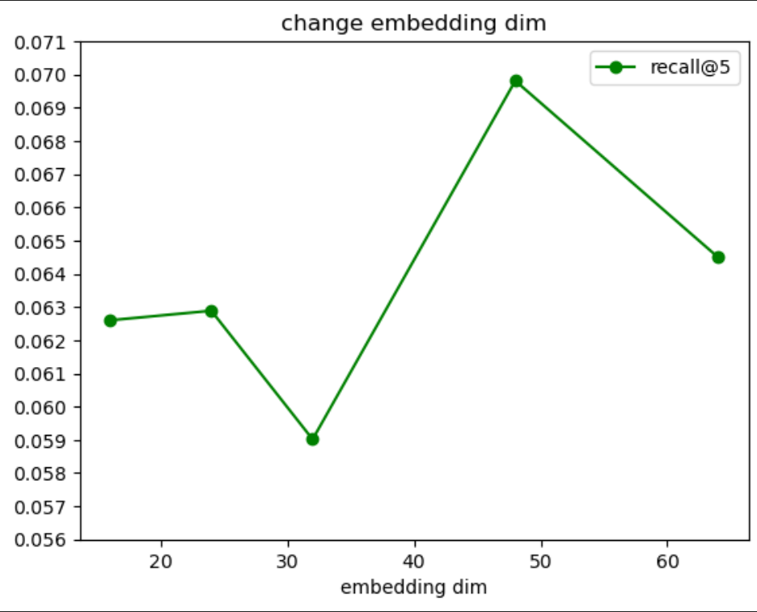
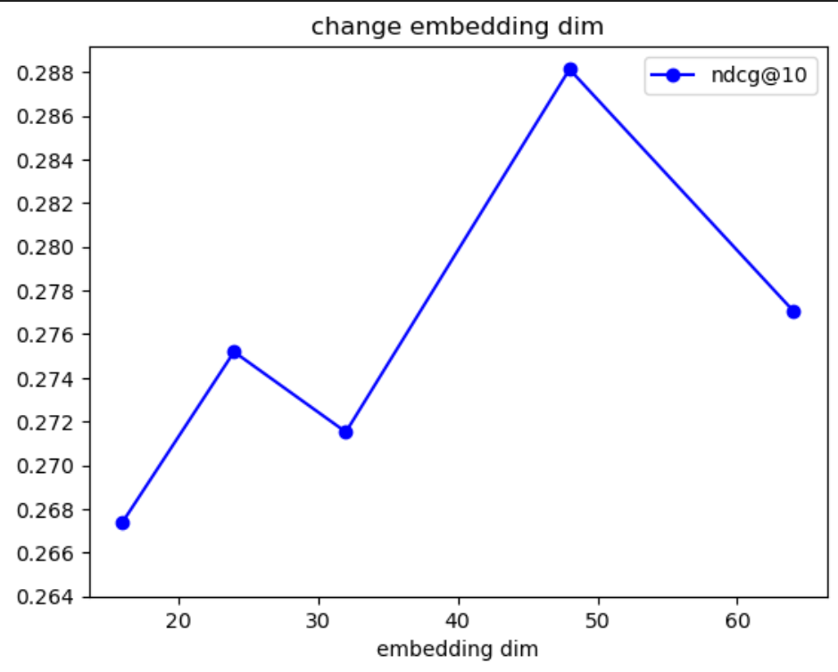
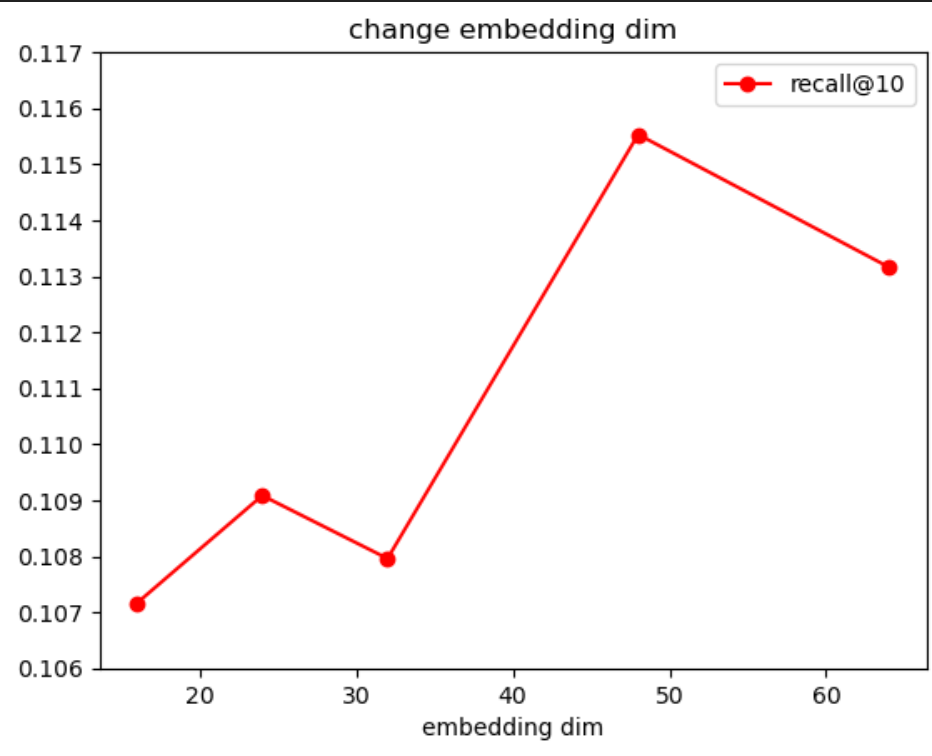
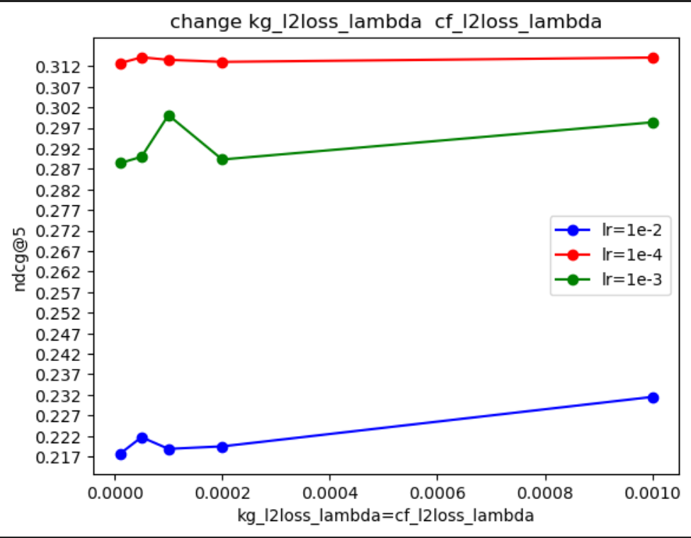
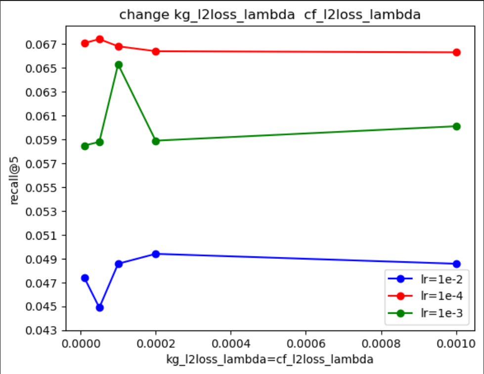
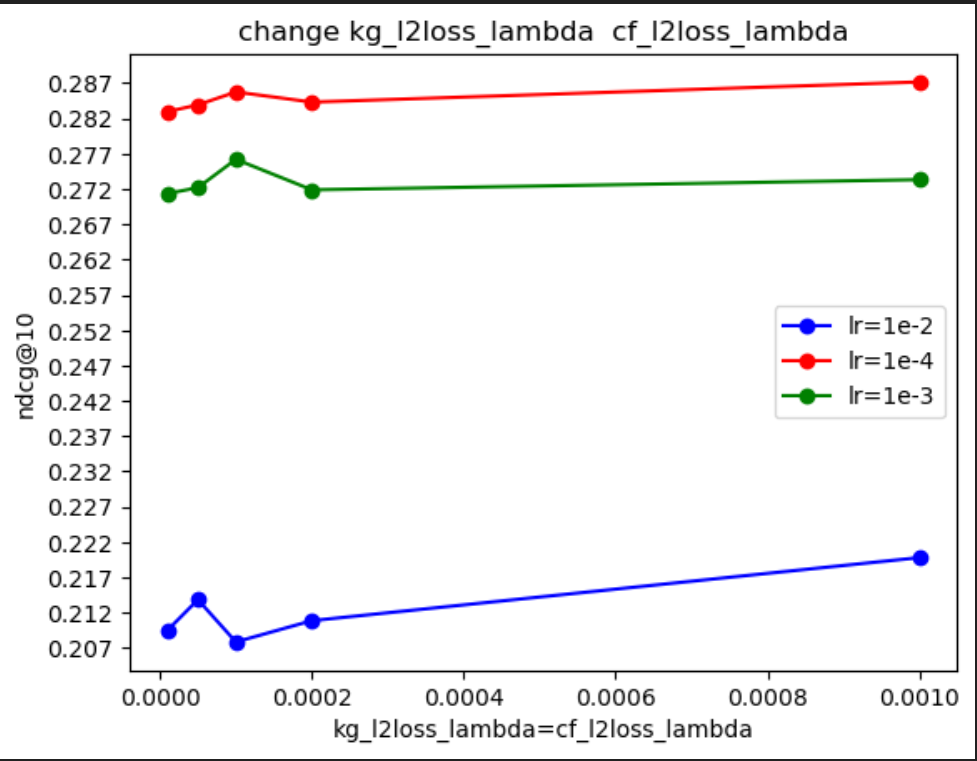
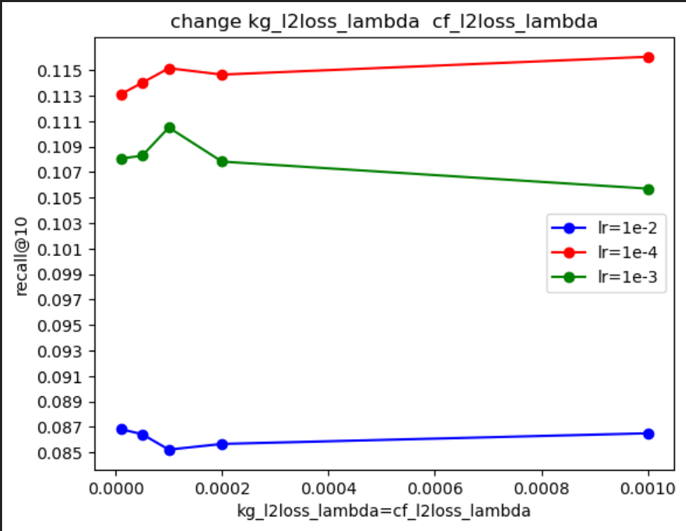

# Web第二次实验实验报告

[toc]

## 简介

### 小组成员

|     ID     |         Name         |
| :--------: | :------------------: |
| PB21030794 | 王道宇(team leader)  |
| PB21030802 | 吴泽众(team members) |
| PB21030814 |  王昱(team members)  |

### 实验环境

> System: Win11/Linux server
>
> IDE/Editor: Pycharm, Visual Studio Code
>
> Language: python3, Jupyter Notebook
>
> Environment/tool:  Anaconda, git
>
> Repository: [WebInfo](https://github.com/Melmaphother/WebInfo)(private now)

## 实验内容简介

### **Stage1**

1. 从公开图谱中匹配已经从`Freebase`中抽取的**578**部电影实体有关系的实体和关系，并生成图谱。
2. 按照规则对抽取到的图谱进行处理，过滤出数量在合适区间的实体或关系。

### **Stage2**

1. 根据映射关系，将Stage1得到的图谱映射为由索引值组成的三元组
2. 将图谱嵌入到原来的model当中
3. 选择评测指标比较图谱嵌入后model与图谱嵌入前model的效果

## 实现过程介绍

### **Stage1**

#### 关于 Freebase 数据库

`Freebase`是一个已经不再活跃的结构化知识数据库，它由Meta公司创建，于2016年关闭。`Freebase`旨在建立一个包含大量实体及其之间关系的知识图谱，以支持广泛的信息检索、语义搜索和知识图谱构建。

关于`Freebase`数据库：

1. **数据结构：** `Freebase`采用图谱结构，将知识组织成实体和关系的网络。实体包括人物、地点、电影、书籍等，而关系描述了这些实体之间的连接。
2. **三元组格式：** `Freebase`的数据以三元组(主体-谓词-客体)的格式存储。例如，一个关于电影的三元组可能是==(Inception，genre，Science Fiction)==。

#### 提取三元组并计数

在第一阶段中，我们需要从给定的**578**个电影实体出发，将其作为头或尾与`Freebase`中的三元组匹配。

提取的代码如下：

```python
def ExtractFreebase(freebase_path, KG_path, entities_set):
    with gzip.open(freebase_path, 'rb') as f:
        with open(KG_path, 'w', encoding='utf-8') as f_out:
            for line in f:
                line = line.strip()
                triplet = line.decode().split('\t')[:3]
                if triplet[0] in entities_set or triplet[2] in entities_set:
                    f_out.write('\t'.join(triplet) + '\n')
```

#### 过滤三元组

在实体和关系的筛选中，我们有三重过滤标准：

1. 只保留具有`<http://rdf.freebase.com/ns/`前缀的实体。因为存在一类关系<http://rdf.freebase.com/ns/common.notable_for.display_name>，这类关系的构成三元组的尾实体通常为一种语言的字符串，而此类关系的尾实体一般不会和其他的实体相连。便于缩小子图规模
2. 只抽取在子图中出现数目在一定范围内的实体：如果某个实体数目太少，就会导致它与其他实体关系过少，进而导致它的语义关系不强。如果某个实体数量过多，就会导致它形成一种过中心化的趋势，进而导致其呈现“大 V”化。关系也同理，但是考虑到关系一般不会太多，所以没有给关系做上界划分。

过滤的代码如下（以实体过滤为例）：

```python
def __filter_entities(self):
        triple_list_filter_entities = []
        for triplet in self.triple_list:
            if (self.entities_min <= self.entities_count[triplet[0]] <= self.entities_max) and (
                    self.entities_min <= self.entities_count[triplet[2]] <= self.entities_max):
                triple_list_filter_entities.append(triplet)
        return triple_list_filter_entities
```

#### 结果介绍

> 在保证子图完整度的前提下，考虑到内存的影响，我们做了两跳子图以及两次过滤。
>
> 其中第二跳子图基于第一跳子图过滤后生成的实体。
>
> 第一次过滤的参数为实体数最小40，最大20000，关系数最小50
>
> 第二次过滤的参数为实体数最小20，最大20000，关系数最小50

结果如下：

|              | 第一跳子图 | 第一条子图过滤 | 第二跳子图 | 第二次子图过滤 |
| ------------ | ---------- | -------------- | ---------- | -------------- |
| 三元组数     | 502128     | 37981          | 317217383  | 277816         |
| 实体数       | 308789     | 760            | 50861749   | 23948          |
| 关系数       | 452        | 49             | 1818       | 62             |
| 生成文件类型 | .txt.gz    | .txt           | .txt.gz    | .txt           |
| 生成文件大小 | 9.9MB      | 5.2MB          | 1.38GB     | 74MB           |

### **Stage2**

#### 生成可供操作的 kg_final

通过给定的`豆瓣id`与`freebase id`的映射以及`豆瓣id`与`kg_final最终id`的映射关系，我们可以得到`freebase id`与 `kg_final最终id`的关系。并对剩余的未编号实体以及关系接下去编号，最终将第一阶段生成的第二跳过滤子图变成用连续数字所代替的子图。

其中编号代码如下(以实体编号为例)：

```python
entities2id = {}
num_of_entities = 578
for entity in entities:
    if entity in entity2id.keys():
        entities2id[entity] = entity2id[entity]
    else:
        entities2id[entity] = str(num_of_entities)
        num_of_entities += 1
```

> 最终生成的kg-final的三元组、实体、关系数量与第二跳子图过滤后的参数一致。但是大小变为了 8.5 MB，更加便于下文的处理。

#### 处理得到kg_data、kg_dict、relation_dict

将三元组逆向并添加到原三元组中得到kg_data，代码如下(主要调用了pandas库进行实现)：

```python
n_relations = max(kg_data['r']) + 1# 原来的relations映射到[0, n_relations)
new_kg = kg_data.copy()
new_kg[['h', 't']] = new_kg[['t', 'h']]
new_kg['r'] = new_kg['r'] + n_relations
self.kg_data = pd.concat([kg_data, new_kg], ignore_index=True)
```

构建kg_dict、relation_dict的代码如下：

```python
self.kg_dict = collections.defaultdict(list)
self.relation_dict = collections.defaultdict(list)
# 遍历 DataFrame 的每一行
for _, row in self.kg_data.iterrows():
    head = row['h']
    relation = row['r']
    tail = row['t']
    # 对 self.kg_dict 进行更新
    self.kg_dict[head].append((tail, relation))
    # 对 self.relation_dict 进行更新
    self.relation_dict[relation].append((head, tail))
```

#### 将知识图谱嵌入到模型中, 实现TransE算法

这里主要尝试了两种方式：

1. 通过将embedding直接相加得到最终的embedding

   ```python
   # calc_cf_loss()函数:
   item_pos_cf_embed = item_pos_embed + item_pos_kg_embed
   item_neg_cf_embed = item_neg_embed + item_neg_kg_embed
   
   # calc_loss()函数:
   item_cf_embed = item_embed + item_kg_embed
   ```

2. 通过将embedding直接相乘得到最终的embedding

   ```python
   # calc_cf_loss()函数:
   item_pos_cf_embed = item_pos_embed * item_pos_kg_embed
   item_neg_cf_embed = item_neg_embed * item_neg_kg_embed
   
   # calc_loss()函数:
   item_cf_embed = item_embed * item_kg_embed
   ```

#### 结果测试与模型对比

首先我们按照默认参数运行了KG_free，也就是未嵌入知识图谱的MF模型。baseline跑出的结果如下：

| Recall@5 | NDCG@5 | Recall@10 | NDCG@10 |
| :------: | :----: | :-------: | :-----: |
|  0.0660  | 0.3110 |  0.1094   | 0.2829  |

然后我们按照默认参数运行了Embedding_based，也就是嵌入了知识图谱的MF模型，采用的是embedding相乘进行嵌入，测出的结果如下：

| Recall@5 | NDCG@5 | Recall@10 | NDCG@10 |
| :------: | :----: | :-------: | :-----: |
|  0.0653  | 0.3001 |  0.1105   | 0.2762  |

> 可以看到与baseline得到的结果并没有太大差别。这里猜测可能是提取出来的知识图谱没有包含太多让模型可以学习的东西，或者受困于MF模型的结构使得很难对原来结果显著提升，亦或者是因为embedding的处理方式导致结果与baseline几乎一致。

于是我们下面对embedding的处理方式做出了调整，让两个embedding相加然后进行嵌入，测出的结果如下：

| Recall@5 | NDCG@5 | Recall@10 | NDCG@10 |
| :------: | :----: | :-------: | :-----: |
|  0.0655  | 0.3014 |  0.1074   | 0.2743  |

> 改变embedding的处理方式依旧得到了与baseline相近的结果。同时embedding相加与embedding相乘的嵌入方式相比，结果也相近。

然后我们在embedding相乘的基础上调了调参数，首先是修改了`embed_dim`、`relation_dim`，让其均在[16, 24, 32, 48, 64]中取值，并使得其他参数与原来保持一致，测试脚本如下：

```bash
for dim in  16 24 32 48 64
do
    python main_Embedding_based.py --seed 2022 \
                               				   --use_pretrain 0 \
                                                           --pretrain_model_path 'trained_model/Douban/Embedding_based.pth' \
                               				   --cf_batch_size 1024 \
                              			          --kg_batch_size 2048 \
                              				   --test_batch_size 2048 \
                              				   --embed_dim $dim \
                               				    --relation_dim $dim \
                               				    --KG_embedding_type "TransE" \
                               				    --kg_l2loss_lambda 1e-4 \
                              				   --cf_l2loss_lambda 1e-4 \
                              				   --lr 1e-3 \
                              				   --n_epoch 1000 \
                              				   --stopping_steps 10
done
```

测试结果可视化如下：

|       NDCG        |      Recall       |
| :---------------: | :---------------: |
|  |  |
|  |  |

> 通过上图结果可以看出：当`embed_dim`、`relation_dim`均调成**48**的时候可以取得不错的效果，超过了baseline。

最后我们在embedding相乘的基础上调了`lr`、`kg_l2loss_lambda`、`cf_l2loss_lambda`三个参数，测试脚本如下：

```bash
for lr in 1e-2 1e-4 1e-3
do
    for l2 in 1e-4 1e-5 1e-3 5e-5 2e-4
    do
    	python main_Embedding_based.py --seed 2022 \
                               					   --use_pretrain 0 \
                                                                  --pretrain_model_path 'trained_model/Douban/Embedding_based.pth' \
                               					   --cf_batch_size 1024 \
                              					  --kg_batch_size 2048 \
                              					  --test_batch_size 2048 \
                              					  --embed_dim 32 \
                               					   --relation_dim 32 \
                               					   --KG_embedding_type "TransE" \
                               					   --kg_l2loss_lambda $l2 \
                              					  --cf_l2loss_lambda $l2 \
                              					  --lr $lr \
                              					  --n_epoch 1000 \
                              					  --stopping_steps 10
    done
done
```

测试结果可视化如下：

|       NDCG        |      Recall       |
| :---------------: | :---------------: |
|  |  |
|  |  |

> 通过上图结果可以看出：`lr`在**1e-4**效果最好**1e-3**次之**1e-2**效果最差；`kg_l2loss_lambda`、`cf_l2loss_lambda`的改变对效果的影响并不是很大。