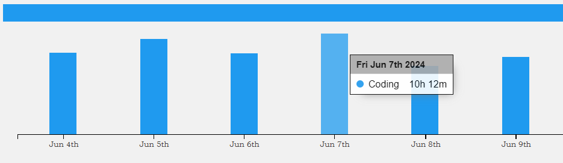

# lab-test

> Reproduce BigRec with Qwen1.5-0.5B model and Amazon CD dataset. Here, we choose SASRec as a baseline.

## BigRec

[Repo link](https://github.com/SAI990323/Grounding4Rec)

## SASRec

[Repo link](https://github.com/pmixer/SASRec.pytorch)

## Evaluate

At beginning, I adopted the same evaluation method as [BigRec repo](https://github.com/SAI990323/Grounding4Rec), so I got the result below.

### Result_original

The Result of current sota checkpoint:

|       Metric       |     @1     |     @3     |     @5     |    @10     |    @20     |
| :----------------: | :--------: | :--------: | :--------: | :--------: | :--------: |
|     SASRec_NG      |   0.0114   |   0.0252   |   0.0311   | **0.0403** | **0.0478** |
|      Qwen_NG       |   0.0270   |   0.0327   |   0.0330   |   0.0335   |   0.0341   |
| Qwen_popularity_NG | **0.0272** | **0.0337** | **0.0346** |   0.0356   |   0.0372   |
|     SASRec_HR      |   0.0114   |   0.0354   | **0.0498** | **0.0786** | **0.1076** |
|      Qwen_HR       |   0.027    |   0.0364   |   0.0372   |   0.0386   |   0.041    |
| Qwen_popularity_HR | **0.0272** | **0.0378** |   0.0402   |   0.0434   |   0.0498   |

If we let LLM return 4 items and choose the most similar one, we can get the results below(**This method may be wrong**):

|       Metric       |     @1     |     @3     |     @5     |    @10     |    @20     |
| :----------------: | :--------: | :--------: | :--------: | :--------: | :--------: |
|         NG         |   0.0426   |   0.0522   |   0.0530   |   0.0540   |   0.0557   |
|         HR         |   0.0426   |   0.0584   |   0.0604   |   0.0634   |   0.07    |

However, after I adopted the same method as [GenRec repo](https://github.com/rutgerswiselab/GenRec/tree/main), I got the result below. And this result corresponds with the reference result.

### Result_now

The Result of current sota checkpoint:

|       Metric       |     @1     |     @3     |     @5     |    @10     |    @20     |
| :----------------: | :--------: | :--------: | :--------: | :--------: | :--------: |
|         NG         |   0.0362   |   0.0432   |   0.0453   |   0.0485   |   0.0519   |
|         HR         |   0.0362   |   0.0484   |   0.0536   |   0.0634   |   0.077    |

## Coding Time

I have tried my best(

