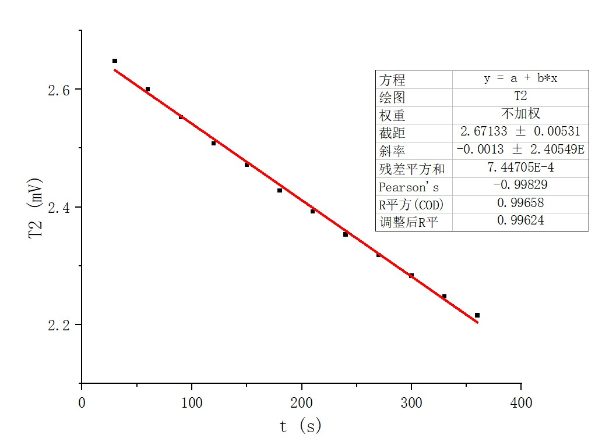

**稳态法测不良导体的导热系数**

    

**姓名：王昱**

**学号：PB21030814**

# 数据处理

* 实验测得铜盘的质量$m=878g$,已知铜盘的比热容$c=0.3709kJ/(kg·K)$

* 铜盘A和橡胶盘B的厚度与直径

$D_A/mm$| 130.60 | 130.62 | 130.58 |
:-: | :-: | :-: | :-: |
$h_A/mm$|7.40|7.42|7.38|

$\overline{D_A}=\frac{130.60+130.62+130.58}{3}=130.60mm$

$\overline{h_A}=\frac{7.40+7.42+7.38}{3}=7.40mm$

$D_B/mm$| 128.04 | 128.02 | 128.06 |
:-: | :-: | :-: | :-: |
$h_B/mm$|7.60|7.58|7.62|

$\overline{D_B}=\frac{128.04+128.02+128.06}{3}=128.04mm$

$\overline{h_B}=\frac{7.60+7.58+7.62}{3}=7.60mm$

* $T_1、T_2$的测量(具体数据在原始数据记录纸上)

$T_1、T_2$稳定读数分别为3.34mV、2.42mV,所以$T_1=3.34mV、T_2=2.42mV$

* 自由散热过程中$T_2$随时间的变化

序号| 1 | 2 | 3 | 4 | 5
:-: | :-: | :-: | :-: | :-: | :-:
$T_2/mV$|2.842|2.785|2.738|2.680|2.648
序号| 6 | 7 | 8 | 9 | 10
$T_2/mV$|2.600|2.552|2.508|2.471|2.428
序号| 11 | 12 | 13 | 14 | 15
$T_2/mV$|2.392|2.353|2.318|2.283|2.248
序号| 16 | 17 | 18 | 19 | 20
$T_2/mV$|2.216|2.180|2.148|2.120|2.090

取$T_2$相邻的前后六位数据(相邻数据间时间间隔大约是30s)得：

t/s| 30 | 60 | 90 | 120 | 150 | 180
:-: | :-: | :-: | :-: | :-: | :-: | :-: |
$T_2/mV$|2.648|2.600|2.552|2.508|2.471|2.428
t/s| 210 | 240 | 270 | 300 | 330 | 360
$T_2/mV$|2.392|2.353|2.318|2.283|2.248|2.216|

* 用Origin作图得到图像如下

由图可知，斜率$\frac{dT}{dt}=1.30\times10^{-3}mV/s$

导热系数公式为$$\lambda=\frac{m_{铜}c_{铜}h_B(R_A+2h_A)}{2\pi {R_B}^2(T_1-T_2)(R_A+h_A)}\times\frac{dT}{dt}$$

$$\therefore \lambda=\frac{0.878\times0.3709\times7.60\times(\frac{130.60}{2}+2\times7.40)}{2\times3.142\times\frac{128.04^2}{2^2}\times10^{-6}\times(3.34-2.42)\times(\frac{130.60}{2}+7.40)}\times1.30\times10^{-3}=0.150W/(m·K)$$

# 误差分析
①此次实验对时间的要求不高，在测量$T_2$的温度时，时间间隔在30s左右，但一般并不是30s，而计算$\frac{dT}{dt}$时 时间间隔使用的是30s，这会对结果的计算产生影响。 ②导热系数受温度的影响，实验过程中室内的温度也会对结果产生影响，空气流动也会对温度的测量产生影响。 ③测量铜盘和样品的直径时，不易确定它们的圆心，直径的测量存在误差。 ④插入的小孔中的热电偶可能没有与圆盘和圆筒底部完全良好的接触，热量的传导不完全。 ⑤三层盘面之间可能没有完全地贴合在一起，造成误差。

# 思考题
①此次实验将对$\frac{dQ}{dt}$的测量转化为对$\frac{dT}{dt}$(散热速率)的测量，而散热速率$\frac{dT}{dt}$可以通过记录铜盘在一定时间内温度的变化来求解。再利用公式$\frac{dQ}{dt}=\frac{\pi R_A(R_A+2h_A)}{\pi R_A(2R_A+2h_A)}\times\frac{dQ'}{dt}$和$\frac{dQ'}{dt}=mc\frac{dT}{dt}$来求解$\frac{dQ}{dt}$。这样就避免了对$\frac{dQ}{dt}$的测量，而对$\frac{dT}{dt}$的测量是较容易的。 ②因为稳态时冷却速度与温度成线性关系，便于通过拟合曲线直接得到$\frac{dT}{dt}$ ③过厚或者过薄都不会太好,一般会选择厚度为1厘米~2厘米左右；因为太厚的话,热量传递并达到平衡需要的时间就会更长；太薄的话,厚度测量的相对偏差占比就会偏大,从而造成的测量误差更大。

