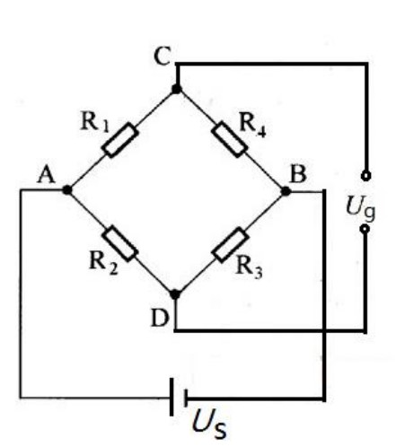
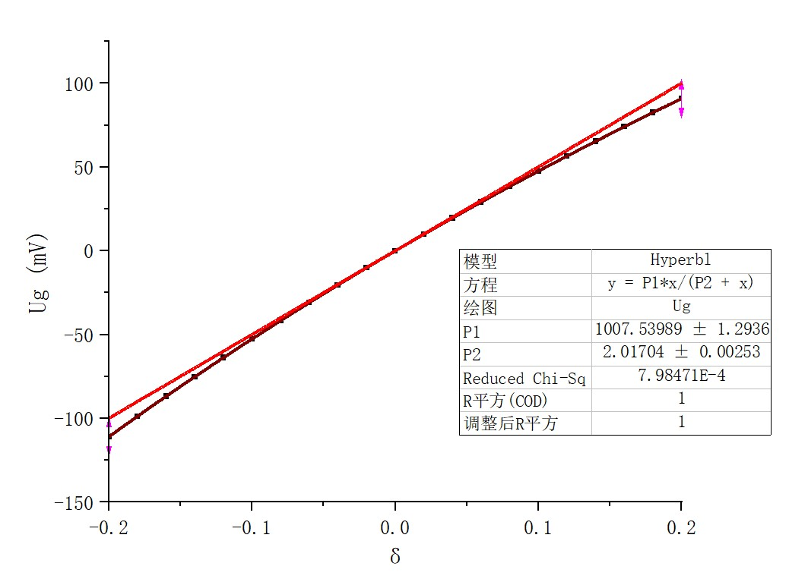
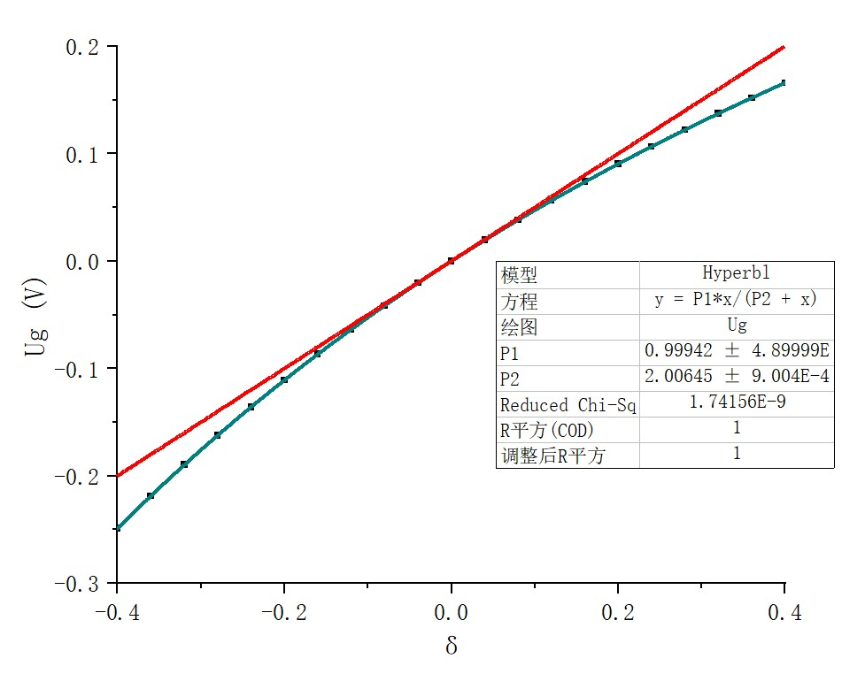
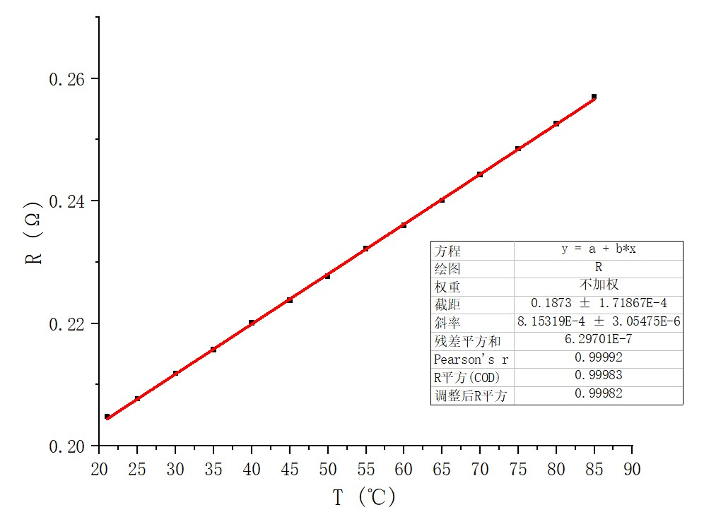

#
#
#

**直流非平衡电桥**

    

**姓名：王昱**
**学号：PB21030814**
**院系班级：计算机科学与技术学院21级2班**
**实验时间：2022.10.17 19:00**
**组内序号：1**

* **摘要**

本实验利用直流非平衡电桥探究了电桥电压与桥臂电阻相对改变量之间的关系，得出其线性关系成立范围与理论值相符；通过改变桥臂电阻重复测量，得出**随桥臂电阻增大，线性关系成立范围变宽，绝对灵敏度变低，相对灵敏度不变**的结论。基于此，实验中利用铜丝电阻随温度变化而改变这一特性，将其与桥臂电阻相连，定量测量出其线性关系，进而求出$T=0$和 $T=20℃$下铜丝电阻、电阻温度系数及其不确定度。利用本实验原理，实际工程和科学实验中很多连续变化的物理量能够被定量测量，从而得出许多材料特性随环境变化的关系。 
关键字:**非平衡电桥、灵敏度、电阻**

#
#

* **Abstraction**

In this experiment, the relationship between the bridge voltage and the relative change of the bridge arm resistance is explored by using the DC unbalanced bridge, and the established range of the linear relationship is consistent with the theoretical value. By changing the arm resistance and repeating the measurement, it is concluded that with the increase of the bridge arm resistance, the linear relationship establishes that the range becomes wider, the absolute sensitivity becomes lower, and the relative sensitivity remains unchanged. Based on this, the copper wire resistance changes with the temperature change this characteristic in the experiment, it is connected to the bridge arm resistance, the linear relationship is
quantitatively measured, and then the copper wire resistance, resistance temperature coefficient and its uncertainty are found at $T=0$ and $T=20°C$. Based on this experimental principle, many continuously changing physical quantities in practical engineering and scientific experiments can be quantitatively measured, resulting in the relationship between many material properties and changes in the environment. 
Keywords:**unbalanced DC bridge、sensitivity、resistance**

* **第一部分**
  
  **前言**

  直流电桥是一种精密的非电量测量仪器，有着广泛的应用。它的基本原理是利用已知阻值的电阻，通过比例运算，求出一个或几个未知电阻的阻值。直流电桥可分为平衡电桥和非平衡电桥。平衡电桥需要通过调节电桥平衡求得待测电阻阻值，如惠斯登电桥和开尔文电桥。由于**需要调节平衡，平衡电桥只能用于测量具有相对稳定状态的物理量**，比如固定电阻的阻值，而对变化电阻的测量有一定的困难。如果**采用直流非平衡电桥，则能对变化的电阻进行动态测量**，直流非平衡电桥输出的非平衡电压能反映电阻的变化，在实际应用中许多被测物理量都与电阻有关，如力敏电阻、热敏电阻、光敏电阻等，只要将这些特殊的电阻装在电桥的一个桥臂上，当某些被测量发生变化时，就引起电阻值的变化，从而输出对应的非平衡电压，就能间接测出被测量的变化。利用这种原理我们可制作电子天平、电子温度计、光通量计等。因此直流非平衡电桥与平衡电桥相比，有着更为广泛的应用。

#
#

* **第二部分**

  **实验原理**

  **实验仪器**：直流稳压电源、电阻箱、万用表、Keithy2000、铜丝、加热台、温度计、导线等。
  **实验原理**：当$\frac{R_3}{R_2}=\frac{R_4}{R_1}$时，电桥平衡，有$U_g=0$。用$R_4+\Delta R$代替$R_4$时，$\frac{R_3}{R_2}$不等于$\frac{R_4+\Delta R}{R_1}$,此时$U_g$不等于$0$，为非平衡状态。可以计算出输出的非平衡电压为$U_g=\frac{R_2R_4+R_2\Delta R-R_1R_3}{(R_1+R_4)(R_2+R_3)+\Delta R(R_2+R_3)}$
  可以得到电桥的三种形式：
  **①等臂电桥：$R_1=R_2=R_3=R_4=R_0$ ②卧式电桥：$R_1=R_4,R_2=R_3$ ③立式电桥：$R_1=R_2,R_3=R_4$**
  将等臂电桥代入化简得：$U_g=\frac{U_s}{4}\delta\frac{1}{1+\frac{\delta}{2}}$,其中$\delta=\frac{\Delta R}{R_0}$称为电阻应变量，令$\Delta R<<R_0$,则$\delta \to 0$,于是有：$U_g=\frac{U_s}{4}\delta=\frac{U_s}{4R_0}\Delta R$,$U_g$与$\Delta R$呈线性关系。
  

  

* **第三部分**
  
  **实验内容**

  1、用外接电阻箱法研究非平衡电桥的$𝑈_g$与$\delta$关系，作出$𝑈_𝑔$∼𝛿曲线，并对此实验曲线与理想直线之间进行误差分析，以确定电桥输出的线性范围和灵敏度。
（1）调节电源输出电压，使其输出电压为$𝑈_𝑠 = 2.0𝑉$。电路如图所示并用导线连接好，用高精度台式万用表（$Keithy2000$）来测量$𝑈_𝑔$。
（2）先取电桥为等臂，即：$𝑅_1 = 𝑅_2 = 𝑅_3 = 𝑅_4 ≡ 𝑅_0 = 1kΩ$，由于导线存在有一定的电阻，微调改变$𝑅_3$的值，使$𝑈_𝑔$为零，此时电桥平衡。（记录$𝑅_3$的具体值）
（3）改变$𝑅_4$从800至1200$Ω$，每次变化量为20$Ω$，按顺序记下各$𝑈_𝑔$的值作出$𝑈_𝑔$∼𝛿（或$𝑈_𝑔$ ∼ $\Delta R$）散点图（或曲线）。
（4）根据公式过原点作一条直线(斜线)$𝑈_g^{理线}$∼$\delta$ ，并与实际测量的$𝑈_g^{实线}$∼$\delta$曲线进行比较，得出$𝑈_𝑔$∼𝛿的线性关系成立的𝛿取值范围。
（5）测算在此桥臂电阻值下，电桥在零点附近的绝对灵敏度。 
  2、保持电源电压$𝑈_𝑠=2.0𝑉$不变，改变$𝑅_0$的值，研究非平衡电桥的线性范围和灵敏度与$𝑅_0$的关系。
（1）保持电源电压$𝑈_𝑠=2.0𝑉$不变，取电桥为等臂，即$𝑅_1=𝑅_2=𝑅_3=𝑅_4≡𝑅_0$，$𝑅_0$分别取$5000Ω$和$50Ω$。微调$𝑅_3$使$𝑈_𝑔$为零，此时电桥平衡。（记录$𝑅_3$调整后的具体值）
（2）改变$𝑅_4$的电阻，取值范围取($𝑅_0 − 20\%𝑅_0,𝑅_0 + 20\%𝑅_0$)。测量并记录数据，画图测算线性范围，并计算（零点）绝对灵敏度(和相对灵敏度)。
（3）结合实验内容1，写出总结。总结包括以下二个方面：
 a) 根据实测数据，分析$𝑈_𝑔$∼𝛿之间关系（近似满足）线性关系时的$𝑅_4$取值范围，此范围的长度$\Delta𝑅_4$与$𝑅_0$大小之间的关系（变宽、变窄）
 b) 零点绝对灵敏度大小与$𝑅_0$大小之间的关系（变高、变低）。
  
 3、利用搭建的直流非平衡电桥，测量并记录铜丝$Cu$的电阻，以及其电阻随温度的改变值。计算铜丝的电阻温度系数，在$0℃$和$20℃$时的值和不确定度。
（1）取桥臂电阻为$50Ω$，用$Keithy2000$来测量桥路输出电压$𝑈_𝑔$。保持恒压源输出电压为$2.0V$,微调$𝑅_3$使电桥平衡。平衡后,记录对应的$𝑈_{𝑔_0𝑚𝑖𝑛}$。
（2）把$3m$长，直径为$0.60mm$的$Cu$丝串联到$𝑅_4$所在的桥臂上。把$Cu$丝浸没在陶瓷杯内的水中，用温度计测量水温$t$，记录水温并测量当前水温下桥路输出电压$𝑈_𝑔(𝑡)$值，并与没有串联$Cu$丝时$𝑈_{𝑔_0𝑚𝑖𝑛}$比较，计算$Cu$丝的当前温度下的电阻值$𝑅_{𝐶𝑢(𝑡)}$。
（3）用加热台对杯子里水进行加热，铜丝温度缓慢上升。每隔$5℃$记录一下对应的$𝑈_{𝑔(𝑡)}$值，直到$85℃$为止。
 
根据各个不同温度点下的$𝑈_{𝑔(𝑡)}$值，利用简单的线性关系，计算出铜丝在各个温度点下的电阻值$𝑅_{𝐶𝑢(𝑡)}$，并作出$𝑅_{𝐶𝑢}∼𝑡$的散点图以及拟合直线。求出拟合直线的斜率$𝑘=𝑑𝑅/𝑑𝑡$，并推算$0℃$和$20℃$时的铜丝电阻（拟合）值$𝑅̂_0$和$𝑅̂_2$。
根据电阻温度系数定义式$\alpha_𝑇$=$𝑘/𝑅_𝑇$,计算$Cu$丝在$𝑡 = 0℃$和$𝑡 = 20℃$处的电阻温度系数。最后，分析和计算二个不同温度处的电阻温度系数$\alpha_𝑡$，以及在$P=95\%$置信概率下的不确定度$𝑢_\alpha$（$A$ 类不确定度）。
另外本实验用非平衡电桥测量出铜丝电阻值，也可与电阻定律公式$𝑅_0=\frac{\rho l}{S}$的计算值进行比较，分析产生差别的原因。铜线参数如下： $\rho=0.0178Ω⋅𝑚𝑚^2/𝑚$;$𝑙=3m$;$\phi=0.60mm(1atm,20℃)$。

* **第四部分**
  
  **实验记录与处理**

$R_0=1000\Omega$时，桥路两端点C、D输出电压与桥臂电阻改变的关系($R_3=999.95\Omega$)

$R_4/\Omega $| $800$ | $820$ | $840$ | $860$ | $880$ | $900$ |
:-: | :-: | :-: | :-: | :-: | :-: | :-: |
$\Delta R=R_4-R_0/\Omega$|$-200$|$-180$|$-160$|$-140$|$-120$|$-100$|
$\delta=\Delta R/R_0 $| $-0.2$ | $-0.18$ | $-0.16$ | $-0.14$ | $-0.12$ | $-0.1$ |
$U_g/mV$|$110.9381$|$98.7360$|$86.8096$|$75.1336$|$63.7063$ | $52.5392$ |
$R_4/\Omega $| $920$ | $940$ | $960$ | $980$ | $1000$ | $1020$ |
$\Delta R=R_4-R_0/\Omega$|$-80$|$-60$|$-40$|$-20$|$0$|$20$|
$\delta=\Delta R/R_0 $| $-0.08$ | $-0.06$ | $-0.04$ | $-0.02$ | $0$ | $0.02$ |
$U_g/mV$|$41.5841$|$30.8543$|$20.3435$|$10.0308$|$0$ | $-9.8904$ |
$R_4/\Omega $| $1040$ | $1060$ | $1080$ | $1100$ | $1120$ | $1140$ |
$\Delta R=R_4-R_0/\Omega$|$40$|$60$|$80$|$100$|$120$|$140$|
$\delta=\Delta R/R_0 $| $0.04$ | $0.06$ | $0.08$ | $0.1$ | $0.12$ | $0.14$ |
$U_g/mV$|$-19.5885$|$-29.0994$|$-38.4258$|$-47.5818$|$-56.5466$ | $-65.3559$ |
$R_4/\Omega $| $1160$ | $1180$ | $1200$ |  |  |  |
$\Delta R=R_4-R_0/\Omega$|$160$|$180$|$200$||||
$\delta=\Delta R/R_0 $| $0.16$ | $0.18$ | $0.2$ |  |  |  |
$U_g/mV$|$-74.0796$|$-82.5758$|$-90.9148$| | | |
 

$R_0=5000\Omega$时，桥路两端点C、D输出电压与桥臂电阻改变的关系($R_3=4999.15\Omega$)
$R_4/\Omega $| $3000$ | $3200$ | $3400$ | $3600$ | $3800$ | $4000$ |
:-: | :-: | :-: | :-: | :-: | :-: | :-: |
$\Delta R=R_4-R_0/\Omega$|$-2000$|$-1800$|$-1600$|$-1400$|$-1200$|$-1000$|
$\delta=\Delta R/R_0 $| $-0.4$ | $-0.36$ | $-0.32$ | $-0.28$ | $-0.24$ | $-0.2$ |
$U_g/V$|$0.249970$|$0.219487$|$0.190452$|$0.162770$|$0.136337$ | $0.111103$ |
$R_4/\Omega $| $4200$ | $4400$ | $4600$ | $4800$ | $5000$ | $5200$ |
$\Delta R=R_4-R_0/\Omega$|$-800$|$-600$|$-400$|$-200$|$0$|$200$|
$\delta=\Delta R/R_0 $| $-0.16$ | $-0.12$ | $-0.08$ | $-0.04$ | $0$ | $0.04$ |
$U_g/V$|$0.086953$|$0.063827$|$0.041664$|$0.020402$|$0$ | $-0.019605$ |
$R_4/\Omega $| $5400$ | $5600$ | $5800$ | $6000$ | $6200$ | $6400$ |
$\Delta R=R_4-R_0/\Omega$|$400$|$600$|$800$|$1000$|$1200$|$1400$|
$\delta=\Delta R/R_0 $| $0.08$ | $0.12$ | $0.16$ | $0.2$ | $0.24$ | $0.28$ |
$U_g/V$|$-0.038459$|$-0.056602$|$-0.074077$|$-0.090898$|$-0.107127$ | $-0.122793$ |
$R_4/\Omega $| $6600$ | $6800$ | $7000$ |  |  |  |
$\Delta R=R_4-R_0/\Omega$|$1600$|$1800$|$2000$||||
$\delta=\Delta R/R_0 $| $0.32$ | $0.36$ | $0.4$ |  |  |  |
$U_g/V$|$-0.137918$|$-0.152534$|$-0.166648$| | | |
 

$R_0=50\Omega$时，桥路两端点C、D输出电压与桥臂电阻改变的关系($R_3=49.98\Omega$)
$R_4/\Omega $| $30$ | $32$ | $34$ | $36$ | $38$ | $40$ |
:-: | :-: | :-: | :-: | :-: | :-: | :-: |
$\Delta R=R_4-R_0/\Omega$|$-20$|$-18$|$-16$|$-14$|$-12$|$-10$|
$\delta=\Delta R/R_0 $| $-0.4$ | $-0.36$ | $-0.32$ | $-0.28$ | $-0.24$ | $-0.2$ |
$U_g/V$|$0.248809$|$0.218558$|$0.189616$|$0.162093$|$0.135795$ | $0.110689$ |
$R_4/\Omega $| $42$ | $44$ | $46$ | $48$ | $50$ | $52$ |
$\Delta R=R_4-R_0/\Omega$|$-8$|$-6$|$-4$|$-2$|$0$|$2$|
$\delta=\Delta R/R_0 $| $-0.16$ | $-0.12$ | $-0.08$ | $-0.04$ | $0$ | $0.04$ |
$U_g/V$|$0.086633$|$0.063573$|$0.041476$|$0.020274$|$0$ | $-0.019574$ |
$R_4/\Omega $| $54$ | $56$ | $58$ | $60$ | $62$ | $64$ |
$\Delta R=R_4-R_0/\Omega$|$4$|$6$|$8$|$10$|$12$|$14$|
$\delta=\Delta R/R_0 $| $0.08$ | $0.12$ | $0.16$ | $0.2$ | $0.24$ | $0.28$ |
$U_g/V$|$-0.038374$|$-0.056439$|$-0.073869$|$-0.090635$|$-0.106746$ | $-0.122352$ |
$R_4/\Omega $| $66$ | $68$ | $70$ |  |  |  |
$\Delta R=R_4-R_0/\Omega$|$16$|$18$|$20$||||
$\delta=\Delta R/R_0 $| $0.32$ | $0.36$ | $0.4$ |  |  |  |
$U_g/V$|$-0.137539$|$-0.152018$|$-0.166056$| | | |
 

$R_0=50\Omega,R_3=49.98\Omega$时，桥路两端点C、D输出电压与温度的关系($U_{g0min}=-0.0189mV$)

| $T/℃ $| $21$ | $25$ | $30$ | $35$ | $40$ | $45$ |
|:-: | :-: | :-: | :-: | :-: | :-: | :-: |
|$U_g/mV$|$-2.0670$|$-2.0962$|$-2.1370$|$-2.1761$|$-2.2196$|$-2.2572$|
|$R_{Cu}/\Omega $| $0.2048$ | $0.2077$ | $0.2118$ | $0.2157$ | $0.2201$ | $0.2238$ |
|$T/℃ $| $50$ | $55$ | $60$ | $65$ | $70$ | $75$ |
|$U_g/mV$|$-2.2963$|$-2.3408$|$-2.3789$|$-2.4196$|$-2.4619$|$-2.5044$|
|$R_{Cu}/\Omega $| $0.2277$ | $0.2322$ | $0.2360$ | $0.2401$ | $0.2443$ | $0.2485$ |
|$T/℃ $| $80$ | $85$ |  |  |  |  |
|$U_g/mV$|$-2.5448$|$-2.5891$|||||
|$R_{Cu}/\Omega $| $0.2526$ | $0.2570$ |  |  |  |  |

* $R_0=1000\Omega$时，$U_g$与$\delta$的变化关系(**这里把$U_g$的正负号调换方便作图观察**)

* $R_0=5000\Omega$时，$U_g$与$\delta$的变化关系

* $R_0=50\Omega$时，$U_g$与$\delta$的变化关系

* $R_{Cu}$与$T$的变化关系

 

* **利用公式**
$$\frac{|U_g^{实线}-U_g^{理线}|}{|U_g^{理线}|}≤0.05$$
$$\delta=\frac{\Delta R}{R_0}$$
$$S_{U_a}=\frac{U_s}{4R_0}$$
$$S_{U_r}=\frac{U_s}{4}$$**可以求出不同$R_0$条件下$U_g-\delta$线性成立时$\delta、\Delta R_4$的范围以及相对灵敏度和绝对灵敏度**

    **当$R_0=1000\Omega$时，根据拟合结果算得$-0.098≤\delta≤0.104，-98\Omega<\Delta R_4<104\Omega,S_{U_a}=5\times10^{-4}A,S_{U_r}=0.5V$**
    **当$R_0=5000\Omega$时，根据拟合结果算得$-0.095≤\delta≤0.105，-475\Omega<\Delta R_4<525\Omega,S_{U_a}=1\times10^{-4}A,S_{U_r}=0.5V$**
    **当$R_0=50\Omega$时，根据拟合结果算得$-0.097≤\delta≤0.103，-4.85\Omega<\Delta R_4<5.15\Omega,S_{U_a}=1\times10^{-2}A,S_{U_r}=0.5V$**
    总结：**①根据$-\frac{10}{105}<\delta_理<\frac{10}{95}$,可知随着R_0的变化，实验测量的$\delta$范围与理论值相近，在误差范围内可认为与理论值相符 ②随着$R_0$变大,$\Delta R_4$变宽 ③随着$R_0$增大，绝对灵敏度变低，相对灵敏度不变。**
     
 斜率$k=8.153\times10^{-4}\Omega/℃$
  斜率的标准差：$s_k=k\sqrt{(\frac{1}{r^2}-1)/(n-2)}=4.708\times10^{-6}\Omega/℃$
  斜率的扩展不确定度：$u_k=t_ps_k=1.026\times10^{-5}\Omega/℃(P=0.95)$
  截距$b=0.1873\Omega$
  截距的标准差：$s_b=\sqrt{\overline{T^2}}s_k=2.649\times10^{-4}\Omega$
  截距的扩展不确定度：$u_b=t_bs_b=5.775\times10^{-4}\Omega(P=0.95)$
  $T=0℃$时，$\hat{R}=b=0.1873\Omega$
  $T=20℃$时，$\hat{R_1}=8.153\times10^{-4}\times20+0.1873=0.2036\Omega$
  $R_1$的标准差:$s_{R_1}=\sqrt{\overline{(T-T_{R_1})^2}}s_k=1.801\times10^{-4}\Omega$
  $R_1$的扩展不确定度：$u_{R_1}=t_ps_{R_1}=3.926\times10^{-4}\Omega(P=0.95)$
   对$\alpha_T=k/R_T$取对数、全微分得到不确定度传递公式:$\frac{u_\alpha}{\alpha}=\sqrt{(\frac{u_R}{R})^2+(\frac{u_k}{k})^2}$
  $T=0℃$时，$\alpha=k/b=4.353\times10^{-3}(℃)^{-1}$，不确定度$u_\alpha=\alpha\sqrt{(\frac{u_R}{R})^2+(\frac{u_k}{k})^2}=0.06\times10^{-3}(℃)^{-1}(P=0.95)$
  $T=20℃$时，$\alpha=k/R_1=4.004\times10^{-3}(℃)^{-1}$，不确定度$u_\alpha=\alpha\sqrt{(\frac{u_{R_1}}{R_1})^2+(\frac{u_k}{k})^2}=0.05\times10^{-3}(℃)^{-1}(P=0.95)$
   所以，$T=0℃$时$\alpha=(4.35\pm0.06)\times10^{-3}(℃)^{-1}(P=0.95)$   $T=20℃$时$\alpha=(4.00\pm0.05)\times10^{-3}(℃)^{-1}(P=0.95)$
     

* **第五部分**

* **实验总结**：
  ①前两个实验主要探究了非平衡电桥中$U_g$与$\delta$的关系，以及对于不同$R_0$实验中这种关系的变化和相应灵敏度的关系。实验中通过测量记录和作图，计算出$U_g$与$\delta$满足线性关系时$δ$的取值与理论值相符；随着$R_0$变大，$\Delta R_4$变宽，绝对灵敏度变低，相对灵敏度不变。 ②第三个实验主要探究了铜丝电阻和电阻温度系数随温度的变化关系。实验中将铜丝接入电路，测量记录不同温度下$U_g$的值，进而计算出对应阻值，作出$R-T$图像并拟合。通过拟合结果推算出$T=0$和$T=20℃$下铜丝阻值和电阻温度系数及其不确定度。从结果看出，随温度升高，铜丝电阻增大且二者成线性关系。 ③实验中铜丝电阻也可通过铜丝参数，利用电阻决定式推出。这种结果与本实验测量结果误差来源如下：
    **1.测量$U_g$时，温度不断变化，读数时刻选择存在误差，且示数波动剧烈，造成读数存在误差。
    2.铜丝受热速度不均匀，而实验中用等高处水温代替铜丝温度存在误差。
    3.铜丝使用时间过长，电阻率因铜丝老化而变化。**

* **思考题**
  ①平衡电桥是把待测电阻与标准电阻进行比较，通过调节电桥平衡，从而测得待测电阻值，如单臂直流电桥：惠斯登电桥、双臂直流电桥：开尔文电桥。它们只能用于测量具有相对稳定状态的物理量。非平衡电桥的基本原理是通过桥式电路来测量电阻，根据电桥输出的不平衡电压，再进行运算处理，从而得到引起电阻变化的其它物理量，如温度、压力、形变等。 ②若$R<1000\Omega,$则$\Delta R<0$,$\frac{1}{1+\frac{\delta}{2}}>1$,$|U_g|>|\frac{U_s}{4}\delta|$ 若$R>1000\Omega,$则$\Delta R>0$,$\frac{1}{1+\frac{\delta}{2}}<1$,$|U_g|<|\frac{U_s}{4}\delta|$。 ③为使误差小于$5\%$的线性范围，根据实验原理公式，代入到$\frac{|U_g^{实线}-U_g^{理线}|}{|U_g^{理线}|}≤0.05$，易知$\Delta R_{max}=50\Omega$时，$R_{0min}=500\Omega$ 为保证测量灵敏度，设热敏电阻阻值随温度线性变化，$\frac{U_s}{4R_0}≥\frac{1mV}{5\Omega}$,$R_{0max}=2500\Omega$ ④测量精确度：$\frac{4.00-3.93}{3.93}\times100\%=1.78\%$,误差分析见总结部分。

