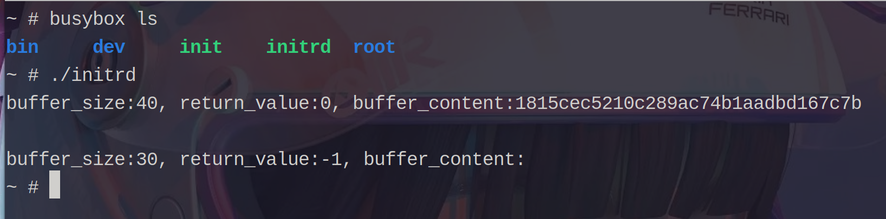

# Lab1

## Linux内核裁剪过程 

* first version `12.4MB`
***
* second version `10.1MB`
  * delete `Kernel hacking` 
***
* third verison `7.2MB`
  * delete `Networking support`
***
* fourth verison `6.4MB`
  * change `General setup_Compiler optimization level (Optimize for size (-Os))`
***
* fifth version `6.1MB`
  * delete `Security options`
  * delete `Library routines`
  * delete `Cryptographic API`
  * delete `Device Drivers_USB support`
***
* sixth version `5.0MB`
  * change `General setup_Kernel compression mode (LZMA)`
***
* seventh version `4.8MB`
  * delete `File systems_Quota support`
  * delete `File systems_The Extended 4 (ext4) filesystem`
***
* eighth version `4.5MB`
  * delete `General setup_Control Group support`
  * delete `Processor type and features_Enable 5-level page tables support`
  * delete `General setup_Compile the kernel with warnings as errors`
  * delete `General setup_Automatically append version information to the version string`
  * delete `General setup_Auditing support`
  * delete `General setup_Profiling support`
  * delete `Processor type and features_Check for low memory corruption`
  * delete `Processor type and features_Indirect Branch Tracking`
  * delete `Processor type and features_Memory Protection Keys`
  * delete `General architecture-dependent options_Kprobes`
  * delete `General architecture-dependent options_Stack Protector buffer overflow detection`
  * delete `General architecture-dependent options_Provide system calls for 32-bit time_t`
  * delete `Processor type and features_EFI runtime service support`
***
* ninth version `3.8MB`
  * delete `Processor type and features_Symmetric multi-processing support`
  * delete `Processor type and features_Single-depth WCHAN output`
  * delete `Processor type and features_Linux guest support`
  * delete `Processor type and features_/dev/cpu/*/msr - Model-specific register support`
  * delete `Processor type and features_/dev/cpu/*/cpuid - CPU information support`
  * delete `Processor type and features_Machine Check / overheating reporting`
  * delete `Processor type and features_Build a relocatable kernel`
  * delete `Processor type and features_kexec system call` 
  * delete `Processor type and features_kernel crash dumps`
  * change `Processor type and features_Processor family (Intel P4 / older Netburst based Xeon)`
  * delete `Processor type and features_Reroute for broken boot IRQs`
  * delete `Processor type and features_IOPERM and IOPL Emulation`
  * delete `Processor type and features_CPU microcode loading support`
  * delete `Device Drivers_Watchdog Timer Support`
  * delete `Device Drivers_Sound card support`
  * delete `Device Drivers_Mailbox Hardware Support`
  * delete `Device Drivers_Multiple devices driver support (RAID and LVM)`

> 实际上上面是我第二次裁剪Linux内核的过程。
> 第一次由于没有考虑到对后续实验的影响，为了裁剪内核(使得内核大小尽量小)去掉了很多可能有影响的选项。

* 对`Linux`内核大小/编译时间有影响的选项
  * `Kernel hacking` 
  * `Networking support`
  * `General setup_Compiler optimization level (Optimize for size (-Os))`
  * `General setup_Kernel compression mode (LZMA)`

* 通过`make menuconfig`命令来设置参数
  * `General setup_Kernel compression mode`共有6种模式，通过`<help>`可以查询到`LZMA`对应的`kernel`大小最小。
  * `General setup_Compiler optimization level`共有2个选择，`Optimize for size (-Os)`是为了优化大小的。
  * `Kernel hacking`和`Networking support`可以通过上面的裁剪过程看出，删除之后Linux内核的大小明显缩小。
  
  
## kernel panic

* 通过将`init.c`中的`while(1){}`删除换成`return 0;`可以造成`kernel panic`
> 原因是`init`将会作为第一个用户态进程被启动，成为所有后续进程的父进程。如果`init`返回了那么就会导致后续进程没有父进程，进而导致`kernel panic`
 
## 自定义Syscall测试

 

`syscall_test`文件夹下是测试所需要的文件
