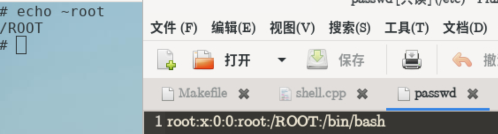
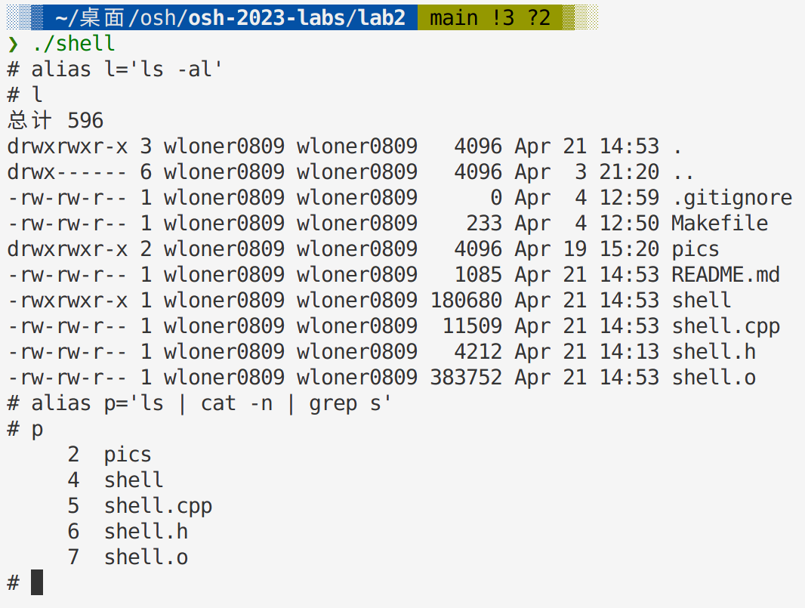
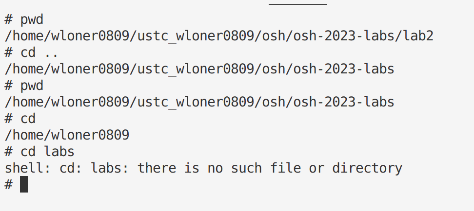
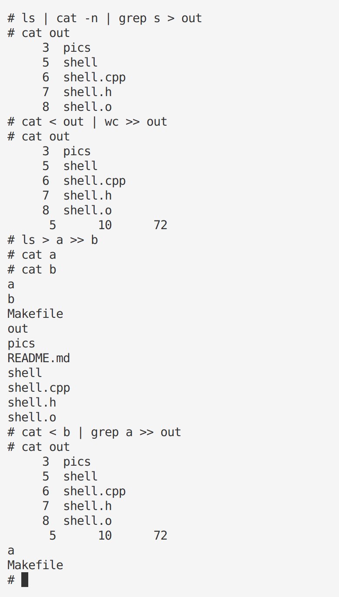
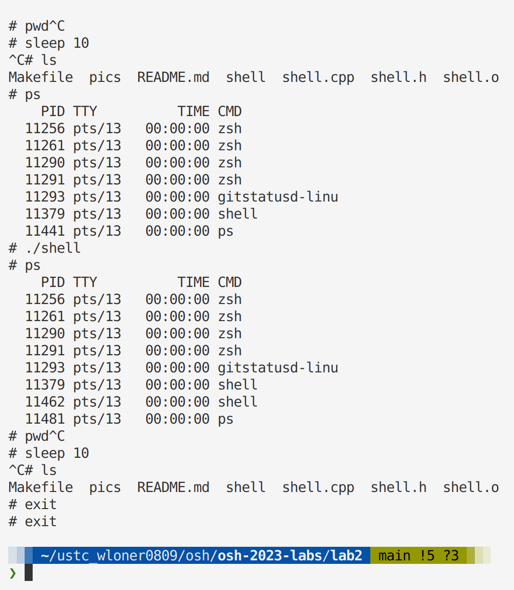
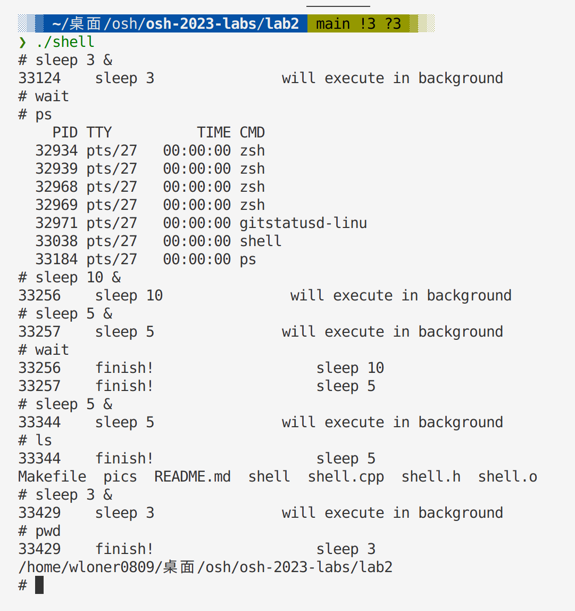
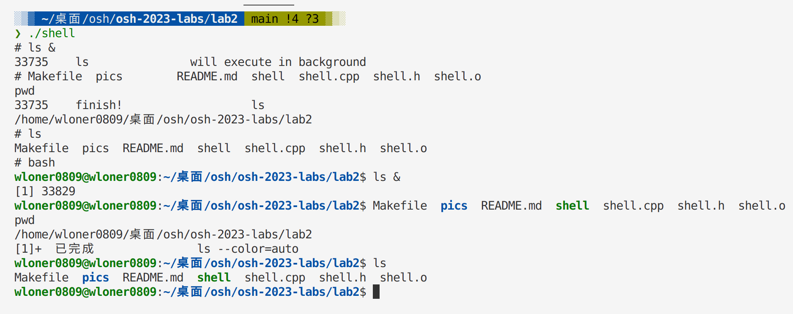

# Lab2

## Make and Run
```C++
//use make to compile
make                                                                         
g++ -c -Wall shell.cpp -o shell.o
g++ shell.o -o shell
//use ./shell to run
./shell   
```

## Optional section
### `cd`在没有第二个参数时，默认进入家目录(5%)
### 支持`CTRL-D`(5%)
  * if there is no input and you input `CTRL-D`, then the shell can exit directly
  * Otherwise, you need to input `CTRL-D` twice to stop the shell 
### `echo $SHELL`(5%)
  * also support `echo $HOME`
### `echo ~root`(5%)
  * support `echo ~root` correctly
> 
> I modify root path in vlab, `echo ~root` can display right path /ROOT(rather than /root)
### 支持`history`(5%)
  * support `history -n`    
  * support `!n`    
  * support `!!`
  * if the same cmd is input continuously, then history just stores one.
  * `!!` corresponding cmd won't be stored in history.
  * `!n` corresponding cmd will be stored in history, but if the same cmd is input continuously, then history just stores one.
### 支持`alias`(5%)


### 支持`A=1 env`(5%)


## Test the function of each part
>  Actually, this section is used to provide examples about how shell executes in my computer.

### `Part1`


> If cd cmd executes correctly, then output current work path.Otherwise output error info.

### `Part2 and Part3`



> Attention: You should input just `one` space before and after "|" "<" ">" ">>"

> like " | "    " < "    " > "  " >> "

### `Part4`


> When stoping sleep cmd, "# " will output after "^C", which is different from Bash. But it can just read instructions and execute correctly. I also asked TA Huang, he said it was OK, so I think it's OK here.

### `Part5`





> This part may be different from bash

* When the `wait` cmd finishes, the output info is in the order of when commands execute. That's to say if I run `sleep 100 &` first and `sleep 5 &` second, the output info is `sleep 100 finish` and `sleep 5 finish`(although sleep 5 may finish first), so the order of output info doesn't depend on when they finish.
* I output finish info first and output execute cmd info second, which is different from bash

> Something the same as bash

* if I input `sleep 3 &` and it finishes in background, and I input `wait` next, there is no output info, which is the same as bash.
* If I input `ls &`, the response of my shell is the same as `bash`, see the last pic.