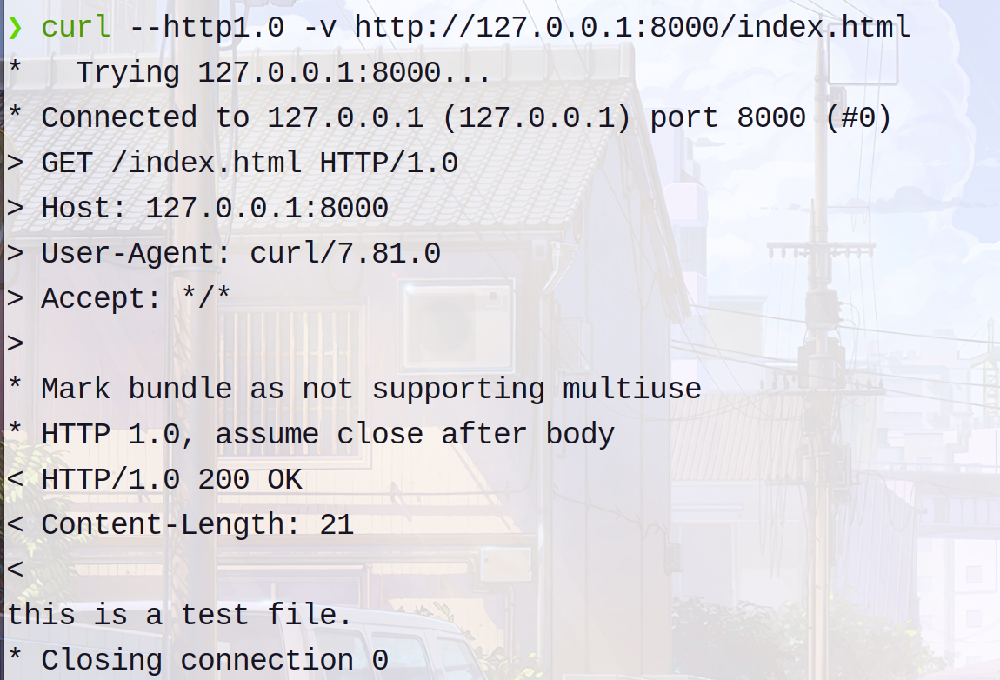
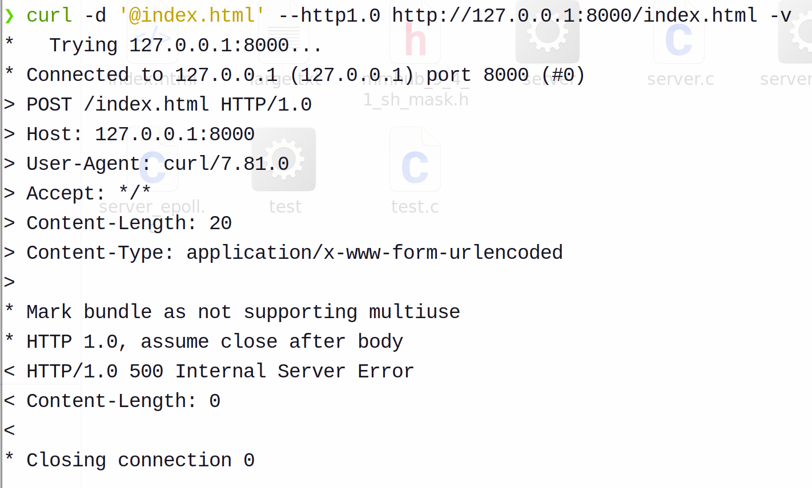
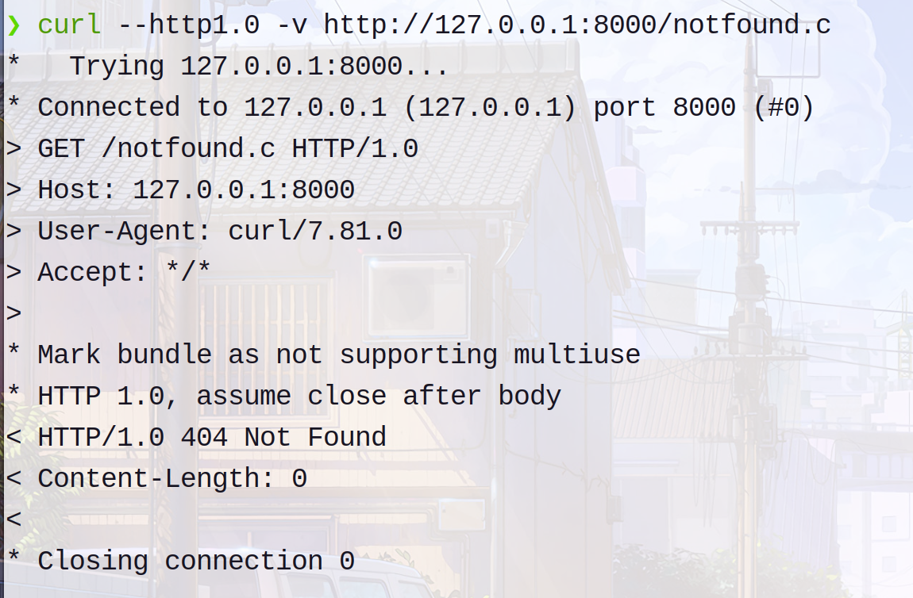
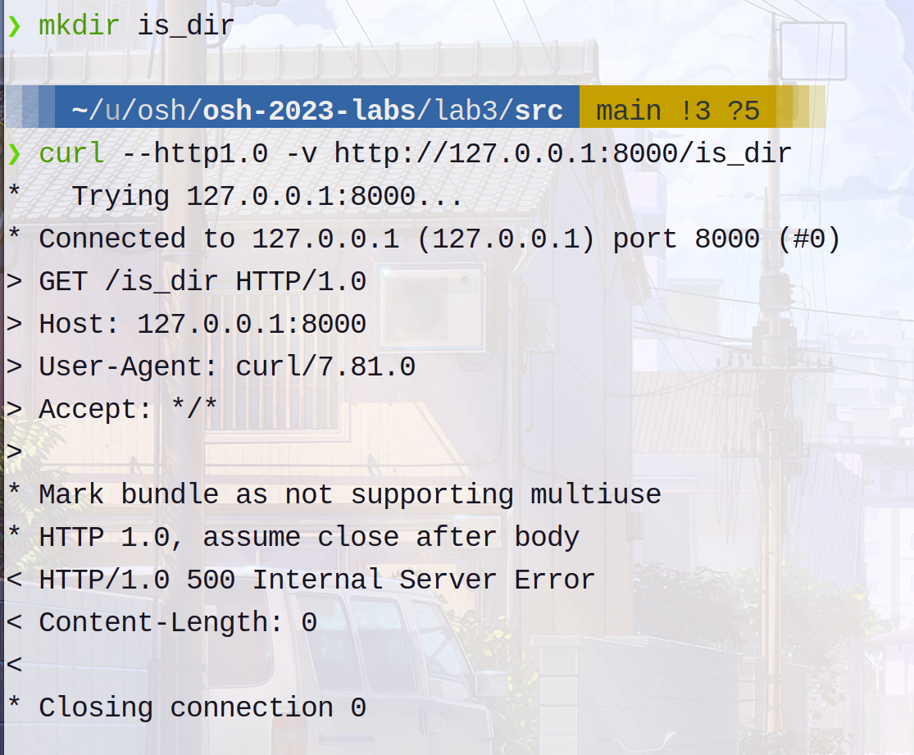
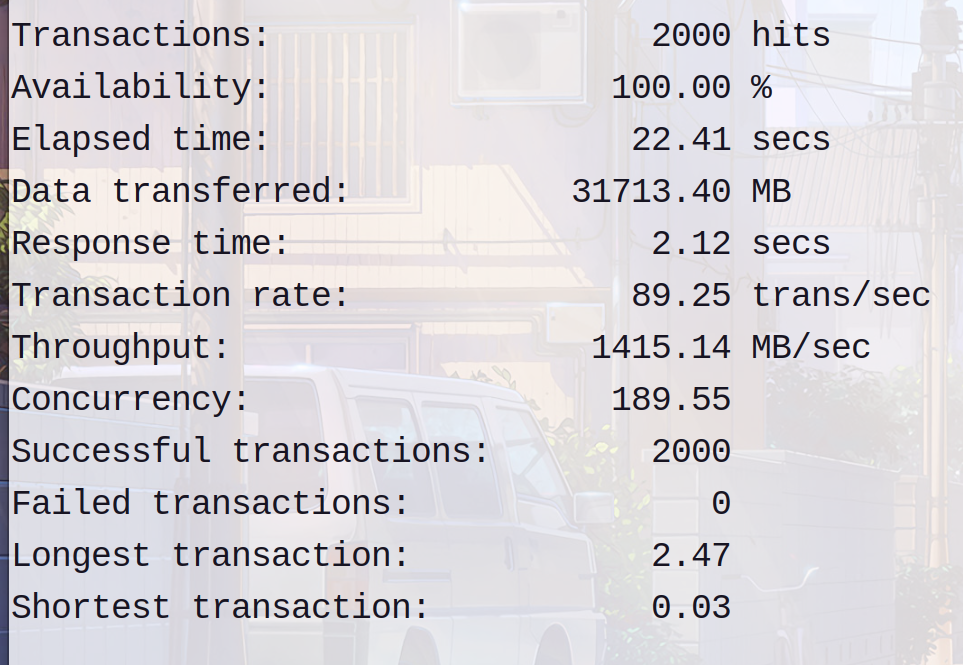
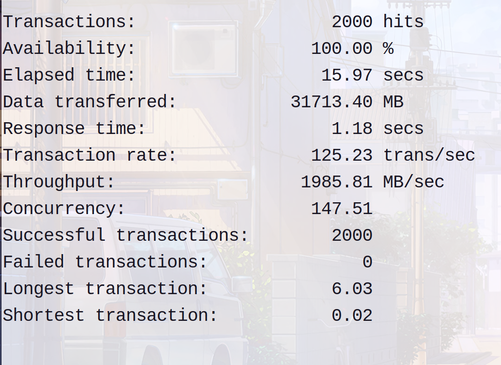
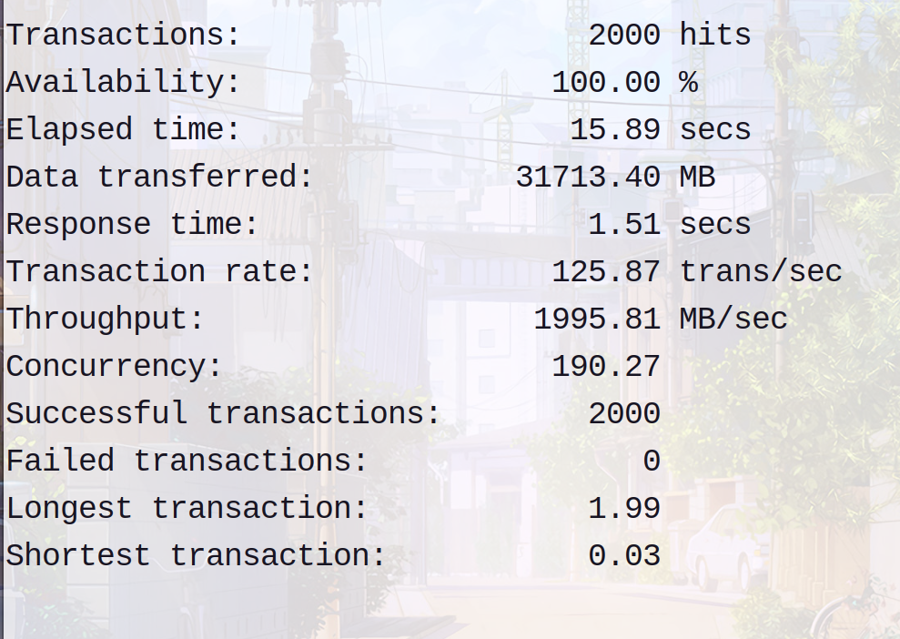

# Lab3

## 实现的选做
* 使用线程池机制
* 使用I/O复用
## 编译和运行方法
```
//编译和运行多线程部分
gcc server.c -o server 
./server
//编译和运行epoll部分
gcc server_epoll.c -o server_epoll 
./server_epoll
```

## 整体设计以及使用的技术

### 错误处理函数
```C
void sol_error(char *error_msg)
{
    perror(error_msg);
    exit(EXIT_FAILURE);
}
```
### 解析与检验http头,实现读取文件资源部分
> 此部分用两个函数处理的
* `parse_request()`函数
  * 解析出文件的路径,一经检测到跳出当前路径就返回-1,代表要写入`500 Internal Server Error`
  * 判断请求头是否完整,主要是看是否有HTTP1.0或HTTP1.1以及HOST。这里HTTP1.1请求不写入`500 Internal Server Error`(问lly TA说这里不是重点，故不写入`500 Internal Server Error`)
* `handle_clnt()`函数
  * 在读`clnt_sock`时判断请求的method是否为GET,不是则写入`500 Internal Server Error`
    * 这里注意`POST`请求时request中含有文件内容，所以单纯通过"\r\n\r\n"来判断是否读完不正确
  * 如果文件不存在(包括请求如果是目录不存在的情况),则写入`404 Not Found`
  * 如果请求的是目录且存在,写入`500 Internal Server Error`

> 注意如果是`404 Not Found`或者`500 Internal Server Error`，则Content-Length输出是0
### 多线程部分

```C
typedef struct
{
    pthread_mutex_t mutex;

    // 两个条件变量
    pthread_cond_t task_queue_not_full;
    pthread_cond_t task_queue_not_empty;

    int *task_queue;
    int task_queue_front;
    int task_queue_tail;
    int task_queue_cur_size; // 当前的队列大小

    int thread_num; // 线程池中开启的线程数
    pthread_t *threads;

} threadpool;
```
> 结构体中的任务队列使用数组实现

> `threadpool *threadpool_create(int thread_num, int queue_size)`，该函数用于创建线程池并初始化。

> `void *threadpool_func(void *thread_pool)`，该函数用于取出一个任务并执行

> `void threadpool_add_a_task(int clnt_sock, threadpool *pool)`，该函数用于向线程池添加一个任务

> 上面的两个函数采用相同的代码结构完成：首先加互斥锁，然后判断队列空/满，然后取出/加入任务，然后判断队列是否不满/不空，最后unlock互斥锁

### epoll部分
* 本部分采用了水平触发实现
* `ep_event_list[i].events == EPOLLIN`情况下处理clnt_sock，并且根据处理结果来判断是否需要修改event类型
* `ep_event_list[i].events == EPOLLOUT`情况下向clnt_sock写入文件内容，这里选择使用更高效的sendfile()函数进行处理

### 一些测试
#### 正常情况

#### POST请求

#### 请求文件不存在

#### 请求的是目录

#### 跳出当前目录


## `siege`测试结果

### 没有多线程和epoll的服务器



### 有多线程的服务器

### 有epoll的服务器


> 可以看到多线程的并发性、吞吐率、响应时间有了显著优化

> epoll的吞吐率、响应时间有了显著优化

> 符合预期

## 遇到的问题以及相对应的sol(相当于做实验的记录,助教可以pass这个部分)
* `path`多出了一个空格导致读文件总是出错
  * 在`parse_request()`函数的最后应该给`path[s2-s1]`赋值'\0'
而不是给`path[s2-s1+1]`
  ```C
  memcpy(path, req + s1, (s2 - s1 + 1) * sizeof(char));
  path[s2 - s1] = '\0';
  ```
* `struct stat *buf`之前没有分配内存且没有指向任何东西，所以使用`stat(path, buf)`会报错
  * 换成使用`struct stat buf`，`stat(path, &buf)`
* `free()`出问题，STFW之后发现是可能改变了指针的指向
  * 在每次`malloc`后都另设一个指针指向相同的区域，用于之后的`free()`
* 针对`POST`请求出现的问题：`POST`请求时request中含有文件内容，所有单纯通过"\r\n\r\n"来判断是否读完不正确
  * 解决方法是在读的while循环里直接进行判断是否为GET方法，而不是跳出循环后再对request进行判断