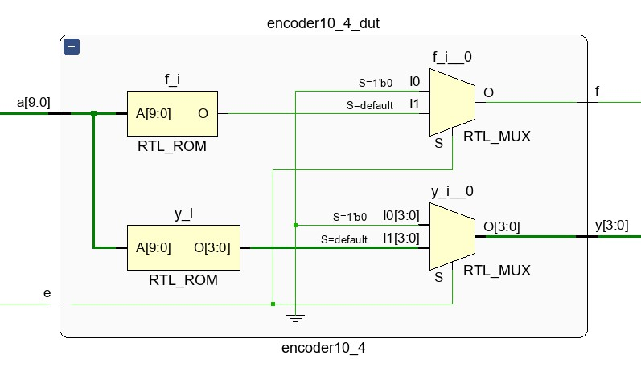
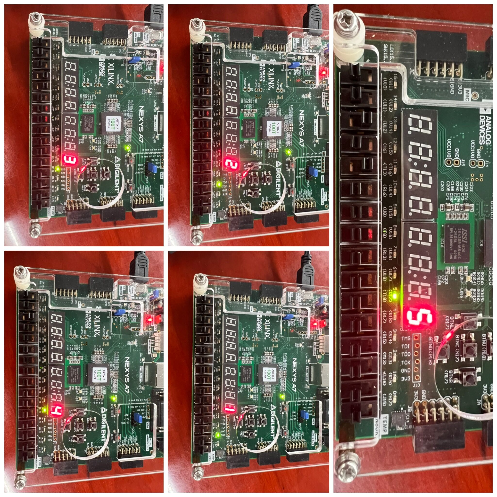

<font face="楷体" size=6><center>**Lab1——编码器与译码器**</font></center>

<center>
    
</center>
<font face="楷体" size=5><center>姓名：**王昱**

学号：**PB21030814**</font></center>


<div style="page-break-after: always;"></div>

<font face="楷体" size=6>**一.实验内容与目的**</font>
<font face="楷体" size=5>
* **实验目的**
①熟悉**ECD、DCD、SDD、MUX**的功能与实现原理<br />②熟悉**Vivado**的使用方法<br />③熟练使用**Verilog HDL**语言描述组合逻辑电路<br />④了解**FPGA**的开发流程(设计、仿真、调试、下载测试等)<br />⑤学会查看资源的使用情况(**LUT**)和生成电路的原理图(**schematic**)
* **实验内容**
利用**Verilog HDL**语言实现**10线-4线优先编码器、二-十进制译码器、7段显示译码器、2选1数据选择器**，并设计综合电路，进行仿真和下载测试。

**数据通路图如上**

   **核心代码(代码解释放在代码块中)：**

   ```verilog
   module mux2_1(   //2选1数据选择器利用了三元运算符
    input s,        //而没有使用与或非门
    input [3:0] a,
    input [3:0] b,
    output [3:0] y
    );
    assign y = s ? b : a;
   endmodule
   ```

    ```verilog
    module decoder4_10(
    input [3:0] d,      //4位BCD码
    output reg [9:0] y      //10位译码，高电平有效
    );
  always @(*) begin //利用case语句而没有使用if语句
    case(d)         //7段显示译码器同理这里就不贴出来
        4'd0: y=10'b00_0000_0001;
        4'd1: y=10'b00_0000_0010;
        4'd2: y=10'b00_0000_0100;
        4'd3: y=10'b00_0000_1000;
        4'd4: y=10'b00_0001_0000;
        4'd5: y=10'b00_0010_0000;
        4'd6: y=10'b00_0100_0000;
        4'd7: y=10'b00_1000_0000;
        4'd8: y=10'b01_0000_0000;
        4'd9: y=10'b10_0000_0000; 
        default: y=10'b00_0000_0000;
        //这里default保证不产生额外的latch
    endcase
  end
   endmodule
    ```

   ```verilog
   module encoder10_4(
    input e,    //使能，高有效
    input [9:0] a,  //待编码信号                              
    output reg f,   //标志，高有效
    output reg [3:0] y  //4位BCD码
    );
  always @(*) begin
    if(e==0)begin
      y=4'd0;
      f=0;
    end
    else    //当e=1时，实现优先编码的功能
        begin
          f=1;//先置为1表示信号有效
          //如果输入的信号不符合则在default中将f置为0
          casex(a)      //x表示任意值
            10'b1x_xxxx_xxxx: y=4'd9;
            10'b01_xxxx_xxxx: y=4'd8;
            10'b00_1xxx_xxxx: y=4'd7;
            10'b00_01xx_xxxx: y=4'd6;
            10'b00_001x_xxxx: y=4'd5;
            10'b00_0001_xxxx: y=4'd4;
            10'b00_0000_1xxx: y=4'd3;
            10'b00_0000_01xx: y=4'd2;
            10'b00_0000_001x: y=4'd1;
            10'b00_0000_0001: y=4'd0;
          default:begin
            y=4'd0;
            f=0;
          end
          endcase
        end
   end
  endmodule
   ```

  ```verilog
  module coder(//这里例化时全部采用名称关联法
    input e,
    input [9:0] a,
    input [3:0] b,
    output f,
    output [3:0] d,
    output [9:0] y,
    output [6:0] yn,
    output dp,
    output [7:0] an
    );
    wire f1;
    wire [3:0] y1;
    wire [3:0] y2;
    encoder10_4 encoder10_4_dut(
        .e(e),
        .a(a),
        .f(f1),
        .y(y1)
    );
    assign f=f1;
    assign d=y1;
    mux2_1 mux2_1_dut(
        .b(y1),
        .a(b),
        .s(f1),
        .y(y2)
    );
    decoder4_10 decoder4_10_dut(
        .d(y2),
        .y(y)
    );
    seven_disp_decoder seven_disp_decoder_dut(
        .d(y2),
        .yn(yn)
    );
    assign dp=1'b1;
    assign an=8'b1111_1110;
  endmodule
  ```

</font>

<font face="楷体" size=6>**二.仿真结果与测试**</font>
<font face="楷体" size=5>
* **运行结果截图**


* **运行结果解释与说明**

第一张图对应的是**decoder4_10**的仿真结果，testbench文件是我自己写的，代码如下:
```verilog
`timescale 1ns / 1ps
module decoder4_10_tb();
    //输入
    reg [3:0] d;
    //输出
    wire [9:0] y;
    initial begin
       d <= 4'd0; 
    end
    always #10 d <= {$random} % 10;
    initial begin
        $monitor("time:%t d:%b y: %b",$time,d,y);
    end
    
    decoder4_10 decoder4_10_dut(
        .d(d),
        .y(y)
    );
endmodule
```

每过**10ns**就产生一个小于**10**的数作为输入，根据译码器的功能可知，该仿真结果是正确的。

第二张图对应的是**coder**的仿真结果，这里用了助教给的**testbench**，代码如下:

```verilog
`timescale 1ns / 1ps
module coder_tb();
    wire            f;
    wire      [3:0] d;
    wire      [9:0] y;
    wire      [6:0] yn;
    wire            dp;
    wire      [7:0] an;
    reg       [9:0] din;
    initial begin
        /* change switch for 10 times */
        din = 1;
        repeat(10) #1 din = din << 1; 
        /* add switch for 10 times */
        din = 1;
        repeat(10) #1 din = din | (din << 1);
    end
    coder coder_test (
        .e        (1'b1),
        .a        (din),
        .b        (4'b0),
        .f        (f),
        .d        (d),
        .y        (y),
        .yn       (yn),
        .dp       (dp),
        .an       (an)
    );
endmodule
```
**din**从**00_0000_0001**开始每隔**1ns**就左移**1**位，重复**10**次；之后再将**din**与**din<<1**做或运算，重复**10**次。每次优先编码器输出的**y**就发生相应的改变。因为**e(使能端)=1**，所以**MUX**选择的是**ECD**输出的**y**数据，**y**数据再输入到**DCD**和**SDD**中，导致最后输出数据的变化。根据模块中的功能实现可知仿真结果的正确性。
</font>


<font face="楷体" size=6>**三.电路设计与分析**</font>
<font face="楷体" size=5>
* **RTL电路图**
  
  
上图为完整的**RTL**电路图，下图为**encoder10_4**模块的电路图。
</font>

<font face="楷体" size=6>**四.测试结果与分析**</font>
<font face="楷体" size=5>

* **decoder4_10**


>**简要说明**：
实现的是译码器的功能。当**4**个开关对应的十进制数是**0-9**的时候，**LED0-LED9**分别亮，在其他情况下**LED**灯不亮。
* **coder**




>**简要说明**：
使能开关开的时候，数据选择器选择的是编码器出来的信号，随后送到译码器和**7**段显示译码器上，数码管显示的数字与**LED0-LED9**亮的灯相对应，同时**LED14-LED11**对应编码器输出数据的二进制；使能开关关的时候，数据选择器选择的是输入的**sw14-sw11**，送到译码器和**7**段显示译码器的原理同上。
</font>

<font face="楷体" size=6>**五.实验总结**</font>

<font face="楷体" size=5>

* 通过本次实验熟悉了**设计、仿真、下载测试**的流程。
* 对**verilog**语言有了更大的把握性，能够独立实现简易的组合逻辑电路。
* 将**vivado**与**vscode**配合使用，提高了开发的效率，同时合理使用**vscode**的插件功能，代码块美观且容易纠错。
* 不足之处在于由于初次使用**vivado**以及**verilog**语言，仅仅是完成了该项目，对于如何进行优化、如何体现更好地模块化并不是太了解，还需要课后继续学习相关知识内容，也希望助教老师们能提供更多的资料。

</font>

