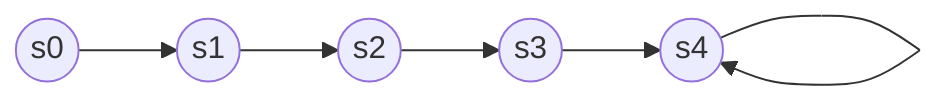
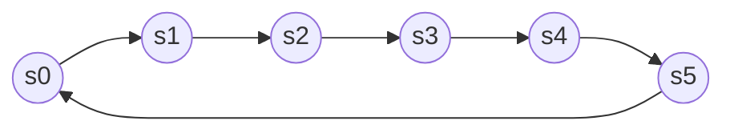

# Lab1

> `Name:王昱`				`ID:PB21030814`

## 实验内容

* 实现`ALU`

* `ALU`的应用——**计算移动**

## 逻辑设计

### 数据通路

`MAV`模块：


> 这其中的`sel`是`FSM`在不同状态下的输出，用于控制输出`m`

### FSM

`MAV`模块：



> 其中`s0`	`s1`	`s2`	`s3`都是`en(使能信号)`为**1**时才进入下一个状态，`s4`是`en`为**1/0**都进入自身。`s0`是`en`第一次有效，`s1`是第二次，`s2`是第三次，`s3`是第四次。

`ALU_top`模块(32位的`ALU`测试)	



> 每个状态都是在`en == 1`的时候转到下一个状态。`s0`	`s1`用于接收`ALU`的输入`a`，`s2`	`s3`用于接收`ALU`的输入`b`，`s4`用于接收`ALU`的输入`f`，`s5`用于给最终显示在开发板上的信号赋值。这样设计的原因是**开发板一次最多只能利用`switch`输入16 bits**。

## 核心代码

* `MAV`模块的`FSM`部分

```verilog
always @(posedge clk or negedge rstn) begin
        if(!rstn)
            CS <= s0;
        else 
            CS <= NS;
    end

always @(posedge clk or negedge rstn) begin

        if(!rstn)begin
            temp <= 16'h0;
            num <= 64'h0;
            NS <= s0;
            sel <= 1'b0;
        end
        else begin
            if(en)begin
                case(CS)
                s0:begin
                    temp <= d;
                    num[15:0] <= d;
                    NS <= s1;
                    sel <= 1'b0;
                end 
                s1:begin
                    temp <= d;
                    num[31:16] <= d;
                    NS <= s2;
                    sel <= 1'b0;
                end
                s2:begin
                    temp <= d;
                    num[47:32] <= d;
                    NS <= s3;
                    sel <= 1'b0;
                end
                s3:begin
                    temp <= m_temp;
                    num[63:48] <= d;
                    NS <= s4;
                    sel <= 1'b1;
                end
                s4:begin
                    temp <= m_temp;
                    num <= {d, num[63:16]};
                    NS <= s4;
                    sel <= 1'b1;
                end
                endcase
            end
            else begin
                temp <= temp;
                num <= num;
                NS <= NS;
                sel <= sel;
            end
        end
    end

    assign m = sel ? m_temp : temp;
```

> 通过这个`FSM`最终输出`sel`选择信号让输出`m`输出正确的结果，如果直接让`m = temp`会导致时许出现错误。`m_temp`是使用`ALU`计算出来的`average`。
>
> 题目要求`m`的输出时机是**clk处于上升沿且en == 1**，所以这里选择时序逻辑来实现。

* `ALU`模块中**比较标志**`t`

```verilog
	if(f == 3'b000)begin
            y = a - b;
            //t需要根据运算结果来设置
            if(y == 0)begin
                t = 3'b001;
            end
            //下面时a!=b的情况
            else begin
                t[0] = 0;
                if(!a[WIDTH-1] && !b[WIDTH-1])begin
                    t[2] = y[WIDTH-1];
                    t[1] = y[WIDTH-1];
                end
                else if(!a[WIDTH-1] && b[WIDTH-1])begin
                    t[2] = 1;
                    t[1] = 0;
                end
                else if(a[WIDTH-1] && !b[WIDTH-1])begin
                    t[2] = 0;
                    t[1] = 1;
                end
                else begin
                    t[2] = y[WIDTH-1];
                    t[1] = y[WIDTH-1];
                end
            end
        end
```

> 题目中说**"* 表示根据运算结果设置"**，如果没有这句话可以直接`a < b`	`$singed(a) < $signed(b)`来得到结果。
>
> 这里我选择了简单粗暴的列举，将`a`	`b`的最高位所有情况列出来，然后得到结果。

* `ALU_top`模块

```verilog
module ALU_top(
    input [15:0] sw,
    input en, clk, rstn,
    output [7:0] an,
    output [6:0] cn,
    output reg [2:0] t
    );
    reg [31:0] a, b;
    wire [31:0] y;
    reg [31:0] y_temp;
    reg [2:0] f;
    wire [2:0] t_temp;
    wire [15:0] sw_temp;
    wire en_temp0, en_temp;
    parameter s0 = 3'b000, 
              s1 = 3'b001,
              s2 = 3'b010,
              s3 = 3'b011,
              s4 = 3'b100,
              s5 = 3'b101;
    reg [2:0] CS, NS;
    always @(posedge clk or negedge rstn) begin
        if(!rstn)
            CS <= s0;
        else    
            CS <= NS;
    end
    always @(posedge clk or negedge rstn) begin
        if(!rstn)begin
            a <= 32'h0;
            b <= 32'h0;
            f <= 3'b0;
            NS <= s0;
            y_temp <= 32'h0;
            t <= 3'h0;
        end
        else if(en_temp)begin
            case(CS)
            s0:begin
                NS <= s1;
                a[15:0] <= sw_temp;
            end 
            s1:begin
                NS <= s2;
                a[31:16] <= sw_temp;
            end
            s2:begin
                NS <= s3;
                b[15:0] <= sw_temp;
            end
            s3:begin
                NS <= s4;
                b[31:16] <= sw_temp;
            end
            s4:begin
                NS <= s5;
                f <= sw_temp[2:0];
            end
            s5:begin
                NS <= s0;
                y_temp <= y;
                t <= t_temp;
            end
            endcase
        end
        else begin
            a <= a;
            b <= b;
            f <= f;
            NS <= NS;
            y_temp <= y_temp;
            t <= t;
        end
    end
    ALU ALU_dut(
        .a(a),
        .b(b),
        .f(f),
        .y(y),
        .t(t_temp)
    );
    genvar i;
    generate
        for(i = 0; i < 16; i = i + 1)
        begin:block
            Debounce Debounce_dut(
                .x(sw[i]),
                .y(sw_temp[i]),
                .clk(clk),
                .rstn(rstn)
            );
        end
    endgenerate
    Debounce Debounce_dut1(
        .x(en),
        .y(en_temp0),
        .clk(clk),
        .rstn(rstn)
    );
    syn_ps syn_ps_dut(
        .a(en_temp0),
        .p(en_temp),
        .clk(clk),
        .rstn(rstn)
    );
    Display Display_dut(
        .d(y_temp),
        .clk(clk),
        .rstn(rstn),
        .an(an),
        .cn(cn)
    );
endmodule
```

> `ALU`32位的测试用到了很多**上学期数电实验**写过的模块。`FSM`的每个状态含义在`FSM`部分已经阐述，在此不再赘述。这里的显示为了更加直观，选择了使用数码管显示，也即`Display`模块(该模块上学期实现过，也就不进行展示说明了)。对于信号的输入：`button`选择**去抖动+取边沿**，`switch`选择**每个都去抖动**。故对于每个`switch`的去抖动这里使用了`generate`语句。

## 仿真结果

* `ALU`模块


```verilog
	initial begin
        a = 4'b1011;
        b = 4'b1100;
        f = 3'b000;
        #50 f = 3'b001;
        #50 f = 3'b010;
        #50 f = 3'b011;
        #50 f = 3'b100;
        #50 f = 3'b101;
        #50 f = 3'b110;
        #50 f = 3'b111;
    end
    ALU #(4) ALU_dut(
        .a(a),
        .b(b),
        .f(f),
        .y(y),
        .t(t)
    );
```

> 为了测试方便，这里选择测试4位的`ALU`。
>
> 可以观察到输出结果符合预期，**算数右移`>>>`**补的是符号位，`a-b`输出的`t`也是正确的。

* `MAV`模块


```verilog
	initial begin
        rstn = 1'b0;
        en = 1'b0;
        clk = 1'b0;
        d = 16'h0004;
        #100 rstn = 1'b1;
        #20 d = 16'h0002;
        #20 d = 16'h0003;
        #50 en = 1'b1;
        #20 d = 16'h0001;
        #20 d = 16'h0005;
        #20 d = 16'h0006;
        #20 d = 16'h0007;
        #20 d = 16'h0008;
    end
    always #5 clk = ~clk;
    always #10 en = ~en;
    MAV MAV_dut(
        .clk(clk),
        .rstn(rstn),
        .en(en),
        .d(d),
        .m(m)
    );
```

> 从仿真图可以看到：输出`m`在`clk`的上升沿与`en == 1`同时成立时发生改变。
>
> 输出结果符合预期，不再赘述。

## 下载结果

* `MAV`模块

> **第一组数据：24	15	20	20	20**
>
> **第二组数据：2	3	4	5	6**


> 结果符合预期
>
> 第一组输出：24	15	20	19	18
>
> 第二组输出：2	3	4	3	4

> `rstn`后`m`输出为`0`

* `ALU`32位测试


> 这里没有测试所有功能，只测试了**加法、算数右移、减法**
>
> 加法的测试数据为：`0000FE0D(H)`	`DFFE1011(H)`	
>
> 加法的运算结果为：`DFFF0E1E(H)`
>
> 算数右移的测试数据为：`80000000(H)`	`00000030(H)`
>
> 算数右移的运算结果为：`FFFFFFFF(H)`
>
> 减法的测试数据为：`8000FDA0(H)`	`0000EF40(H)`
>
> 减法的运算结果为：`80000E60(H)`，同时`t`为`010`

## 电路资源

### MAV模块

* `RTL`


* 综合实现电路


* 电路资源


### ALU测试模块

* `RTL`


* 综合实现电路


* 电路资源


## 时间性能

* `MAV`模块


* `ALU`测试模块


## 实验总结

* 本次实验主要是对上学期数电实验的一个回顾，并不算很难，完成时间也相对较短。
* 主要复习了**verilog的语法、FSM的设计、数据通路的设计、去抖动/取边沿模块的写法、数码管显示的写法**
* 实验遇到的主要`bug`
  * `ALU`32位测试时，忘记给`en`信号取边沿，导致按下一次`button`状态会变化很多很多次，导致结果出错。
  * `MAV`模块`FSM`设计时遇到时序问题，一开始想用组合逻辑实现`m`的输出，但是不满足`clk上升沿 && en == 1`时`m`输出的条件，所以最终选择用时序逻辑输出。

## RTL analysis、synthesis、implementation的区别

* `RTL analysis`(**RTL分析**)
  * 本质上时将硬件描述语言转化成**逻辑电路图**
* `synthesis`(**综合**)
  * 综合的概念是：将高级抽象层次的电路描述转化成较低层次的描述。
  * 将硬件描述语言描述的逻辑电路转化成**查找表LUT、触发器**等`FPGA内部`存在的基本逻辑单元的互连关系，也就是我们常说的**综合网表**。
* `implementation`(**实现**)
  * 将综合网表中的**逻辑资源位置**以及**连线长度**确定的过程(**布局布线的过程**)

### Reference

* [Xilinx Vivado的RTL分析（RTL analysis）、综合（synthesis）和实现（implementation）的区别？](https://blog.csdn.net/wuzhikaidetb/article/details/128295529)
* [FPGA开发流程synthesis和implementatin的作用](https://blog.csdn.net/wangjie36/article/details/121804997)