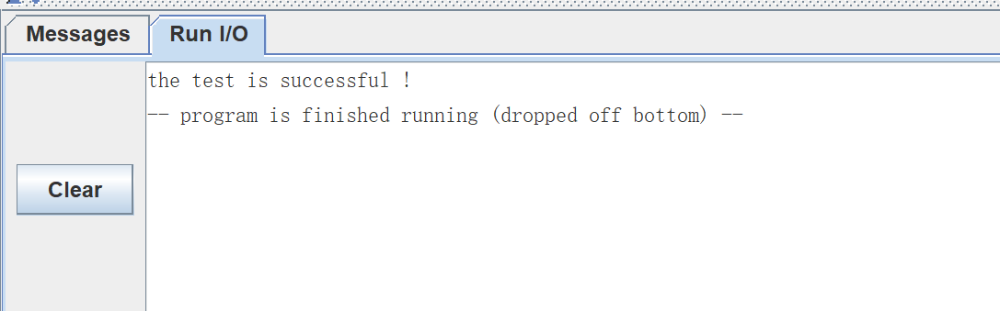
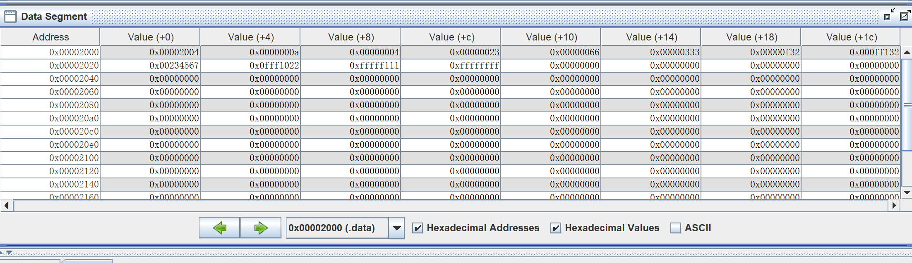

# Lab3

> `Name:王昱`				`ID：PB21030814`

## 实验内容

* 使用`risc-v`汇编，自动测试18个指令的功能
* 利用`risc-v`汇编，实现可变长数组的排序

## 核心代码

* `test`

```asm
.data

data1: .word 0x00000023
data2: .word 0x00000210
data3: .word 0x00000233
data4: .word 0xffff00ff
data6: .word 0x00002100
data7: .word 0xfffff00f
data8: .word 0x00023000
data9: .word 0x00001188
data5: .word 0x00002100

str:   .string "the test is successful !"

.text


#定义一个宏，用于失败时终止程序
.macro fail
li a7, 10
ecall
.end_macro

beq x0, x0, next1               #测试beq
fail

next1:
    lw  t1, 0x00002500          #测试lw，让0x00002500中的值为0
    beq t1, x0, next2
    fail

next2:
    lw  t1, data1               #测试add
    lw  t2, data2
    lw  t3, data3
    add t2, t2, t1
    beq t2, t3, next3
    fail

next3:
    lw  t1, data2               #测试addi
    addi t1, t1, 0x23
    beq t1, t3, next4
    fail

next4:
    sub t1, t1, t3              #测试sub
    beq t1, x0, next5
    fail

next5:
    lw  t1, data4               #测试blt
    lw  t2, data1
    blt t1, t2, next6
    fail

next6:
    lw  t1, data1               #测试bltu
    lw  t2, data4
    bltu t1, t2, next7
    fail

next7:
    lw  t1, data1               #测试and
    lw  t2, data2
    and t1, t1, t2
    beq t1, x0, next8
    fail

next8:
    lw  t1, data2               #测试or
    lw  t2, data3
    or  t1, t1, t2
    beq t1, t2, next9
    fail

next9:
    lw  t1, data1               #测试xor
    lw  t2, data2
    lw  t3, data3
    xor t2, t2, t3
    beq t2, t1, next10
    fail

next10:
    lw  t1, data2               #测试slli
    lw  t2, data6
    slli t1, t1, 4
    beq t1, t2, next11
    fail

next11:
    lw  t1, data3               #测试srli
    lw  t2, data1
    srli t1, t1, 4
    beq t1, t2, next12
    fail

next12:
    lw  t1, data4               #测试srai
    lw  t2, data7
    srai t1, t1, 4
    beq t1, t2, next13
    fail

next13:
    lw  t1, data8               #测试lui
    lui t2, 0x00023
    beq t1, t2, next14
    fail

next14:
    auipc t1, 0x00001           #测试auipc
    lw  t2, data9
    beq t1, t2, next15
    fail

next15:
    lw  t1, 0x00002020           #测试sw
    lw  t2, data3
    sw  t2, 0(t1)
    lw  t3, 0(t1)
    beq t2, t3, next16
    fail

next16:
    addi ra, x0, 0              #测试jal
    jal ra, next17
    fail

next17:
    addi  t1, ra, 0x18          #测试jalr
    jalr ra, 0(t1)
    fail
    la  a0, str
    li  a7, 4
    ecall


```

> 在实现测试程序的时候没有考虑到对后续实验的影响，所以这里使用了`ecall`用来终止程序和输出测试成功的标志。
>
> 这段代码没有完美满足待测指令与已测指令的依赖关系，实际上也很难满足。

* `sort`

```asm
.text

j	main

sort:
    #a0存储数组的起始地址，a1存放数组的大小
    mv  t0, a0      #t0存放数组的起始地址
    addi t0, t0, 4  #因为第一个存放的是数组大小，之后的才是数据
    add a1, a1, a1
    add a1, a1, a1  #a1 = a1 * 4
    add t1, a0, a1  #t1存放最后元素的地址
    addi t1, t1, 4
    mv  t2, t0      #t2相当于外层循环中的i

    outloop:
        beq t2, t1, outloop_end
        addi t3, t2, 4  #t3相当于内层循环的j

    inloop:
        beq t3, t1, inloop_end
        lw  t4, 0(t2)   #t4存放的是待排序的数据 
        lw  t5, 0(t3)   #t5存放的是待排序的数据
        bleu t4, t5, next_inloop    #数组按照升序排列
        mv  t6, t4      #交换数据
        mv  t4, t5
        mv  t5, t6
        sw  t4, 0(t2)   #将数据写入内存
        sw  t5, 0(t3)

    next_inloop:
        addi t3, t3, 4  #更新内层循环变量
        j   inloop

    inloop_end:
        addi t2, t2, 4  #更新外层循环变量
        j   outloop
    outloop_end:
        ret

main:
    lw  a0, 0x00002000
    lw  a1, 0(a0)
    jal ra, sort
    

```

> 在这里，`Data Segment中的0x00002000`里是待排序数组的起始地址
>
> a0里的值为待排序数组的起始地址，a1存放着数组的大小(数组的第一个元素)
>
> 算法的思想：相当于冒泡排序。

## 测试结果

* 测试程序的结果如下图



* 排序的结果如下图



> 数组的起始地址是`0x00002004`
>
> 数组大小是`0x0000000a`
>
> 10个无符号数按照升序排列

## 实验总结

* 本次实验主要熟悉了`RISC-V`的指令，同时为后续CPU的测试提供了测试程序，实验较为简单
* `ppt`的描述不够详细，尤其是指令自动测试的部分，希望能有所完善
* `coe`文件随实验报告打包