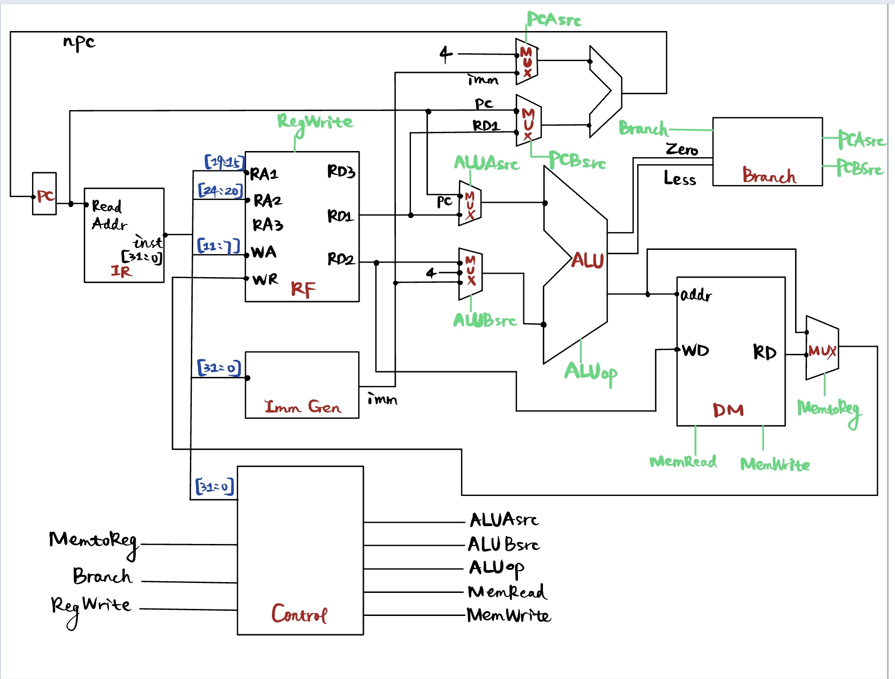
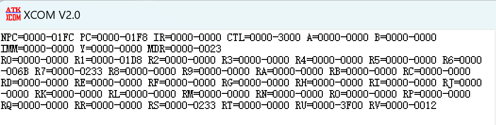
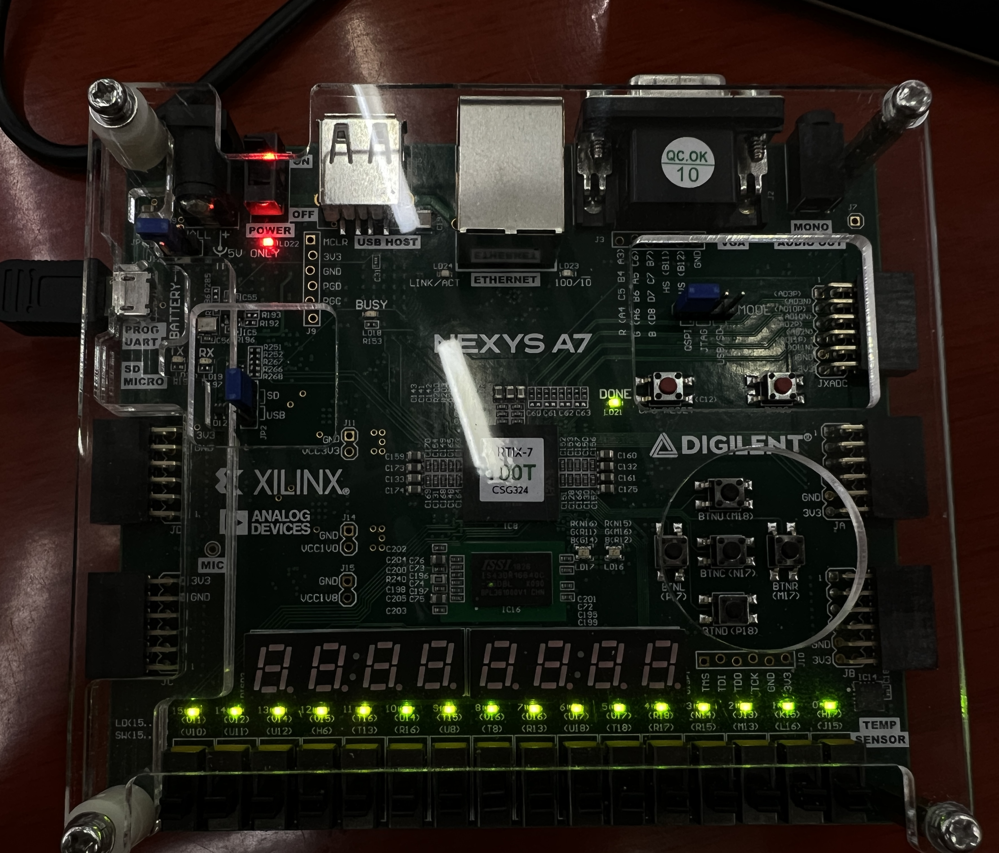
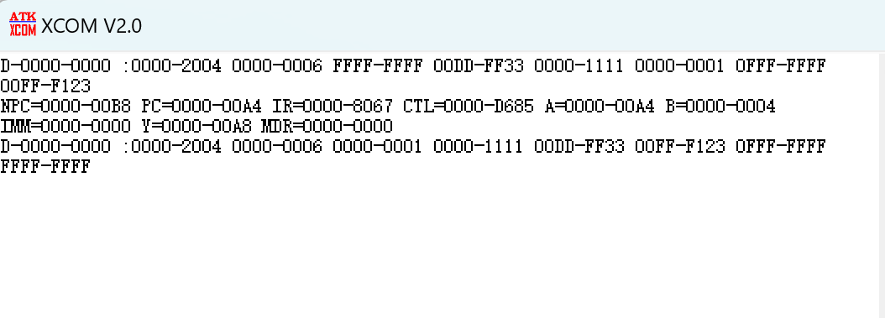
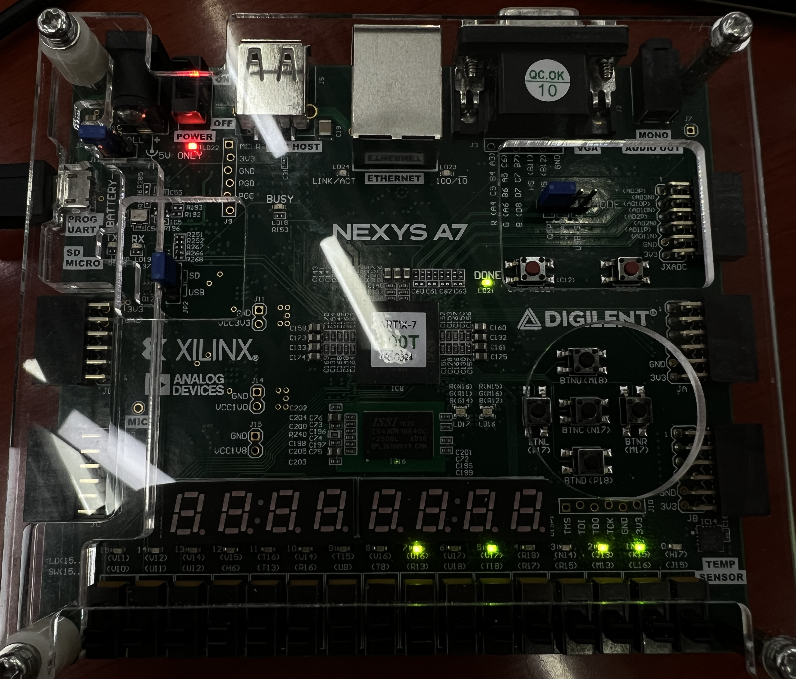
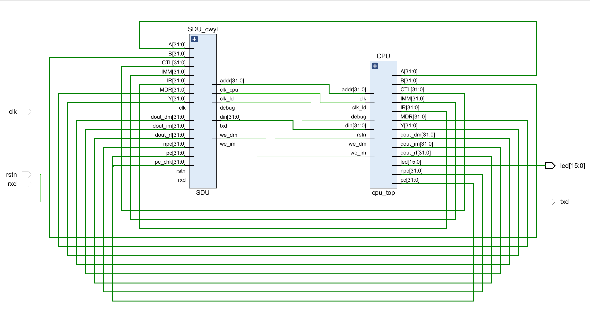
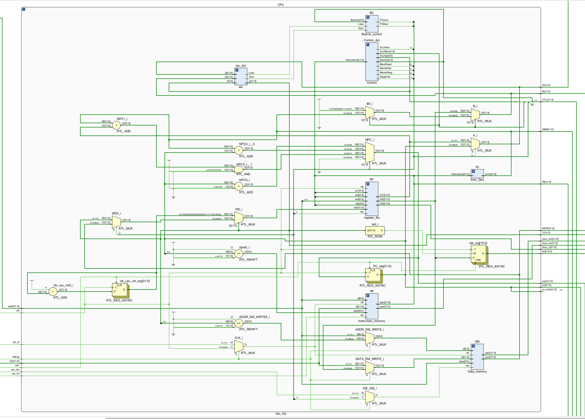
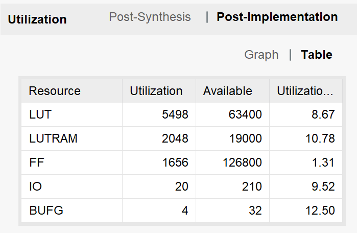
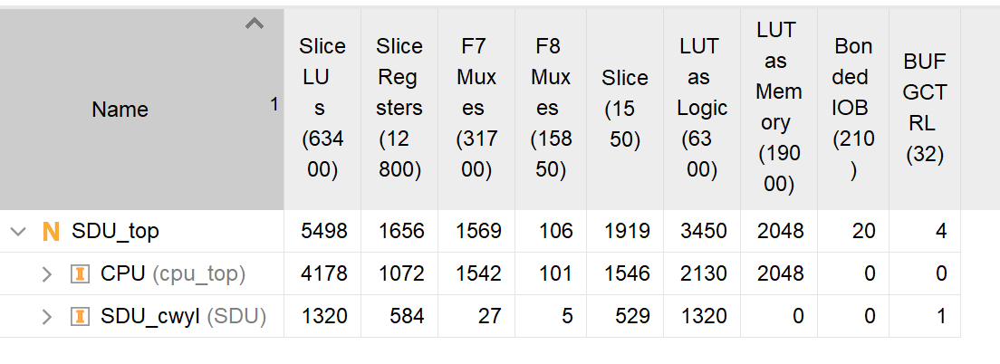
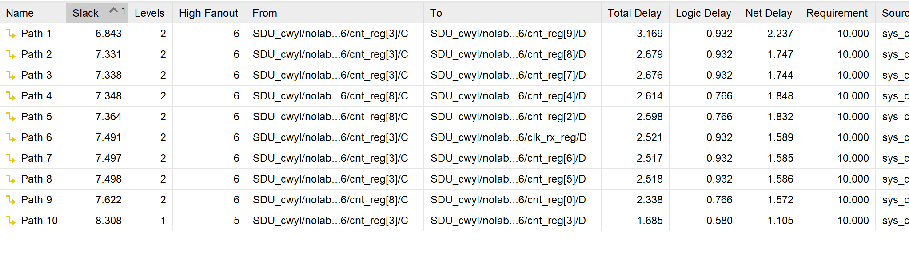

# Lab4

> `Name:王昱`				`ID：PB21030814`

## 实验内容

* **独立设计单周期CPU数据通路实现18条指令，掌握单周期CPU的工作原理**
* **使用提供的SDU模块进行单周期CPU的调试**

## 逻辑设计

* **CPU数据通路**



> **该数据通路与课本/ppt上的数据通路有较大区别**

> **首先介绍一下控制信号：**
>
> `ALUAsrc`：1bit，负责选择ALU的操作数A
>
> `ALUBsrc`：2bit，负责选择ALU的操作数B
>
> `ALUop`：4bit，负责选择ALU应该进行的运算操作
>
> `MemRead`：1bit，负责控制是否需要读数据存储器的内容
>
> `MemWrite`：1bit，负责控制是否需要向数据存储器写数据
>
> `MemtoReg`：1bit，负责选择写入寄存器堆的数据来源
>
> `Branch`：3bit，负责控制分支类型
>
> `RegWrite`：1bit，负责控制是否写入寄存器堆
>
> **其中Branch模块根据输入的Branch信号和ALU输出的Zero、Less，输出PC计算操作数的选择信号：**
>
> `PCAsrc`：1bit，负责选择PC adder的操作数A
>
> `PCBsrc`：1bit，负责选择PC adder的操作数B

> **下面介绍与课本/ppt上的数据通路的区别/原因：**
>
> * **ALU的操作数来源**
>
>   * 操作数A不仅仅是RD1，还可能是PC。比如`auipc rd, imm`指令进行运算的一个操作数是PC；`jal rd offset`和`jalr rd, offset(rs1)`的一个操作数也是PC
>   * 操作数B不仅仅是RD2和imm，还可能是4。比如`jal rd offset`和`jalr rd, offset(rs1)`指令
>
> * **PC运算的操作数来源一共有三种可能**
>
>   * PC+4
>   * PC+imm
>   * (RD1+imm) & ~1
>
>   > 故设计数据通路如上
>
> * **Branch模块**
>
>   * 此模块的添加主要是为了实现`beq  blt  bltu  jal  jalr`分支跳转指令
>   * 具体实现见下面

* **ALU**

> 该ALU与lab1的ALU略有不同，故在此说明

| ALUop |              ALU操作               |
| :---: | :--------------------------------: |
| 0000  |                加法                |
| 1000  |                减法                |
| x001  |                左移                |
| 0010  | 减法，设置有符号情况下的Zero、Less |
| 1010  | 减法，设置无符号情况下的Zero、Less |
| x011  |          直接输出操作数B           |
| x100  |                异或                |
| 0101  |              逻辑右移              |
| 1101  |              算术右移              |
| x110  |                 或                 |
| x111  |                 与                 |

* **Branch**

  | Branch |   对应的指令   |
  | :----: | :------------: |
  |  000   | 非分支跳转指令 |
  |  001   |      beq       |
  |  010   |      blt       |
  |  011   |      bltu      |
  |  100   |      jal       |
  |  101   |      jalr      |

## 核心代码、

> **注：汇编代码附在压缩文件中，在实验报告中不进行展示**

* `Control`

```verilog
module Control(
    input [31:0] Instruction,
    output reg ALUAsrc,
    output reg [1:0] ALUBsrc,
    output reg [3:0] ALUop,
    output reg MemRead, MemWrite,
    output reg MemtoReg,
    output reg [2:0] Branch,
    output reg RegWrite
    );

    always @(*) begin
        case (Instruction[6:0])
            7'b0110011: begin
                //add、sub、and、or、xor
                ALUAsrc = 1'b1;
                ALUBsrc = 2'b00;
                if({Instruction[31:25], Instruction[14:12]} == 10'b0000000000)
                    //add
                    ALUop = 4'b0000;
                else if({Instruction[31:25], Instruction[14:12]} == 10'b0100000000)
                    //sub
                    ALUop = 4'b1000;
                else if({Instruction[31:25], Instruction[14:12]} == 10'b0000000100)
                    //xor
                    ALUop = 4'bx100;
                else if({Instruction[31:25], Instruction[14:12]} == 10'b0000000110)
                    //or
                    ALUop = 4'bx110;
                else if({Instruction[31:25], Instruction[14:12]} == 10'b0000000111)
                    //and
                    ALUop = 4'bx111;
                else    
                    //avoid latch
                    ALUop = 4'bxxxx;
                MemRead = 1'bx;
                MemWrite = 1'b0;
                MemtoReg = 1'b1;
                Branch = 3'b000;
                RegWrite = 1'b1;
            end
            7'b0010011: begin
                //addi、slli、srli、srai
                ALUAsrc = 1'b1;
                ALUBsrc = 2'b10;
                if(Instruction[14:12] == 3'b000)
                    //addi
                    ALUop = 4'b0000;
                else if(Instruction[14:12] == 3'b001)
                    //slli
                    ALUop = 4'bx001;
                else if(Instruction[14:12] == 3'b101) begin
                    if(Instruction[31:25] == 7'b0000000)
                        //srli
                        ALUop = 4'b0101;
                    else
                        //srai
                        ALUop = 4'b1101; 
                end
                else
                    ALUop = 4'bxxxx;
                MemRead = 1'bx;
                MemWrite = 1'b0;
                MemtoReg = 1'b1;
                Branch = 3'b000;
                RegWrite = 1'b1;
            end
            7'b0110111: begin
                //lui
                ALUAsrc = 1'bx;
                ALUBsrc = 2'b10;
                ALUop = 4'bx011;
                MemRead = 1'bx;
                MemWrite = 1'b0;
                MemtoReg = 1'b1;
                Branch = 3'b000;
                RegWrite = 1'b1;
            end
            7'b0010111: begin
                //auipc
                ALUAsrc = 1'b0;
                ALUBsrc = 2'b10;
                ALUop = 4'b0000;
                MemRead = 1'bx;
                MemWrite = 1'b0;
                MemtoReg = 1'b1;
                Branch = 3'b000;
                RegWrite = 1'b1;
            end
            7'b0000011: begin
                //lw
                ALUAsrc = 1'b1;
                ALUBsrc = 2'b10;
                ALUop = 4'b0000;
                MemRead = 1'b1;
                MemWrite = 1'b0;
                MemtoReg = 1'b0;
                Branch = 3'b000;
                RegWrite = 1'b1;
            end
            7'b0100011: begin
                //sw
                ALUAsrc = 1'b1;
                ALUBsrc = 2'b10;
                ALUop = 4'b0000;
                MemRead = 1'bx;
                MemWrite = 1'b1;
                MemtoReg = 1'bx;
                Branch = 3'b000;
                RegWrite = 1'b0;
            end
            7'b1100011: begin
                //beq、blt、bltu
                ALUAsrc = 1'b1;
                ALUBsrc = 2'b00;
                if(Instruction[14:12] == 3'b000) begin
                    //beq
                    ALUop = 4'b1000;
                    Branch = 3'b001;
                end
                else if(Instruction[14:12] == 3'b100) begin
                    //blt
                    ALUop = 4'b0010;
                    Branch = 3'b010;
                end
                else if(Instruction[14:12] == 3'b110) begin
                    //bltu
                    ALUop = 4'b1010;
                    Branch = 3'b011;
                end
                else begin
                    //avoid latch
                    ALUop = 4'bxxxx;
                    Branch = 3'b000;
                end
                MemRead = 1'bx;
                MemWrite = 1'b0;
                MemtoReg = 1'bx;
                RegWrite = 1'b0;
            end
            7'b1101111: begin
                //jal
                ALUAsrc = 1'b0;
                ALUBsrc = 2'b01;
                ALUop = 4'b0000;
                MemRead = 1'bx;
                MemWrite = 1'b0;
                MemtoReg = 1'b1;
                Branch = 3'b100;
                RegWrite = 1'b1;
            end
            7'b1100111: begin
                //jalr
                ALUAsrc = 1'b0;
                ALUBsrc = 2'b01;
                ALUop = 4'b0000;
                MemRead = 1'bx;
                MemWrite = 1'b0;
                MemtoReg = 1'b1;
                Branch = 3'b101;
                RegWrite = 1'b1;
            end
            default: begin
                //avoid latch
                ALUAsrc = 1'b1;
                ALUBsrc = 2'b00;
                ALUop = 4'b0000;
                MemRead = 1'bx;
                MemWrite = 1'b0;
                MemtoReg = 1'bx;
                Branch = 3'b000;
                RegWrite = 1'b0;
            end
        endcase
    end

endmodule

```

> `Control`模块主要根据`Instruction[6:0]`来判断相对应的指令，从而输出控制信号
>
> 如果不能区分，则再根据`Instruction[31:25]  Instruction[14:12]`来进行区分

* `Imm_Gen`

```verilog
module Imm_Gen(
    input [31:0] Instruction,
    output reg [31:0] imm
    );
    always @(*) begin
        case (Instruction[6:0])
            7'b0110011: begin
                //add、sub、and、or、xor
                imm = 0;
            end
            7'b0010011: begin
                //addi、slli、srli、srai
                if(Instruction[14:12] == 3'b101)
                    imm = {27'b0, Instruction[24:20]};
                else
                    imm = {{20{Instruction[31]}}, Instruction[31:20]};
            end
            7'b0110111: begin
                //lui
                imm = {Instruction[31:12], 12'b0};
            end
            7'b0010111: begin
                //auipc
                imm = {Instruction[31:12], 12'b0};
            end
            7'b0000011: begin
                //lw
                imm = {{20{Instruction[31]}}, Instruction[31:20]};
            end
            7'b0100011: begin
                //sw
                imm = {{20{Instruction[31]}}, Instruction[31:25],Instruction[11:7]};
            end
            7'b1100011: begin
                //beq、blt、bltu
                imm = {{20{Instruction[31]}}, Instruction[7], Instruction[30:25], Instruction[11:8], 1'b0};
            end
            7'b1101111: begin
                //jal
                imm = {{12{Instruction[31]}}, Instruction[19:12], Instruction[20], Instruction[30:21], 1'b0};
            end
            7'b1100111: begin
                //jalr
                imm = {{20{Instruction[31]}}, Instruction[31:20]};
            end
            default: begin
                imm = 0;
            end
        endcase
    end
endmodule
```

* `Branch_control`

```verilog
module Branch_control(
    input Zero, Less,
    input [2:0] Branch,
    output reg PCAsrc, PCBsrc
    );
    always @(*) begin
        case (Branch)
            3'b000: begin
                PCAsrc = 1'b0;
                PCBsrc = 1'b0;
            end
            3'b001: begin
                PCBsrc = 1'b0;
                if(Zero) 
                    PCAsrc = 1'b1;
                else 
                    PCAsrc = 1'b0;
            end
            3'b010: begin
                PCBsrc = 1'b0;
                if(Less)
                    PCAsrc = 1'b1;
                else
                    PCAsrc = 1'b0; 
            end
            3'b011: begin
                PCBsrc = 1'b0;
                if(Less)
                    PCAsrc = 1'b1;
                else    
                    PCAsrc = 1'b0;
            end
            3'b100: begin
                PCAsrc = 1'b1;
                PCBsrc = 1'b0;
            end
            3'b101: begin
                PCAsrc = 1'b1;
                PCBsrc = 1'b1;
            end
            default: begin
                //avoid latch
                PCAsrc = 1'bx;
                PCBsrc = 1'bx;
            end
        endcase
    end
endmodule
```

* `cpu_top`

```verilog
module cpu_top(
    input clk, rstn, clk_ld,
    input debug,
    input [31:0] addr,
    input [31:0] din,
    input we_dm, we_im,
    output [31:0] pc_chk, npc, pc,
    output [31:0] IR,
    output [31:0] CTL,  //control signal
    output [31:0] A, B,
    output [31:0] IMM,
    output [31:0] Y,
    output [31:0] MDR,
    output [31:0] dout_rf, dout_im, dout_dm,
    output reg [15:0] led
    );


    wire [31:0] Instruction;
    wire [31:0] WD;
    reg [31:0] PC, NPC;
    wire [31:0] RD1, RD2;
    //control signal
    wire ALUAsrc, MemRead, MemWrite, MemtoReg, RegWrite;
    wire [1:0] ALUBsrc;
    wire [3:0] ALUop;
    wire [2:0] Branch;

    //used in Branch
    wire Zero, Less;

    //used in PC calculation
    wire PCAsrc, PCBsrc;
    //集成在一起的control signal
    assign CTL = {16'b0, PCAsrc, PCBsrc, ALUAsrc, MemRead, MemWrite, MemtoReg, RegWrite, ALUBsrc, ALUop, Branch};
    
    wire CLK; 
    assign CLK = debug ? clk_ld : clk;
    wire WE_DM; 
    assign WE_DM = debug ? we_dm : MemWrite;


    //有关PC
    always @(posedge clk or negedge rstn) begin
        if(!rstn)
            PC <= 32'h00000000;
        else
            PC <= NPC;
    end

    always @(*) begin
        case ({PCAsrc, PCBsrc})
            2'b00: begin
                NPC = PC + 32'h00000004;
            end
            2'b10: begin
                NPC = IMM + PC;
            end
            2'b11: begin
                NPC = (IMM + RD1) & ~1;
            end
            default: begin
                NPC = 32'h00000000;
            end
        endcase
    end

    assign pc = PC;
    assign npc = NPC;
    assign pc_chk = PC;
    assign IR = Instruction;


    //IO
    //CPU输入
    reg [31:0] clk_cpu_cnt;
    always @(posedge clk or negedge rstn) begin
        if(!rstn)
            clk_cpu_cnt <= 32'h00000000;
        else
            clk_cpu_cnt <= clk_cpu_cnt + 1;
    end


    Instruction_memory IM(
        .a(addr[9:0]),
        .d(din),
        .dpra(PC[9:0] >> 2),
        .clk(CLK), 
        .we(we_im),
        .spo(dout_im),
        .dpo(Instruction)
    );

    //这里主要是为了处理从外设输入的情况
    //输入内容为CPU工作时钟的计数
    assign WD = (Y == 32'h00003f20) ? clk_cpu_cnt : (MemtoReg ? Y : MDR);

    register_file RF(
        .clk(clk),
        .ra1(Instruction[19:15]),
        .ra2(Instruction[24:20]),
        .rd1(RD1),
        .rd2(RD2),
        .wa(Instruction[11:7]),
        .wd(WD),
        .we(RegWrite),
        .ra3(addr[4:0]),
        .rd3(dout_rf)
    );

    Imm_Gen IG(
        .Instruction(Instruction),
        .imm(IMM)
    );

    Control Control_dut(
        .Instruction(Instruction),
        .ALUAsrc(ALUAsrc),
        .ALUBsrc(ALUBsrc),
        .ALUop(ALUop),
        .MemRead(MemRead),
        .MemWrite(MemWrite),
        .MemtoReg(MemtoReg),
        .Branch(Branch),
        .RegWrite(RegWrite)
    );

    assign A = ALUAsrc ? RD1 : PC;
    assign B = (ALUBsrc == 2'b00) ? RD2 : ((ALUBsrc == 2'b01) ? 32'h00000004 : IMM);

    alu alu_dut(
        .a(A),
        .b(B),
        .f(ALUop),
        .y(Y),
        .Zero(Zero),
        .Less(Less)
    );

    Branch_control BC(
        .Zero(Zero),
        .Less(Less),
        .Branch(Branch),
        .PCAsrc(PCAsrc),
        .PCBsrc(PCBsrc)
    );


    wire [9:0] ADDR_DM_WRITE;
    assign ADDR_DM_WRITE = debug ? addr[9:0] : (Y[9:0] >> 2);

    wire [31:0] DATA_DM_WRITE;
    assign DATA_DM_WRITE = debug ? din : RD2;

    // pay attention to which port "we" makes difference to.
    Data_memory DM(
        //address here is similar to the address in IM
        .a(ADDR_DM_WRITE),
        .d(DATA_DM_WRITE),
        .dpra(addr[9:0]),
        .clk(CLK),
        .we(WE_DM),
        .spo(MDR),
        .dpo(dout_dm)
    );

    //IO
    //CPU输出
    always @(posedge clk or negedge rstn) begin
        if(!rstn)
            led <= 16'hffff;
        else if(Y == 32'h00003f00)
            led <= RD2[15:0];
        else    
            led <= led;
    end
endmodule
```

> 该模块是根据给出的顶层模块`SDU_top`设计的
>
> **需要注意的是时钟CLK、数据存储器写使能WE_DM、数据存储器的写地址ADDR_DM_WRITE、数据存储器的写数据DATA_DM_WRITE需要根据顶层模块给出的debug信号进行选择，debug=0时选择cpu本身的数据/地址/时钟/使能**
>
> 同时实现了简单的IO功能，当汇编代码lw/sw 相对应的MMIO地址时，cpu会从外设读取/向外设写入对应的数据

## 下载结果

* **指令自动测试**

|   |                     |
| ------------------- | ------------------- |
|  |  |

> 一开始让外设的灯全亮。当指令全部测试完成之后，在汇编中写了指令将寄存器`t6`的值写给外设，如果值为18(D)，则说明指令全部正确。同时在汇编代码的最后从外设中读取CPU的时钟周期数，并存放到寄存器`t1`中。
>
> 如图所示：在代码执行完毕后，`RV=0000-0012`且`R6=0000-006B`，同时LED灯显示正确，说明18条指令的实现是正确的

* **数组排序**

|   |                     |
| ------------------- | ------------------- |
|  |  |

> 检查时已测试过向存储器写的功能，所以这里不再赘述
>
> 对6个数进行排序，排序结果如上所示，是按照无符号升序排列的。
>
> 同时LED灯输出了排序所需要的时钟周期数

## 电路资源与性能

* `RTL`





* **电路资源与延时**

  |   |  |
  | ---------------------------------------------- | --------------------------------------------- |
  |  |                                               |

  
## 实验总结

* 该实验实现单周期的CPU，总体来说难度不是太大(给了三周)
* ppt对于实现简单IO的部分说明过少，希望有所改进
* 实验容易出bug的地方主要是将CPU模块与SDU综合在一起时相关变量的复用(需要通过debug信号选择)，同时要注意输给指令存储器和数据存储器的address。


