# Lab5

> `Name:王昱`				`ID：PB21030814`

## 实验内容

* 设计并调试流水线CPU，实现`RISCV`的18条指令
* 处理**数据相关、控制相关**

## 逻辑设计

* **粗略版的数据通路**

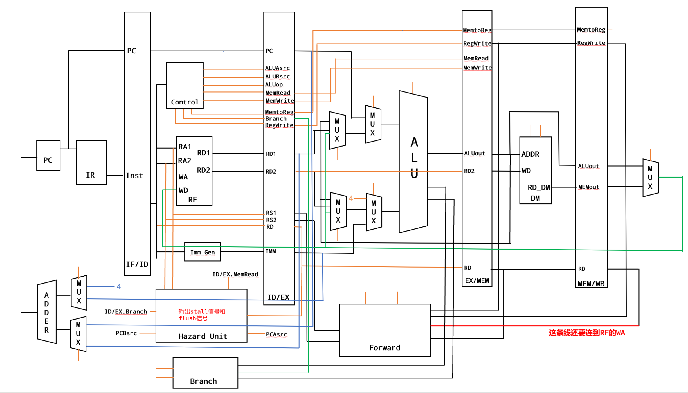

> **本版数据通路是仿照单周期CPU设计的，具体细节可参照单周期CPU的设计。区别在于加了4个段间寄存器，以及用于处理的Forward和Hazard模块**

> **需要注意的是**：本版数据通路是最初设计时的数据通路，实际上的连线可能略有出入，但是由于连线太多不好改动，故没有修改，下面对此数据通路进行讲解。

* **段间寄存器**

  * `IF/ID`

    * 这部分没什么需要注意的细节，输入的控制信号为`stall`、`IF_ID_Flush`。当有`stall`信号的时候将自己赋值给自己即可。当有`IF_ID_Flush`信号的时候直接将寄存器清零

  * `ID/EX`

    * 这部分的输入输出较多，只要按照线连起来即可。需要注意的是：控制信号只有`ID_EX_Flush`。一开始实现的时候还加入了`stall`信号，用于处理Load-use，在Hazard模块产生stall，然后`IF/ID`寄存器和`ID/EX`寄存器都停止，导致数据不更新，流水线停下。所以这里实际上应该清除`ID/EX`的内容。

  * `EX/MEM`

    * 这里注意`RD2`的输入(即可能写入内存的数据)不仅仅来自`ID_EX_RD2`，需要考虑数据相关的情况

    ```verilog
    assign RD_DM_TRUE = ((pre_inst[6:0] == 7'b1101111 | pre_inst[6:0] == 7'b1100111) & (ID_EX_RS2 == pre_mem_wb_rd)) ? pre_mem_reg_wd : (ForwardB == 2'b01) ? MEM_WB_WD : ((ForwardB == 2'b10) ? EX_MEM_ALUout : ID_EX_RD2);
    ```

    > `RD_DM_TRUE`是真正写入数据储存器的数据。这里需要考虑到sw指令前有lw、add、jal这样的指令，所以不仅仅可能写入`ID_EX_RD2`

  * `MEM/WB`

    * 这部分直接连线即可

* **Forward**

  * 这部分完全仿照课本实现，完成对数据的前递

  ```verilog
      always @(*) begin
          if(EX_MEM_RegWrite & (EX_MEM_RD !=0) & (EX_MEM_RD == ID_EX_RS1))
              ForwardA = 2'b10;
          else if(MEM_WB_RegWrite & (MEM_WB_RD !=0) & (MEM_WB_RD == ID_EX_RS1))
              ForwardA = 2'b01;
          else 
              ForwardA = 2'b00;
      end
      always @(*) begin
          if(EX_MEM_RegWrite & (EX_MEM_RD !=0) & (EX_MEM_RD == ID_EX_RS2))
              ForwardB = 2'b10;
          else if(MEM_WB_RegWrite & (MEM_WB_RD !=0) & (MEM_WB_RD == ID_EX_RS2))
              ForwardB = 2'b01;
          else 
              ForwardB = 2'b00;
      end
  ```

* **Hazard**

  * 在这里处理Load-use问题和跳转分支指令
    * 对于跳转指令，直接清除`IF/ID`寄存器和`ID/EX`寄存器
    * 对于分支指令，判断分支是否成功(通过PCAsrc和PCBsrc判断)，如果分支成功则清除`IF/ID`寄存器和`ID/EX`寄存器，否则不变。

  ```verilog
      // 处理Load-Use Hazard
      always @(*) begin
          if(ID_EX_MemRead & (ID_EX_RD != 5'b0) & ((ID_EX_RD == rs1) | (ID_EX_RD == rs2)))
              stall = 1'b1;
          else
              stall = 1'b0;
      end
  
      always @(*) begin
          if(ID_EX_Branch == 3'b100 | ID_EX_Branch == 3'b101) begin
              // 说明是跳转指令
              IF_ID_Flush = 1'b1;
              ID_EX_Flush = 1'b1;            
          end
          else if({PCAsrc, PCBsrc} == 2'b10) begin
              // 跳转成功的情况
              // 为了处理数据相关与控制相关的情况
              IF_ID_Flush = 1'b1;
              ID_EX_Flush = 1'b1; 
          end
          else begin
              IF_ID_Flush = 1'b0;
              ID_EX_Flush = stall ? 1'b1 : 1'b0;
          end
      end
  ```

  > 这里注意最后一个else中`ID_EX_Flush`的值，当遇到Load-use情况时需要将`ID/EX`的寄存器清除，所以根据stall判断是否处于Load-use的情况。

* **写入寄存器的值**

  ```verilog
  assign MEM_WB_WD = ((MEM_WB_RD == EX_MEM_RD) && EX_MEM_RegWrite) ? (EX_MEM_MemtoReg ? EX_MEM_ALUout : MEMout) : (MEM_WB_MemtoReg ? MEM_WB_ALUout : MEM_WB_MEMout);
  ```

  > 这里主要是处理当MEM、WB阶段都要写入寄存器且写入的目标寄存器相同时，应该选择MEM阶段(也即EX/MEM寄存器)的数据写入。
  
* **可能产生的数据相关(总结)**

|        在前\在后        | add/sub/and/or/xor | addi/slli/srli/srai |  lui   | beq/blt/bltu |   lw   |   sw   | auipc  |  jal   |  jalr  |
| :---------------------: | :----------------: | :-----------------: | :----: | :----------: | :----: | :----: | :----: | :----: | :----: |
| **add/sub/and/or/xor**  |        相关        |        相关         | 无相关 |     相关     |  相关  |  相关  | 无相关 | 无相关 |  相关  |
| **addi/slli/srli/srai** |        相关        |        相关         | 无相关 |     相关     |  相关  |  相关  | 无相关 | 无相关 |  相关  |
|         **lui**         |        相关        |        相关         | 无相关 |     相关     |  相关  |  相关  | 无相关 | 无相关 |  相关  |
|    **beq/blt/bltu**     |       无相关       |       无相关        | 无相关 |    无相关    | 无相关 | 无相关 | 无相关 | 无相关 | 无相关 |
|         **lw**          |        相关        |        相关         | 无相关 |     相关     |  相关  |  相关  | 无相关 | 无相关 |  相关  |
|         **sw**          |       无相关       |       无相关        | 无相关 |    无相关    | 无相关 | 无相关 | 无相关 | 无相关 | 无相关 |
|        **auipc**        |        相关        |        相关         | 无相关 |     相关     |  相关  |  相关  | 无相关 | 无相关 |  相关  |
|         **jal**         |        相关        |        相关         | 无相关 |     相关     |  相关  |  相关  | 无相关 | 无相关 |  相关  |
|        **jalr**         |        相关        |        相关         | 无相关 |     相关     |  相关  |  相关  | 无相关 | 无相关 |  相关  |

> `beq、blt、bltu、sw`不涉及寄存器堆的写，不会与其后的指令产生数据相关
>
> `lui、auipc、jal`计算时没有用到别的寄存器，不会与其前的指令产生数据相关

## 核心代码

> 基本的框架与单周期完全相同，这里不做展示，仅展示CPU模块

```verilog
module CPU_v4(
    input cpu_clk,
    input cpu_rstn,
    input [4:0] rra0,
    input [31:0] dra0,
    output [31:0] rrd0,
    output [31:0] drd0,
    output [31:0] ctr_debug,
    output [31:0] npc,
    output [31:0] pc,
    output [31:0] ir,
    output [31:0] pc_id,
    output [31:0] ir_id,
    output [31:0] pc_ex,
    output [31:0] ir_ex,
    output [31:0] rrd1,
    output [31:0] rrd2,
    output [31:0] imm,
    output [31:0] ir_mem,
    output [31:0] res,
    output [31:0] dwd,
    output [31:0] ir_wb,
    output [31:0] res_wb,
    output [31:0] drd,
    output [31:0] rwd
    );

    //变量声明
    reg [31:0] PC;
    reg [31:0] NPC;
    //PC计算操作数之一
    reg [31:0] NPC_src;
    reg [1:0] cnt;
    //暂停一周期的信号
    wire stall;
    //PC运算的选择信号
    wire PCAsrc;
    wire PCBsrc;
    //Forward模块
    wire [1:0] ForwardA;
    wire [1:0] ForwardB;
    //jal、jalr的处理
    reg [31:0] pre_inst;
    reg [31:0] pre_mem_reg_wd;
    reg [4:0] pre_mem_wb_rd;


    //IF阶段
    wire [31:0] IF_ID_PC;
    wire [31:0] IF_ID_Inst;
    wire [31:0] Inst;
    wire IF_ID_Flush;
    //ID阶段
    wire [31:0] ID_EX_Inst;
    wire [31:0] ID_EX_PC;
    wire ID_EX_Flush;
    wire ID_EX_ALUAsrc;
    wire [1:0] ID_EX_ALUBsrc;
    wire [3:0] ID_EX_ALUop;
    wire ID_EX_MemRead;
    wire ID_EX_MemWrite;
    wire ID_EX_MemtoReg;
    wire [2:0] ID_EX_Branch;
    wire ID_EX_RegWrite;
    wire [31:0] ID_EX_RD1;
    wire [31:0] ID_EX_RD2;
    wire [4:0] ID_EX_RS1;
    wire [4:0] ID_EX_RS2;
    wire [4:0] ID_EX_RD;
    wire [31:0] ID_EX_IMM; 
        //用于Control模块
    wire ALUAsrc;
    wire [1:0] ALUBsrc;
    wire [3:0] ALUop;
    wire MemRead;
    wire MemWrite;
    wire MemtoReg;
    wire [2:0] Branch;
    wire RegWrite;
        //用于RF模块
    wire [31:0] rd1;
    wire [31:0] rd2;
        //用于Imm_Gen模块
    wire [31:0] IMM;
    //EX阶段
    wire [31:0] EX_MEM_Inst;
    wire [31:0] EX_MEM_ALUout;
    wire [31:0] EX_MEM_RD2;
    wire EX_MEM_MemtoReg;
    wire EX_MEM_MemRead;
    wire EX_MEM_MemWrite;
    wire EX_MEM_RegWrite;
    wire [4:0] EX_MEM_RD;
    wire [31:0] RD1_true;
    wire [31:0] RD2_true;
        //用于ALU模块
    wire [31:0] ALUA;
    wire [31:0] ALUB;
    wire Zero;
    wire Less;
    wire [31:0] ALUout;
    //MEM阶段
    wire [31:0] MEM_WB_Inst;
    wire [31:0] MEMout;
    wire MEM_WB_MemtoReg;
    wire MEM_WB_RegWrite;
    wire [31:0] MEM_WB_ALUout;
    wire [31:0] MEM_WB_MEMout;
    wire [4:0] MEM_WB_RD;
    //WB阶段
    wire [31:0] MEM_WB_WD;


    //PC相关的处理
    always @(posedge cpu_clk or negedge cpu_rstn) begin
        if(!cpu_rstn)
            PC <= 32'h0;
        else if(stall)
            PC <= PC;
        else    
            PC <= NPC;
    end
    always @(*) begin
        case ({PCAsrc, PCBsrc})
            2'b00: begin
                NPC = (PC == 32'h0 | PC == 32'h4) ? (PC + 32'h4) : (NPC_src + 32'h4);
            end
            2'b10: begin
                //jal
                NPC = ID_EX_IMM + ID_EX_PC;
            end
            2'b11: begin
                //jalr
                NPC = (ID_EX_IMM + (((pre_inst[6:0] == 7'b1101111 | pre_inst[6:0] == 7'b1100111) & (ID_EX_RS1 == pre_mem_wb_rd)) ? pre_mem_reg_wd : (((ForwardA == 2'b10) ? EX_MEM_ALUout : ((ForwardA == 2'b01) ? MEM_WB_WD : ID_EX_RD1))))) & ~1;
            end
            default: begin
                NPC = 32'h00000000;
            end
        endcase
    end
    
    //判断stall结束与否
    reg pre_stall;
    always @(posedge cpu_clk or negedge cpu_rstn) begin
        if(!cpu_rstn)
            pre_stall <= 0;
        else 
            pre_stall <= stall;
    end
    always @(posedge cpu_clk or negedge cpu_rstn) begin
        if(!cpu_rstn) begin
            NPC_src <= 32'b0;
            cnt <= 0;
        end
        else if(ID_EX_Flush & IF_ID_Flush) begin
            NPC_src <= NPC;
            cnt <= 1;
        end
        else if(cnt == 1) begin
            NPC_src <= NPC_src + 32'h4;
            cnt <= 2;
        end
        else if(cnt == 2) begin
            NPC_src <= NPC_src + 32'h4;
            cnt <= 0;
        end
        else begin
            if(stall) begin
                NPC_src <= NPC_src;
                cnt <= cnt;
            end
            else if(pre_stall) begin
                NPC_src <= NPC_src + 4;
                cnt <= cnt;
            end
            else begin
                NPC_src <= NPC;
                // NPC_src <= ID_EX_PC + 32'hc;
                cnt <= 0;
            end
        end
    end

    //指令存储器
    //这里主要是照顾到上一版SDU需要写入数据，所以开了双端口的存储器
    //test variable
    wire [31:0] test1;
    Instruction_memory IR(
        .a(10'b0),              // input wire [9 : 0] a
        .d(32'b0),              // input wire [31 : 0] d
        .dpra(PC[9:0] >> 2),    // input wire [9 : 0] dpra
        .clk(cpu_clk),          // input wire clk
        .we(1'b0),              // input wire we
        .spo(test1),            // output wire [31 : 0] spo
        .dpo(Inst)              // output wire [31 : 0] dpo
    );

    //IF/ID寄存器
    IF_ID IF_ID_dut(
        .PC(PC),
        .Inst(Inst),
        .stall(stall),
        .IF_ID_Flush(IF_ID_Flush),
        .clk(cpu_clk),
        .rstn(cpu_rstn),
        .IF_ID_PC(IF_ID_PC),
        .IF_ID_Inst(IF_ID_Inst)
    );

    //Control模块产生控制信号
    Control Control_dut(
        .Instruction(IF_ID_Inst),
        .ALUAsrc(ALUAsrc),
        .ALUBsrc(ALUBsrc),
        .ALUop(ALUop),
        .MemRead(MemRead),
        .MemWrite(MemWrite),
        .MemtoReg(MemtoReg),
        .Branch(Branch),
        .RegWrite(RegWrite)
    );

    //寄存器堆
    Register_File Register_File_dut(
        .clk(cpu_clk),
        .ra1(IF_ID_Inst[19:15]),
        .ra2(IF_ID_Inst[24:20]),
        .rd1(rd1),
        .rd2(rd2),
        .wa(MEM_WB_RD),
        .wd(MEM_WB_WD),
        .we(MEM_WB_RegWrite),
        .ra3(rra0),
        .rd3(rrd0)
    );

    Imm_Gen Imm_Gen_dut(
        .Instruction(IF_ID_Inst),
        .imm(IMM)
    );

    //ID/EX寄存器
    ID_EX ID_EX_dut(
        .IF_ID_PC(IF_ID_PC),
        .ALUAsrc(ALUAsrc),
        .ALUBsrc(ALUBsrc),
        .ALUop(ALUop),
        .MemRead(MemRead),
        .MemWrite(MemWrite),
        .MemtoReg(MemtoReg),
        .Branch(Branch),
        .RegWrite(RegWrite),
        .RD1(rd1),
        .RD2(rd2),
        .RS1(IF_ID_Inst[19:15]),
        .RS2(IF_ID_Inst[24:20]),
        .RD(IF_ID_Inst[11:7]),
        .IMM(IMM),
        // .stall(stall),
        .ID_EX_Flush(ID_EX_Flush),
        .clk(cpu_clk),
        .rstn(cpu_rstn),
        .ID_EX_PC(ID_EX_PC),
        .ID_EX_ALUAsrc(ID_EX_ALUAsrc),
        .ID_EX_ALUBsrc(ID_EX_ALUBsrc),
        .ID_EX_ALUop(ID_EX_ALUop),
        .ID_EX_MemRead(ID_EX_MemRead),
        .ID_EX_MemWrite(ID_EX_MemWrite),
        .ID_EX_MemtoReg(ID_EX_MemtoReg),
        .ID_EX_Branch(ID_EX_Branch),
        .ID_EX_RegWrite(ID_EX_RegWrite),
        .ID_EX_RD1(ID_EX_RD1),
        .ID_EX_RD2(ID_EX_RD2),
        .ID_EX_RS1(ID_EX_RS1),
        .ID_EX_RS2(ID_EX_RS2),
        .ID_EX_RD(ID_EX_RD),
        .ID_EX_IMM(ID_EX_IMM),
        .IF_ID_Inst(IF_ID_Inst),
        .ID_EX_Inst(ID_EX_Inst)
    );

    //Forward模块
    Forward Forward_dut(
        .EX_MEM_RegWrite(EX_MEM_RegWrite),
        .MEM_WB_RegWrite(MEM_WB_RegWrite),
        .ID_EX_RS1(ID_EX_RS1),
        .ID_EX_RS2(ID_EX_RS2),
        .EX_MEM_RD(EX_MEM_RD),
        .MEM_WB_RD(MEM_WB_RD),
        .ForwardA(ForwardA),
        .ForwardB(ForwardB)
    );

    //Hazard Unit
    Hazard_Unit Hazard_Unit_dut(
        .rs1(IF_ID_Inst[19:15]),
        .rs2(IF_ID_Inst[24:20]),
        .PCAsrc(PCAsrc),
        .PCBsrc(PCBsrc),
        .ID_EX_MemRead(ID_EX_MemRead),
        .ID_EX_RD(ID_EX_RD),
        .ID_EX_Branch(ID_EX_Branch),
        .stall(stall),
        .IF_ID_Flush(IF_ID_Flush),
        .ID_EX_Flush(ID_EX_Flush)
    );

    //处理jal、jalr的相关
    //这里jal、jalr指令一定会产生Flush，暂停两个周期
    //所以在执行下一条指令时，jal、jalr刚好执行完毕
    always @(posedge cpu_clk or negedge cpu_rstn) begin
        if(!cpu_rstn) begin
            pre_inst <= 32'b0;
            pre_mem_reg_wd <= 32'b0;
            pre_mem_wb_rd <= 5'b0;
        end
        else begin
            pre_inst <= MEM_WB_Inst;
            pre_mem_reg_wd <= MEM_WB_WD;
            pre_mem_wb_rd <= MEM_WB_RD;
        end
    end

    //选择操作数
    //其中的对应关系参照课本实现
    assign RD1_true = ((pre_inst[6:0] == 7'b1101111 | pre_inst[6:0] == 7'b1100111) & (ID_EX_RS1 == pre_mem_wb_rd)) ? pre_mem_reg_wd : ((ForwardA == 2'b00) ? ID_EX_RD1 : ((ForwardA == 2'b01) ? MEM_WB_WD : EX_MEM_ALUout));
    assign RD2_true = ((pre_inst[6:0] == 7'b1101111 | pre_inst[6:0] == 7'b1100111) & (ID_EX_RS2 == pre_mem_wb_rd)) ? pre_mem_reg_wd : ((ForwardB == 2'b00) ? ID_EX_RD2 : ((ForwardB == 2'b01) ? MEM_WB_WD : EX_MEM_ALUout));
    assign ALUA = ID_EX_ALUAsrc ? RD1_true : ID_EX_PC;
    assign ALUB = (ID_EX_ALUBsrc == 2'b00) ? RD2_true : ((ID_EX_ALUBsrc == 2'b01) ? 32'h00000004 : ID_EX_IMM);

    //ALU
    ALU ALU_dut(
        .a(ALUA),
        .b(ALUB),
        .f(ID_EX_ALUop),
        .y(ALUout),
        .Zero(Zero),
        .Less(Less)
    );

    //Branch
    Branch Branch_dut(
        .Zero(Zero),
        .Less(Less),
        .Branch(ID_EX_Branch),
        .PCAsrc(PCAsrc),
        .PCBsrc(PCBsrc)
    );

    // 写入数据存储器的数据
    // 需要考虑数据相关的情况
    wire [31:0] RD_DM_TRUE;
    assign RD_DM_TRUE = ((pre_inst[6:0] == 7'b1101111 | pre_inst[6:0] == 7'b1100111) & (ID_EX_RS2 == pre_mem_wb_rd)) ? pre_mem_reg_wd : (ForwardB == 2'b01) ? MEM_WB_WD : ((ForwardB == 2'b10) ? EX_MEM_ALUout : ID_EX_RD2);
    //EX/MEM寄存器
    EX_MEM EX_MEM_dut(
        .ID_EX_MemtoReg(ID_EX_MemtoReg),
        .ID_EX_RegWrite(ID_EX_RegWrite),
        .ID_EX_MemRead(ID_EX_MemRead),
        .ID_EX_MemWrite(ID_EX_MemWrite),
        .ALUout(ALUout),
        .ID_EX_RD2(RD_DM_TRUE),
        .ID_EX_RD(ID_EX_RD),
        .clk(cpu_clk),
        .rstn(cpu_rstn),
        .EX_MEM_MemtoReg(EX_MEM_MemtoReg),
        .EX_MEM_RegWrite(EX_MEM_RegWrite),
        .EX_MEM_MemRead(EX_MEM_MemRead),
        .EX_MEM_MemWrite(EX_MEM_MemWrite),
        .EX_MEM_ALUout(EX_MEM_ALUout),
        .EX_MEM_RD2(EX_MEM_RD2),
        .EX_MEM_RD(EX_MEM_RD),
        .ID_EX_Inst(ID_EX_Inst),
        .EX_MEM_Inst(EX_MEM_Inst)
    );

    //数据存储器
    Data_memory DM(
        .a(EX_MEM_ALUout[9:0] >> 2),        // input wire [9 : 0] a
        .d(EX_MEM_RD2),                     // input wire [31 : 0] d
        .dpra(dra0[9:0]),                   // input wire [9 : 0] dpra
        .clk(cpu_clk),                      // input wire clk
        .we(EX_MEM_MemWrite),               // input wire we
        .spo(MEMout),                       // output wire [31 : 0] spo
        .dpo(drd0)                          // output wire [31 : 0] dpo
    );

    //MEM/WB寄存器
    MEM_WB MEM_WB_dut(
        .EX_MEM_MemtoReg(EX_MEM_MemtoReg),
        .EX_MEM_RegWrite(EX_MEM_RegWrite),
        .EX_MEM_ALUout(EX_MEM_ALUout),
        .MEMout(MEMout),
        .EX_MEM_RD(EX_MEM_RD),
        .clk(cpu_clk),
        .rstn(cpu_rstn),
        .MEM_WB_MemtoReg(MEM_WB_MemtoReg),
        .MEM_WB_RegWrite(MEM_WB_RegWrite),
        .MEM_WB_ALUout(MEM_WB_ALUout),
        .MEM_WB_MEMout(MEM_WB_MEMout),
        .MEM_WB_RD(MEM_WB_RD),
        .EX_MEM_Inst(EX_MEM_Inst),
        .MEM_WB_Inst(MEM_WB_Inst)
    );

    //将EX_MEM段的寄存器写回
    assign MEM_WB_WD = ((MEM_WB_RD == EX_MEM_RD) && EX_MEM_RegWrite) ? (EX_MEM_MemtoReg ? EX_MEM_ALUout : MEMout) : (MEM_WB_MemtoReg ? MEM_WB_ALUout : MEM_WB_MEMout);


    //下面是CPU输出
    //EX阶段的控制信号
    assign ctr_debug = {18'b0, ID_EX_ALUAsrc, ID_EX_MemRead, ID_EX_MemWrite, ID_EX_MemtoReg, ID_EX_RegWrite, ID_EX_ALUBsrc, ID_EX_ALUop, ID_EX_Branch};
    assign npc = NPC;
    assign pc = PC;
    assign ir = Inst;
    assign pc_id = IF_ID_PC;
    assign ir_id = IF_ID_Inst;
    assign pc_ex = ID_EX_PC;
    assign ir_ex = ID_EX_Inst;
    assign imm = IMM;
    assign ir_mem = EX_MEM_Inst;
    assign res = ALUout;
    assign dwd = RD_DM_TRUE;
    assign ir_wb = MEM_WB_Inst;
    assign res_wb = MEM_WB_ALUout;
    assign drd = MEM_WB_MEMout;
    assign rwd = MEM_WB_WD;
    assign rrd1 = rd1;
    assign rrd2 = rd2;

endmodule
```

> 注意：这里指令存储器并不需要双端口，因为这一次给的sdu模块没有写入的功能，而在写实验的时候我是按照上次的sdu写的，所以这里开了双端口的存储器。

>**这里重点说一下PC。PC的处理相对复杂，需要针对stall和flush的情况单独处理，所以这里开了一个寄存器NPC_src来作为NPC的一个操作数。flush的时候会计算出新的PC，这是就要将新的PC赋值给NPC_src。stall的时候NPC也需要停一下，由于NPC是组合逻辑实现的，所以在NPC_src上进行stall操作** 

> **同时要注意数据相关的处理，比较容易忽略的是jal、jalr对其他指令的影响。**

## 仿真结果

* **CPU模块**(18条指令测试的仿真)

| 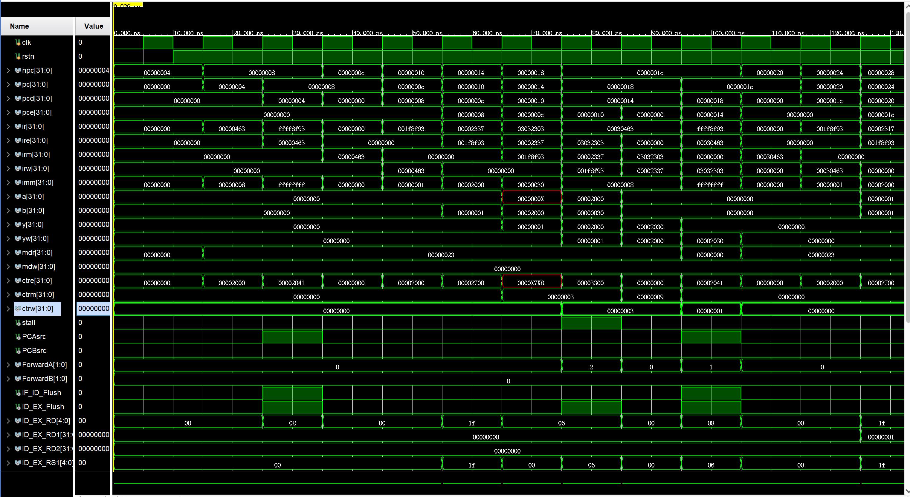 | 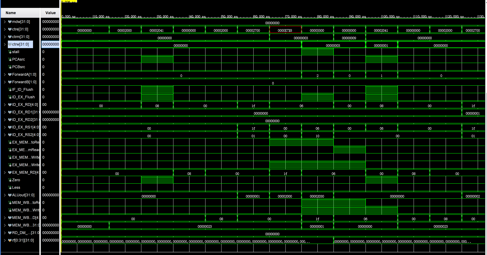 |
| ------------------ | ------------------ |
| 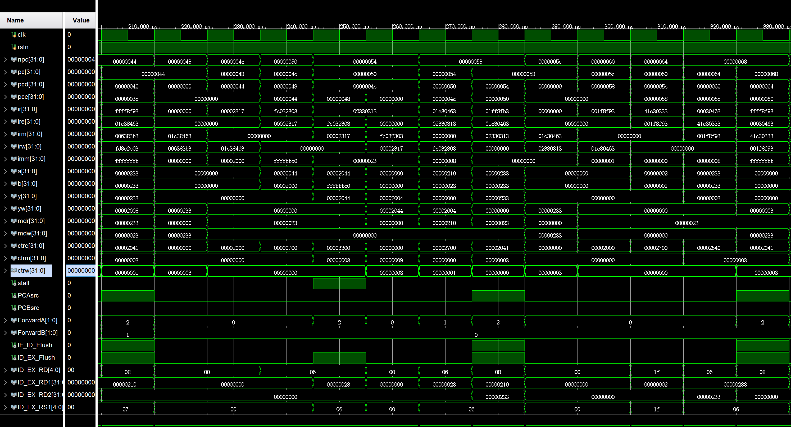 | 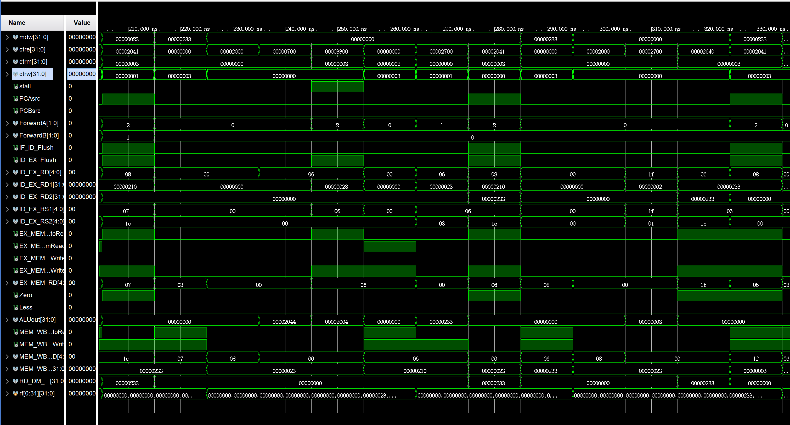 |
| 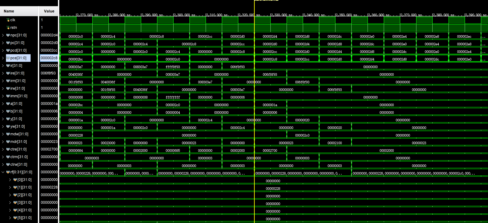 | 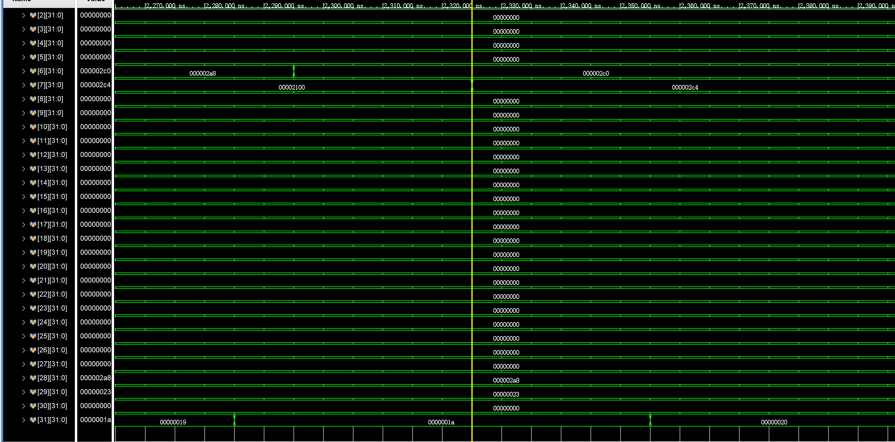 |

> 上面只是大致的仿真结果，最后**x31寄存器**的值为0000_0020，说明指令实现的是正确的

## 下载测试结果

|        test        |        sort        |
| :----------------: | :----------------: |
|  | 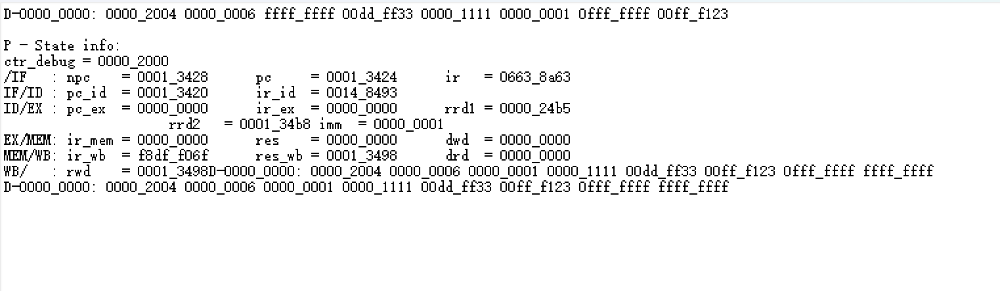 |

> 可以看到test中`x31寄存器`的值为0000_0020
>
> sort中存储器的值是按照升序排的
>
> 结果符合预期

## 电路资源与性能

* `RTL`

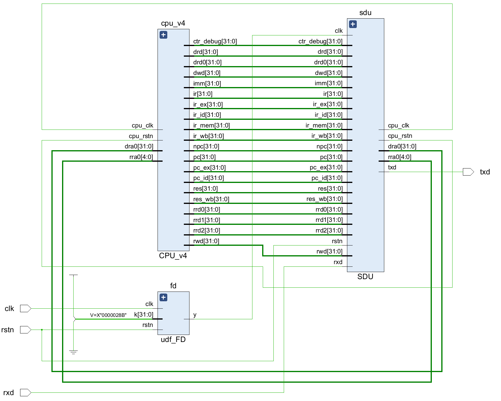

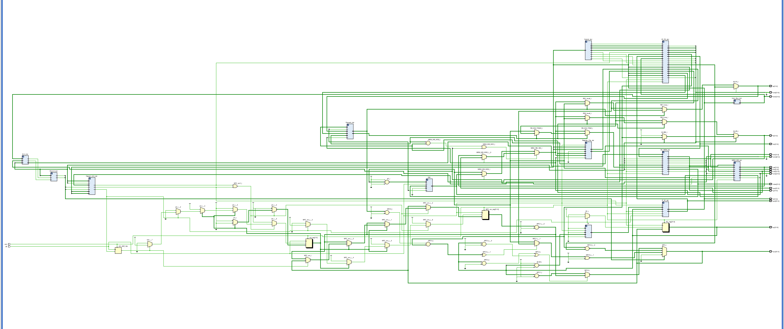

* `utilization`

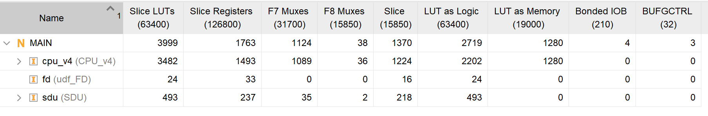

* `timing`

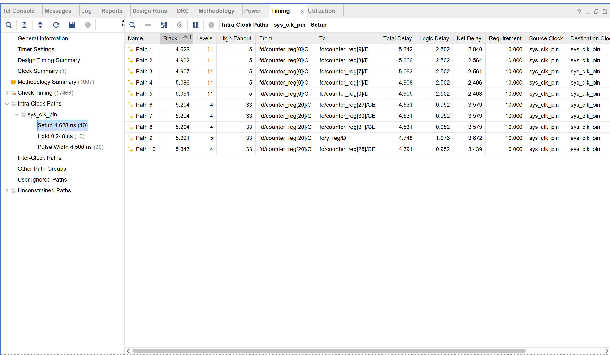

## 实验总结

* 本次实验主要基于上一次单周期CPU的设计来实现，在此基础上实现流水线相对来说并没有太困难。
* 流水线最难的地方应该是时序部分的debug，但是只要在仿真中一点一点找出bug，也是可以解决的
* 在开始实验之前，画好数据通路会使得写代码达到事半功倍的效果
* **建议在ppt中再详细说明数据通路，而不是给一个“四不像”的数据通路让大家来补全。如果有条件，建议把实验内容放到网站上，每届助教都不断进行优化、修改，给后人更好的实验体验。**

