# Lab6

> `Name:王昱`				`ID：PB21030814`

## 实验内容

* 设计`Dcache`

* 实现简单的`IO`模块

## 逻辑设计

### 数据通路

* **总体数据通路**


> 其中CPU的数据通路与流水线相同，这里只需要将流水线数据通路中的**Data memory部分**换成**Dcache部分+主存部分**即可

* **流水线大致数据通路**


### 状态机

* **Dcache状态机**

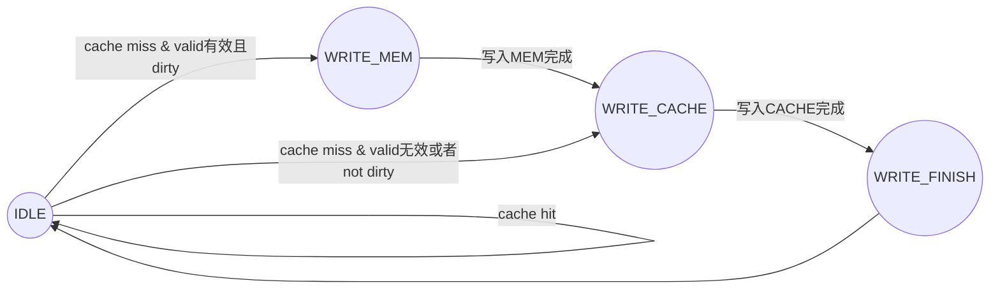

> 当**cache**命中时，循环`IDLE`状态
>
> 当**cache**未命中时，分两种情况：
>
> * 请求的cache行已经被使用并且脏，这时需要将这行写入主存中，也就是进入`WRITE_MEM`状态
> * 请求的cache行没有被使用或者不脏，这时需要将主存写入cache中，也就是进入`WRITE_CACHE`状态

## 核心代码

> **注：流水线部分的核心代码这里就不做展示了**

* **直接映射**`Dcache`

  * **cache hit与cache miss的判断以及命中率统计**

  ```verilog
  	always @(*) begin
          if(valid[index] && (cache_addr_tag[index] == addr_tag) && (we_read | we_write))
              cache_hit = 1'b1;
          else
              cache_hit = 1'b0;
      end
  	assign cache_miss = (we_read | we_write) & (~cache_hit | CS != IDLE);
  	//统计cache的命中率
      //需要对cache_miss取边沿
      reg pre_cache_miss;
      always @(posedge clk or negedge rstn) begin
          if(!rstn)
              pre_cache_miss <= 0;
          else
              pre_cache_miss <= cache_miss;
      end
      //对未命中的统计
      always @(posedge clk or negedge rstn) begin
          if(!rstn)
              cache_miss_cnt <= 0;
          else if(~pre_cache_miss & cache_miss)
              cache_miss_cnt <= cache_miss_cnt + 1;
          else    
              cache_miss_cnt <= cache_miss_cnt;
      end
      always @(posedge clk or negedge rstn) begin
          if(!rstn)
              cache_hit_cnt <= 0;
          else if(cache_hit)
              cache_hit_cnt <= cache_hit_cnt + 1;
          else 
              cache_hit_cnt <= cache_hit_cnt;
      end
  ```

  > `cache hit`通过**是否有读写请求、valid信号是否有效、tag是否一样来判断**
  >
  > `cache miss`通过**是否有读写请求、cache hit是否有效、当前状态是否处于IDLE状态**
  >
  > 对`cache miss`请求时需要进行取边沿操作，否则未命中时`cache miss`一直为1，而实际上只miss一次

  * **FSM**

  ```verilog
      //cache状态机
      reg [1:0] CS;
      reg [1:0] NS;
      parameter IDLE = 2'b00,
                WRITE_MEM = 2'b01,
                WRITE_CACHE = 2'b10,
                WRITE_FINISH = 2'b11;
  
  	always @(posedge clk or negedge rstn) begin
          if(!rstn)
              CS <= IDLE;
          else    
              CS <= NS;
      end
  
      always @(*) begin
          if(CS == IDLE) begin
              if(cache_hit)
                  NS = IDLE;
              else if((we_read | we_write) && (valid[index] && dirty[index]))
                  NS = WRITE_MEM;
              else if((!valid[index] || !dirty[index]) && (we_read | we_write))
                  NS = WRITE_CACHE; 
              else
                  NS = IDLE;
          end
          else if(CS == WRITE_MEM) begin
              NS = mem_ready ? WRITE_CACHE : WRITE_MEM;
          end
          else if(CS == WRITE_CACHE) begin
              NS = mem_ready ? WRITE_FINISH : WRITE_CACHE;
          end
          else begin
              NS = IDLE;
          end
      end
  
  	integer i, j ,k, m;
      always @(posedge clk or negedge rstn) begin
          if(!rstn) begin
              //初始化valid和dirty
              for (i = 0; i < (1 << CACHE_INDEX); i = i + 1) begin
                  valid[i] <= 0;
                  dirty[i] <= 0;
              end
              //初始化向主存中写入的数据
              write_mem_data <= 0;
              //初始化向主存写入的地址
              write_mem_addr <= 0;
              //初始化从主存读数据的地址
              read_mem_addr <= 0;
              //初始化读出的数据
              //dout <= 0;
          end
          else begin
              case(CS)
                  IDLE: begin
                      if(cache_hit) begin
                          //cache命中
                          if(we_read) begin
                              //读请求
                              //dout <= {cache_data[(index << OFFSET) + offset], cache_data[(index << OFFSET) + offset + 1],cache_data[(index << OFFSET) + offset + 2], cache_data[(index << OFFSET) + offset + 3]};
                          end
                          else if(we_write)begin
                              //写请求
                              {cache_data[(index << OFFSET) + offset], cache_data[(index << OFFSET) + offset + 1],cache_data[(index << OFFSET) + offset + 2], cache_data[(index << OFFSET) + offset + 3]} <= din;
                              dirty[index] <= 1;
                          end
                      end
                      else begin
                          //cache未命中
                          if(we_read || we_write) begin
                              //如果有读写请求        
                              if(valid[index] && dirty[index]) begin
                                  //换入的那一行有效且脏
                                  //此时需要写入主存
                                  write_mem_addr <= {cache_addr_tag[index], index};
                                  for(k = 0; k < (1 << OFFSET); k = k + 1) begin
                                      write_mem_data[((k + 1) * DATA_WIDTH - 1)-:DATA_WIDTH] <= cache_data[(index << OFFSET) + k];
                                  end
                              end
                              //记录要写入cache的主存那一行的地址有关信息
                              //同时为了更新cache
                              read_mem_addr <= {addr_tag, index};
                          end
                      end
                  end
                  WRITE_FINISH: begin
                      //该状态用于写入cache数据
                      for(m = 0; m < (1 << OFFSET); m = m + 1) begin
                          cache_data[(read_mem_addr[CACHE_INDEX-1 : 0] << OFFSET) + m] <= read_mem_data[((m + 1) * DATA_WIDTH - 1)-:DATA_WIDTH];
                      end
                      
                      //更新tag
                      cache_addr_tag[index] <= read_mem_addr[ADDR_WIDTH-1-OFFSET : CACHE_INDEX];
                      //更新valid、dirty
                      valid[read_mem_addr[CACHE_INDEX-1 : 0]] <= 1;
                      dirty[read_mem_addr[CACHE_INDEX-1 : 0]] <= 0;
                  end
              endcase
          end
      end
  
  ```

  > 采用三段式的写法，下一状态`NS`根据现在状态`CS`来初步区分，在每种情况里再根据**有无读写信号、valid/dirty是否有效、握手信号mem_ready是否有效**来做进一步判断
  >
  > 在最后的一段中，根据现在状态`CS`对`data`和`addr`做处理
  >
  > **注意cache miss时，如果当前行被使用且脏，则要对写入主存的addr、data进行处理。**
  >
  > **同时要注意，在最后写入cache阶段时，也要对cache_addr_tag、valid、dirty进行更新**

  * **完整代码**

```verilog
module DCache #(
    parameter OFFSET = 5,
    parameter CACHE_INDEX = 5,
    parameter ADDR_TAG = 2,
    parameter DATA_WIDTH = 8,
    parameter ADDR_WIDTH = 12,
    parameter BLOCK = 8
)(
    input clk,
    input rstn,
    input [ADDR_WIDTH-1 : 0] addr,  //读or写的地址
    input [31 : 0] din,             //要写入的数据，一次写入一个字
    input we_write,                 //写使能          
    input we_read,                  //读使能
    output [31 : 0] dout,           //读出的数据，一次读一个字
    output cache_miss,              //cache未命中信号
    //用于SDU交互的变量
    input [11 : 0] sdu_addr,
    output [31 : 0] sdu_data,
    //输出cache命中率
    output reg [31 : 0] cache_miss_cnt,
    output reg [31 : 0] cache_hit_cnt
);

    //cache状态机
    reg [1:0] CS;
    reg [1:0] NS;
    parameter IDLE = 2'b00,
              WRITE_MEM = 2'b01,
              WRITE_CACHE = 2'b10,
              WRITE_FINISH = 2'b11;

    //cache有关定义
    reg [DATA_WIDTH-1 : 0] cache_data [0 : (1 << (OFFSET + CACHE_INDEX)) - 1];  //cache存储数据
    reg [ADDR_TAG-1 : 0] cache_addr_tag [0 : (1 << CACHE_INDEX) - 1];
    reg valid [0 : (1 << CACHE_INDEX) - 1]; //valid有效位
    reg dirty [0 : (1 << CACHE_INDEX) - 1]; //dirty脏位
    wire [OFFSET-1 : 0] offset;
    wire [CACHE_INDEX-1 : 0] index;
    wire [ADDR_TAG-1 : 0] addr_tag;
    assign {addr_tag, index, offset} = addr;    //将输入的地址分为三部分
    reg cache_hit;  //cache命中

    //主存有关定义
    wire mem_ready; //主存输出的读写握手信号
    wire [(DATA_WIDTH << OFFSET) - 1 : 0] read_mem_data;    //读取主存中的一行数据
    reg [(DATA_WIDTH << OFFSET) - 1 : 0] write_mem_data;    //向主存中写入一行数据(dirty)
    reg [ADDR_WIDTH-1-OFFSET : 0] write_mem_addr;  //写入主存的地址，这里不需要offset，因为是一行一行写的
    reg [ADDR_WIDTH-1-OFFSET : 0] read_mem_addr;  //读取主存的地址，这里不需要offset，因为是一行一行读的


    always @(*) begin
        if(valid[index] && (cache_addr_tag[index] == addr_tag) && (we_read | we_write))
            cache_hit = 1'b1;
        else
            cache_hit = 1'b0;
    end

    always @(posedge clk or negedge rstn) begin
        if(!rstn)
            CS <= IDLE;
        else    
            CS <= NS;
    end

    always @(*) begin
        if(CS == IDLE) begin
            if(cache_hit)
                NS = IDLE;
            else if((we_read | we_write) && (valid[index] && dirty[index]))
                NS = WRITE_MEM;
            else if((!valid[index] || !dirty[index]) && (we_read | we_write))
                NS = WRITE_CACHE; 
            else
                NS = IDLE;
        end
        else if(CS == WRITE_MEM) begin
            NS = mem_ready ? WRITE_CACHE : WRITE_MEM;
        end
        else if(CS == WRITE_CACHE) begin
            NS = mem_ready ? WRITE_FINISH : WRITE_CACHE;
        end
        else begin
            NS = IDLE;
        end
    end

    //输出数据
    //异步读数据，模拟分布式存储器
    assign dout = (CS === IDLE && cache_hit && we_read) ? {cache_data[(index << OFFSET) + offset], cache_data[(index << OFFSET) + offset + 1],cache_data[(index << OFFSET) + offset + 2], cache_data[(index << OFFSET) + offset + 3]} : 0;

    integer i, j ,k, m;
    always @(posedge clk or negedge rstn) begin
        if(!rstn) begin
            //初始化valid和dirty
            for (i = 0; i < (1 << CACHE_INDEX); i = i + 1) begin
                valid[i] <= 0;
                dirty[i] <= 0;
            end
            //初始化向主存中写入的数据
            write_mem_data <= 0;
            //初始化向主存写入的地址
            write_mem_addr <= 0;
            //初始化从主存读数据的地址
            read_mem_addr <= 0;
            //初始化读出的数据
            //dout <= 0;
        end
        else begin
            case(CS)
                IDLE: begin
                    if(cache_hit) begin
                        //cache命中
                        if(we_read) begin
                            //读请求
                            //dout <= {cache_data[(index << OFFSET) + offset], cache_data[(index << OFFSET) + offset + 1],cache_data[(index << OFFSET) + offset + 2], cache_data[(index << OFFSET) + offset + 3]};
                        end
                        else if(we_write)begin
                            //写请求
                            {cache_data[(index << OFFSET) + offset], cache_data[(index << OFFSET) + offset + 1],cache_data[(index << OFFSET) + offset + 2], cache_data[(index << OFFSET) + offset + 3]} <= din;
                            dirty[index] <= 1;
                        end
                    end
                    else begin
                        //cache未命中
                        if(we_read || we_write) begin
                            //如果有读写请求        
                            if(valid[index] && dirty[index]) begin
                                //换入的那一行有效且脏
                                //此时需要写入主存
                                write_mem_addr <= {cache_addr_tag[index], index};
                                for(k = 0; k < (1 << OFFSET); k = k + 1) begin
                                    write_mem_data[((k + 1) * DATA_WIDTH - 1)-:DATA_WIDTH] <= cache_data[(index << OFFSET) + k];
                                end
                            end
                            //记录要写入cache的主存那一行的地址有关信息
                            //同时为了更新cache
                            read_mem_addr <= {addr_tag, index};
                        end
                    end
                end
                WRITE_FINISH: begin
                    //该状态用于写入cache数据
                    for(m = 0; m < (1 << OFFSET); m = m + 1) begin
                        cache_data[(read_mem_addr[CACHE_INDEX-1 : 0] << OFFSET) + m] <= read_mem_data[((m + 1) * DATA_WIDTH - 1)-:DATA_WIDTH];
                    end
                    
                    //更新tag
                    cache_addr_tag[index] <= read_mem_addr[ADDR_WIDTH-1-OFFSET : CACHE_INDEX];
                    //更新valid、dirty
                    valid[read_mem_addr[CACHE_INDEX-1 : 0]] <= 1;
                    dirty[read_mem_addr[CACHE_INDEX-1 : 0]] <= 0;
                end
            endcase
        end
    end


    wire we_read_data_memory;
    assign we_read_data_memory = (CS === WRITE_CACHE) ? 1 : 0;
    wire we_write_data_memory;
    assign we_write_data_memory = (CS === WRITE_MEM) ? 1 : 0;
    wire [CACHE_INDEX+ADDR_TAG-1 : 0] mem_addr;
    assign mem_addr = we_read_data_memory ? read_mem_addr : (we_write_data_memory ? write_mem_addr : 0);

    main_data_memory main_data_memory_dut(
        .clk(clk),
        .rstn(rstn),
        .we_read(we_read_data_memory),
        .we_write(we_write_data_memory),
        .addr(mem_addr),
        .write_mem(write_mem_data),
        .read_mem_line(read_mem_data),
        .ready(mem_ready),
        .sdu_addr(sdu_addr),
        .sdu_data(sdu_data)
    );

    assign cache_miss = (we_read | we_write) & (~cache_hit | CS != IDLE);

    //统计cache的命中率
    //需要对cache_miss取边沿
    reg pre_cache_miss;
    always @(posedge clk or negedge rstn) begin
        if(!rstn)
            pre_cache_miss <= 0;
        else
            pre_cache_miss <= cache_miss;
    end
    //对未命中的统计
    always @(posedge clk or negedge rstn) begin
        if(!rstn)
            cache_miss_cnt <= 0;
        else if(~pre_cache_miss & cache_miss)
            cache_miss_cnt <= cache_miss_cnt + 1;
        else    
            cache_miss_cnt <= cache_miss_cnt;
    end
    always @(posedge clk or negedge rstn) begin
        if(!rstn)
            cache_hit_cnt <= 0;
        else if(cache_hit)
            cache_hit_cnt <= cache_hit_cnt + 1;
        else 
            cache_hit_cnt <= cache_hit_cnt;
    end

endmodule
```

> 这里`cache`定义的是**1024个byte而没有定义成256个word**

* **两路组相联**`cache`(**这部分的实现与直接映射几乎一致，所以这里只说明LRU算法的实现**)

  * `LRU`算法

  ```verilog
  	always @(*) begin
          hit_way = 0;
          cache_hit = 0;
          //判断是否命中第零路
          if(valid[index][0] && cache_addr_tag[index][0] == addr_tag && (we_read | we_write)) begin
              cache_hit = 1;
              hit_way = 0;
              LRU[index] = 1;    //因为LRU时替换最近最少使用的，如果命中则将另一路赋给寄存器
          end
          //判断是否命中第一路
          else if(valid[index][1] && cache_addr_tag[index][1] == addr_tag && (we_read | we_write)) begin
              cache_hit = 1;
              hit_way = 1;
              LRU[index] = 0;
          end
          //没有命中
          else begin
              cache_hit = 0;
          end
      end
  ```

  > 实现LRU的思路是：为每一行定义一个1位寄存器(因为实现两路组相联)。当命中第0路时，该行寄存器存储1，代表1这一路最近没有使用；当命中第1路时，该寄存器存储0，代表第0路最近没有使用。`hit_way`初始值设为第0路。

* `main_data_memory`**主存模块**

```verilog
module main_data_memory #(
    parameter ADDR = 7,
    parameter DATA = 8,
    parameter LINE_BYTE = 32,
    parameter DELAY = 16
)(
    input clk,
    input rstn,
    input we_read,
    input we_write,
    input [ADDR-1 : 0] addr,
    input [(DATA << 5) - 1 : 0] write_mem,
    output reg [(DATA << 5) - 1 : 0] read_mem_line,
    output ready,   //握手信号
    //用于与SDU交互
    input [11 : 0] sdu_addr,
    output [31 : 0] sdu_data
);

    localparam READ_CYCLE = DELAY + (LINE_BYTE >> 2);
    localparam WRITE_CYCLE = DELAY + (LINE_BYTE >> 2);

    reg [4 : 0] read_cnt;   
    reg [4 : 0] write_cnt;
    wire read_finish;
    wire write_finish;
    reg [9 : 0] data_mem_addr; //访问的主存地址
    reg [31 : 0] data_mem_din;
    wire [31 : 0] data_mem_dout;
    reg [31 : 0] read_buffer [0 : (LINE_BYTE >> 2) - 1];
    reg we;

    assign read_finish = (read_cnt >= READ_CYCLE);
    assign write_finish = (write_cnt >= WRITE_CYCLE);

    Data_memory Data_memory_dut(
        .clka(clk),
        .addra(data_mem_addr),
        .dina(data_mem_din),
        .wea(we),
        .douta(data_mem_dout)
    );

    //解决SDU的问题
    reg [31 : 0] sdu_data_mem [0 : 1023];
    always @(posedge clk) begin
        if(we) begin
            sdu_data_mem[data_mem_addr] <= data_mem_din;
        end
    end
    assign sdu_data = sdu_data_mem[sdu_addr[9 : 0]];


    always @(posedge clk or negedge rstn) begin
        if(!rstn) begin
            data_mem_addr <= 0;
            data_mem_din <= 0;
            we <= 0;
            read_cnt <= 0;
            write_cnt <= 0;
        end
        else begin
            data_mem_addr <= {addr, 3'b0};
            data_mem_din <= 0;
            we <= 0;
            if(we_read) begin
                write_cnt <= 0;
                if(read_finish) begin
                    read_cnt <= 0;
                end
                else begin
                    if(read_cnt < DELAY) begin
                        if((read_cnt <= (LINE_BYTE >> 2)) && read_cnt > 0) begin
                            data_mem_addr <= (addr << 3) + (read_cnt - 1);
                        end
                        if(read_cnt > 3 && read_cnt < 12) begin
                            read_buffer[read_cnt-4] <= data_mem_dout;
                        end
                    end
                    else begin
                        //每次读出一个字
                        //首字延迟16个clks
                        // read_mem_line[(32*(read_cnt-DELAY) + 31)-:32] <=read_buffer[read_cnt-DELAY];
                        read_mem_line[(32*(read_cnt-DELAY) + DATA - 1)-:8] <= read_buffer[read_cnt-DELAY][31:24];
                        read_mem_line[(32*(read_cnt-DELAY) + 2*DATA - 1)-:8] <= read_buffer[read_cnt-DELAY][23:16];
                        read_mem_line[(32*(read_cnt-DELAY) + 3*DATA - 1)-:8] <= read_buffer[read_cnt-DELAY][15:8];
                        read_mem_line[(32*(read_cnt-DELAY) + 4*DATA - 1)-:8] <= read_buffer[read_cnt-DELAY][7:0];
                    end
                    read_cnt <= read_cnt + 1;
                end
            end
            else if(we_write) begin
                read_cnt <= 0;
                if(write_finish) begin
                    write_cnt <= 0;
                end
                else begin
                    if(write_cnt >= DELAY) begin
                        data_mem_addr <= (addr << 3) + (write_cnt - DELAY);
                        we <= 1;
                        data_mem_din[7:0] <= write_mem[(32*(write_cnt-DELAY) + 4*DATA - 1)-:8];
                        data_mem_din[15:8] <= write_mem[(32*(write_cnt-DELAY) + 3*DATA - 1)-:8];
                        data_mem_din[23:16] <= write_mem[(32*(write_cnt-DELAY) + 2*DATA - 1)-:8];
                        data_mem_din[31:24] <= write_mem[(32*(write_cnt-DELAY) + DATA - 1)-:8];
                    end
                end 
                write_cnt <= write_cnt + 1;
            end
        end
    end

    assign ready = ((we_write && write_finish) || (we_read && read_finish) === 1) ? 1 : 0; 


endmodule
```

> **这里主要要搞明白cache与主存交互的原理：首字延迟是为了模拟实际读主存的操作(要满足流水化)**
>
> * 首先说明如何解决SDU的问题
>   * 因为我bram是用ip核生成的，所以不能在上面添加一个异步读出的端口。基于此，我另开了一个寄存器堆(实际上就充当主存的一个副本)，用于异步读出数据，从而满足SDU的要求(因为SDU是给了一个周期读数据)
> * 然后就是处理首字延迟
>   * 针对读的情况：需要写一个FIFO队列来存储读进来的值，因为读的时候是一次读一个字，所以可以满足延时16clk的需求。这里注意时序问题，很容易出现读的时机不对(快或者慢一个clk)。
>   * 针对写的情况：写比读好处理，直接首字延迟即可。

* `IOU`**模块**

```verilog
module io_unit(
    input clk,
    input cpu_clk,        //用sdu生成的cpu时钟
    input rstn,           //cpu_resetn
    input data,           //btnc
    input del,            //btnl
    input [15:0] x,       //sw15-0
    output reg [15:0] led,//led15-0
    output reg [7:0] an,
    output reg [6:0] seg,
    //IO_BUS
    input [7:0] io_addr,
    input [31:0] io_dout,
    input io_we,
    input io_rd,
    output reg [31:0] io_din
    );

    //数码管数据
    reg [31:0] seg_data;
    //数码管准备好
    reg seg_rdy;
    //数码管选择
    reg seg_sel;
    //开关输入有效
    reg swx_vld;
    //开关输入数据
    reg [31:0] swx_data;
    //计数器数据
    reg [31:0] cnt_data;
    //开关编码后的数据
    reg [3:0] x_hd_t;
    //临时编辑的数据
    reg [31:0] tmp;
    //显示的数据
    reg [31:0] disp_data;


    //PDU模块的一些代码
    reg [15:0] rstn_r;
    wire rst;               //复位信号，高电平有效
    assign rst = rstn_r[15];//经处理后的复位信号，高电平有效

    reg [19:0] cnt_clk_r;           //时钟分频、数码管刷新计数器
    wire clk_db;                    //去抖动计数器时钟
    assign clk_db = cnt_clk_r[16];  //去抖动计数器时钟763Hz（周期约1.3ms）

    wire pdu_clk;
    assign pdu_clk = cnt_clk_r[1];  //PDU工作时钟25MHz

    //开关
    reg [4:0] cnt_sw_db_r;
    reg [15:0] x_db_r, x_db_1r;
    reg xx_r, xx_1r;
    wire x_p;
    assign x_p = xx_r ^ xx_1r;

    //按钮
    wire [1:0] btn;
    assign btn ={data, del};
    reg [1:0] cnt_btn_db_r;
    reg [1:0] btn_db_r, btn_db_1r;
    wire data_p, del_p;
    assign data_p = btn_db_r[1] & ~ btn_db_1r[1];
    assign del_p = btn_db_r[0] & ~ btn_db_1r[0];


    ///////////////////////////////////////////////
    //复位处理：异步复位、同步和延迟释放
    ///////////////////////////////////////////////
    always @(posedge clk, negedge rstn) begin
        if (~rstn)
            rstn_r <= 16'hFFFF;
        else
            rstn_r <= {rstn_r[14:0], 1'b0};
    end
    ///////////////////////////////////////////////
    //时钟分频
    ///////////////////////////////////////////////
    always @(posedge clk, posedge rst) begin
        if (rst)
            cnt_clk_r <= 20'h0;
        else
            cnt_clk_r <= cnt_clk_r + 20'h1;
    end
    ///////////////////////////////////////////////
    //开关sw去抖动
    ///////////////////////////////////////////////
    always @(posedge clk_db, posedge rst) begin
        if (rst)
            cnt_sw_db_r <= 5'h0;
        else if ((|(x ^ x_db_r)) & (~ cnt_sw_db_r[4])) 
            cnt_sw_db_r <= cnt_sw_db_r + 5'h1;
        else
            cnt_sw_db_r <= 5'h0;
    end

    always@(posedge clk_db, posedge rst) begin
        if (rst) begin
            x_db_r <= x;
            x_db_1r <= x;
            xx_r <= 1'b0;
        end
        else if (cnt_sw_db_r[4]) begin    //信号稳定约21ms后输出
            x_db_r <= x;
            x_db_1r <= x_db_r;
            xx_r <= ~xx_r;
        end
    end

    always @(posedge pdu_clk, posedge rst) begin
        if (rst)
            xx_1r <= 1'b0;
        else
            xx_1r <= xx_r;
    end

    ///////////////////////////////////////////////
    //按钮btn去抖动
    ///////////////////////////////////////////////
    always @(posedge clk_db, posedge rst) begin
        if (rst)
            cnt_btn_db_r <= 2'h0;
        else if ((|(btn ^ btn_db_r)) & (~ cnt_btn_db_r[1]))
            cnt_btn_db_r <= cnt_btn_db_r + 2'h1;
        else
            cnt_btn_db_r <= 2'h0;
    end

    always@(posedge clk_db, posedge rst) begin  
        if (rst)
            btn_db_r <= btn;
        else if (cnt_btn_db_r[1])
            btn_db_r <= btn;
    end

    always @(posedge pdu_clk, posedge rst) begin   
        if (rst)
            btn_db_1r <= btn;
        else
            btn_db_1r <= btn_db_r;
    end


    ///////////////////////////////////////////////
    //CPU输入/输出
    ///////////////////////////////////////////////

    //CPU输出
    always @(posedge cpu_clk or negedge rstn) begin
        if(!rstn) begin
            led <= 16'hffff;
            seg_data <= 32'h12345678;
        end
        else if(io_we) begin
            if(io_addr == 8'h00)
                led <= io_dout[15:0];
            else if(io_addr == 8'h0c)
                seg_data <= io_dout;
        end
    end

    always @(posedge pdu_clk or negedge rstn) begin
        if(!rstn)
            seg_rdy <= 1;
        else if(io_we & (io_addr == 8'h0c))
            seg_rdy <= 0;
        else if(x_p | del_p)
            seg_rdy <= 1;   //这里不确定
    end

    //CPU输入
    always @(*) begin
        case (io_addr)
            8'h04:
                io_din = {14'h0, data, del, x};
            8'h08:
                io_din = {31'h0, seg_rdy};
            8'h10:
                io_din = {31'h0, swx_vld};
            8'h14:
                io_din = swx_data;
            8'h18:
                io_din = cnt_data;
            default: 
                io_din = 0;
        endcase
    end

    always @(posedge pdu_clk or negedge rstn) begin
        if(!rstn)
            swx_vld <= 0;
        else if(~swx_vld & data_p)
            swx_vld <= 1;
        else if(io_rd & (io_addr == 8'h14))
            swx_vld <= 0;
    end

    ///////////////////////////////////////////////
    //性能计数器
    ///////////////////////////////////////////////
    always@(posedge cpu_clk or negedge rstn) begin
        if(!rstn)
            cnt_data <= 32'h0;
        else 
            cnt_data <= cnt_data + 1;
    end
    
    ///////////////////////////////////////////////
    //开关编辑数据
    ///////////////////////////////////////////////
    always @* begin    //开关输入编码
        case (x_db_r ^ x_db_1r)
            16'h0001:
                x_hd_t = 4'h0;
            16'h0002:
                x_hd_t = 4'h1;
            16'h0004:
                x_hd_t = 4'h2;
            16'h0008:
                x_hd_t = 4'h3;
            16'h0010:
                x_hd_t = 4'h4;
            16'h0020:
                x_hd_t = 4'h5;
            16'h0040:
                x_hd_t = 4'h6;
            16'h0080:
                x_hd_t = 4'h7;
            16'h0100:
                x_hd_t = 4'h8;
            16'h0200:
                x_hd_t = 4'h9;
            16'h0400:
                x_hd_t = 4'hA;
            16'h0800:
                x_hd_t = 4'hB;
            16'h1000:
                x_hd_t = 4'hC;
            16'h2000:
                x_hd_t = 4'hD;
            16'h4000:
                x_hd_t = 4'hE;
            16'h8000:
                x_hd_t = 4'hF;
            default:
                x_hd_t = 4'h0;
        endcase
    end

    always @(posedge pdu_clk or negedge rstn) begin
        if(!rstn)
            tmp <= 0;
        else if(x_p)
            tmp <= {tmp[27:0], x_hd_t};
        else if(del_p)
            tmp <= {4'h0, tmp[31:4]};
        else if(~swx_vld & data_p)
            tmp <= 0;
    end


    always @(posedge pdu_clk or negedge rstn) begin
        if(!rstn)
            swx_data <= 0;
        else if(~swx_vld & data_p)
            swx_data <= tmp;
        else 
            swx_data <= swx_data;

    end

    ///////////////////////////////////////////////
    //数码管多用途显示
    ///////////////////////////////////////////////

    always @(posedge pdu_clk or negedge rstn) begin
        if(!rstn)
            seg_sel <= 0;
        else if(io_we & (io_addr == 8'h0c))
            seg_sel <= 1;
        else if(x_p | del_p)
            seg_sel <= 0;
    end

    always @(*) begin
        if(seg_sel)
            disp_data = seg_data;
        else    
            disp_data = tmp;
    end

    reg [3:0] hd_t;

    always @(*) begin          //数码管扫描
        an <= 8'b1111_1111;
        hd_t <= disp_data[3:0];
        if (&cnt_clk_r[16:15])    //降低亮度
        case (cnt_clk_r[19:17])   //刷新频率约为95Hz
            3'b000: begin
                an <= 8'b1111_1110;
                hd_t <= disp_data[3:0];
            end
            3'b001: begin
                an <= 8'b1111_1101;
                hd_t <= disp_data[7:4];
            end
            3'b010: begin
                an <= 8'b1111_1011;
                hd_t <= disp_data[11:8];
            end
            3'b011: begin
                an <= 8'b1111_0111;
                hd_t <= disp_data[15:12];
            end
            3'b100: begin
                an <= 8'b1110_1111;
                hd_t <= disp_data[19:16];
            end
            3'b101: begin
                an <= 8'b1101_1111;
                hd_t <= disp_data[23:20];
            end
            3'b110: begin
                an <= 8'b1011_1111;
                hd_t <= disp_data[27:24];
            end
            3'b111: begin
                an <= 8'b0111_1111;
                hd_t <= disp_data[31:28];
            end
            default:
                ;
        endcase
    end

    always @ (*) begin    //7段译码
        case(hd_t)
            4'b1111:
                seg = 7'b0111000;
            4'b1110:
                seg = 7'b0110000;
            4'b1101:
                seg = 7'b1000010;
            4'b1100:
                seg = 7'b0110001;
            4'b1011:
                seg = 7'b1100000;
            4'b1010:
                seg = 7'b0001000;
            4'b1001:
                seg = 7'b0001100;
            4'b1000:
                seg = 7'b0000000;
            4'b0111:
                seg = 7'b0001111;
            4'b0110:
                seg = 7'b0100000;
            4'b0101:
                seg = 7'b0100100;
            4'b0100:
                seg = 7'b1001100;
            4'b0011:
                seg = 7'b0000110;
            4'b0010:
                seg = 7'b0010010;
            4'b0001:
                seg = 7'b1001111;
            4'b0000:
                seg = 7'b0000001;
            default:
                seg = 7'b1111111;
        endcase
    end


endmodule
```

> 此部分代码几乎全部来自老师提供的pdu，只是将`debug bus`全部去掉，仅保留`io bus`即可。

* `Dcache_wrapper`模块

```verilog
module Dcache_wrapper(
    input clk,
    input rstn,
    input [31:0] addr,  //这里注意地址是32位的，其实也就是alu的输出结果
    input [31:0] din,
    input we_write, we_read,
    input [11:0] sdu_addr,
    output [31:0] dout,
    output cache_miss,
    output [31:0] sdu_data,
    //下面是IO相关
    output [7:0] io_addr,
    output [31:0] io_dout,
    output io_we,
    output io_rd,
    input [31:0] io_din,
    //下面是cache命中率的统计
    output [31:0] cache_hit_cnt,
    output [31:0] cache_miss_cnt
    );

    //判断是否为外设
    wire mmio;
    assign mmio = (addr[31:8] == 24'h00007f) ? 1 : 0;
    wire true_we_write;
    assign true_we_write = mmio ? 0 : we_write;
    wire true_we_read;
    assign true_we_read = mmio ? 0 : we_read;

    wire [31:0] memout;
    //更改这里来换不同的cache实现
    Dcache_two_way DCache_dut(
        .clk(clk),
        .rstn(rstn),
        .addr(addr[11:0]),
        .din(din),
        .we_write(true_we_write),
        .we_read(true_we_read),
        .dout(memout),
        .cache_miss(cache_miss),
        .sdu_addr(sdu_addr),
        .sdu_data(sdu_data),
        .cache_hit_cnt(cache_hit_cnt),
        .cache_miss_cnt(cache_miss_cnt)
    );
    assign dout = mmio ? io_din : memout;
    assign io_addr = addr[7:0];
    assign io_dout = din;
    assign io_we = we_write & mmio;
    assign io_rd = we_read & mmio;
```

> 此模块用于包装Dcache实现IO
>
> MMIO的初始地址设置为**0X00007f00**
>
> **值得注意的是这里的读写使能信号，如果发现时mmio则不需要访问Dcache，所以mmio如果是1则要将读写使能信号置为0**

* **riscv汇编**

  * **查询式输入输出**

  ```assembly
  #s7中的值为MMIO初始地址，即为0X00007f00
  #查询式输入数组大小
  size_loop:             
      lw  a1, 16(s7)
      beq a1, x0, size_loop
      lw  a1, 20(s7)
  #查询式输入数组首元素
  data_loop:              
      lw  s1, 16(s7)
      beq s1, x0, data_loop
      lw  s1, 20(s7)
  #查询式输出排序周期数
  cnt_loop:                    
      lw  s10, 8(s7)
      beq s10, x0, cnt_loop
      sw  s8, 12(s7)
  ```

  * **伪随机数的生成**

  ```assembly
  generate:
      #LFSR
      addi s4, x0, 1  
      addi t0, a0, 0  
      add  t1, t1, a1
      loop:
          addi t2, t2, 1
          and s2, s1, s4  
          srai s3, s1, 3
          and s3, s3, s4  
          xor s2, s2, s3
          srai s1, s1, 1
          slli s2, s2, 9
          add s1, s1, s2  
          sw s1, 0(t0)
          addi t0, t0, 4
          beq t2, t1, loopend
          j   loop
      loopend:
          ret
  ```

  > 这里采用的触发器个数为10，相对应的反馈多项式为$x^{10}+x^7+1$。      
  >
  > 使用斐波那契LFSR

  * **完整代码**

```assembly
.data

.word 0x00002004

.text

j	main

generate:
    #LFSR
    addi s4, x0, 1  
    addi t0, a0, 0  
    add  t1, t1, a1
    loop:
        addi t2, t2, 1
        and s2, s1, s4  
        srai s3, s1, 3
        and s3, s3, s4  
        xor s2, s2, s3
        srai s1, s1, 1
        slli s2, s2, 9
        add s1, s1, s2  
        sw s1, 0(t0)
        addi t0, t0, 4
        beq t2, t1, loopend
        j   loop
    loopend:
        ret
sort:
    lw  s8, 24(s7)
    mv  t0, a0      
    add a1, a1, a1
    add a1, a1, a1  #a1 = a1 * 4
    add t1, a0, a1  
    mv  t2, t0      
    outloop:
        beq t2, t1, outloop_end
        addi t3, t2, 4  
    inloop:
        beq t3, t1, inloop_end
        lw  t4, 0(t2)  
        lw  t5, 0(t3)   
        bltu t4, t5, next_inloop   
        mv  t6, t4      
        mv  t4, t5
        mv  t5, t6
        sw  t4, 0(t2)  
        sw  t5, 0(t3)
    next_inloop:
        addi t3, t3, 4  
        j   inloop
    inloop_end:
        addi t2, t2, 4 
        j   outloop
    outloop_end:
        lw  s9, 24(s7)
        sub s8, s9, s8
    cnt_loop:                    
        lw  s10, 8(s7)
        beq s10, x0, cnt_loop
        sw  s8, 12(s7)

        addi t1, x0, 0
    check:
        addi t1, t1, 1
        lw  t2, 0(a0)
        lw  t3, 4(a0)
        addi a0, a0, 4
        bltu t2, t3, check
        ret

main:
    lw  a0, 0x00002000
    addi s7, s7, 7
    slli s7, s7, 4
    addi s7, s7, 15
    slli s7, s7, 8

    addi t0, t0, 1      
    sw  t0, 0(s7)
size_loop:             
    lw  a1, 16(s7)
    beq a1, x0, size_loop
    lw  a1, 20(s7)

    addi t0, t0, 1      
    sw  t0, 0(s7)
data_loop:              
    lw  s1, 16(s7)
    beq s1, x0, data_loop
    lw  s1, 20(s7)

    jal ra, generate
    jal ra, sort
    addi s6, s6, 1
Forever_loop:
    beq x0, x0, Forever_loop 
```

## 仿真结果

> 由于排序数很多，这里不可能展示所有结果，选取一部分做展示

|     仿真结果1      |     仿真结果2      |
| :----------------: | :----------------: |
| 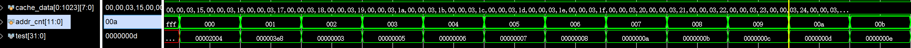 | 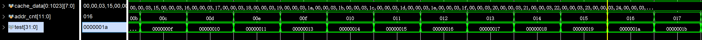 |

> **这是仿真130ms的结果，可以看到从主存读出的数和cache中的数据都有序**

## 下载测试

> **一些参数解释**
>
> **cache命中率在sdu中体现，其中cache hit记录在rrd1中，总的请求数记录在rrd2中**
>
> **s8寄存器记录的是周期数的差(也就是排序所用的周期数，与数码管一致)**
>
> **t1寄存器记录的是有序元素的个数**
>
> **命中率是可以用来比较相对命中率的**

* 对`cache`块大小为8字的测试

  * **直接映射**

  |                       排序周期数                       |                      cache命中率                       |
  | :----------------------------------------------------: | :----------------------------------------------------: |
  | 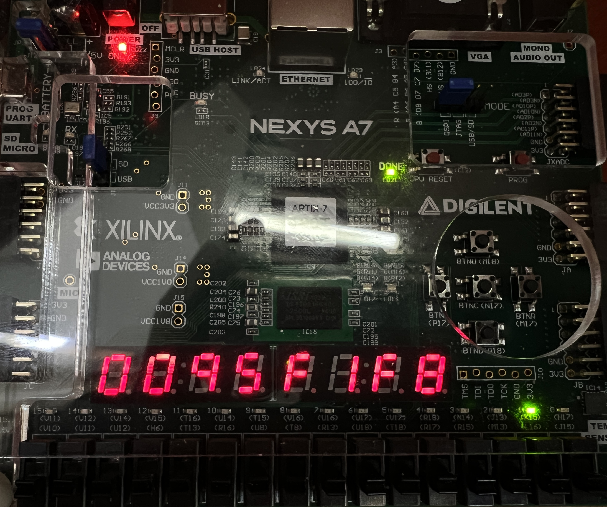 | 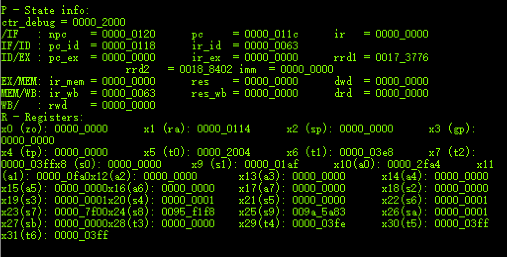 |

  > **cache命中率：**$\frac{173776(H)}{188402(H)}\times100\%=94.7\%$

  * **两路组相连**

  |                       排序周期数                       |                       cache命中率                        |
  | :----------------------------------------------------: | :------------------------------------------------------: |
  | 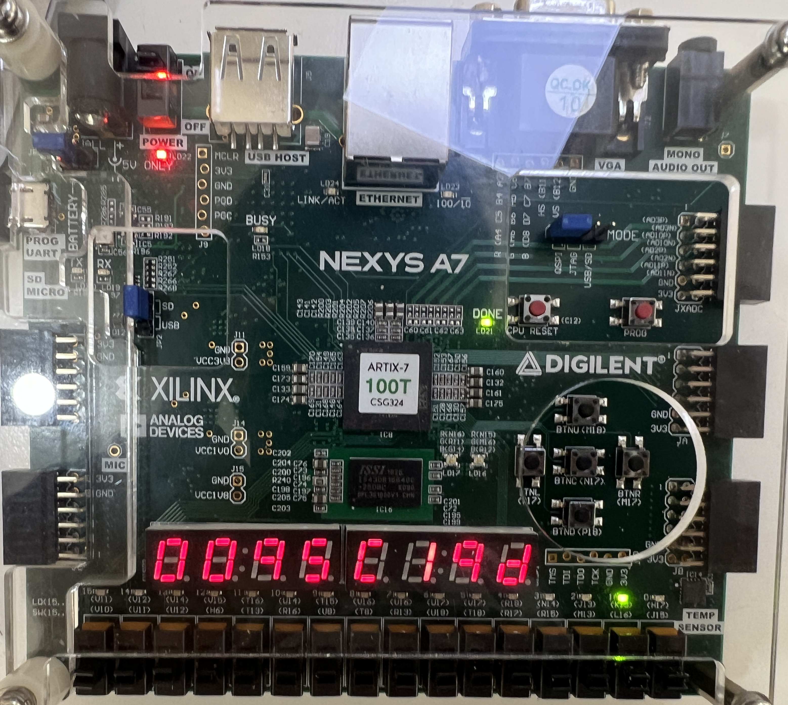 | 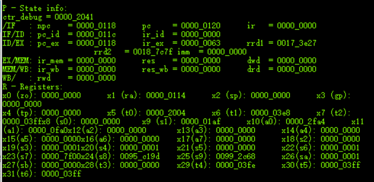 |

  > **cache命中率：**$\frac{173e27(H)}{187c7f(H)}\times100\%=94.9\%$

* 对`cache`块大小为4字的测试

  * **直接映射**

  |                      排序周期数                       |                       cache命中率                       |
  | :---------------------------------------------------: | :-----------------------------------------------------: |
  | 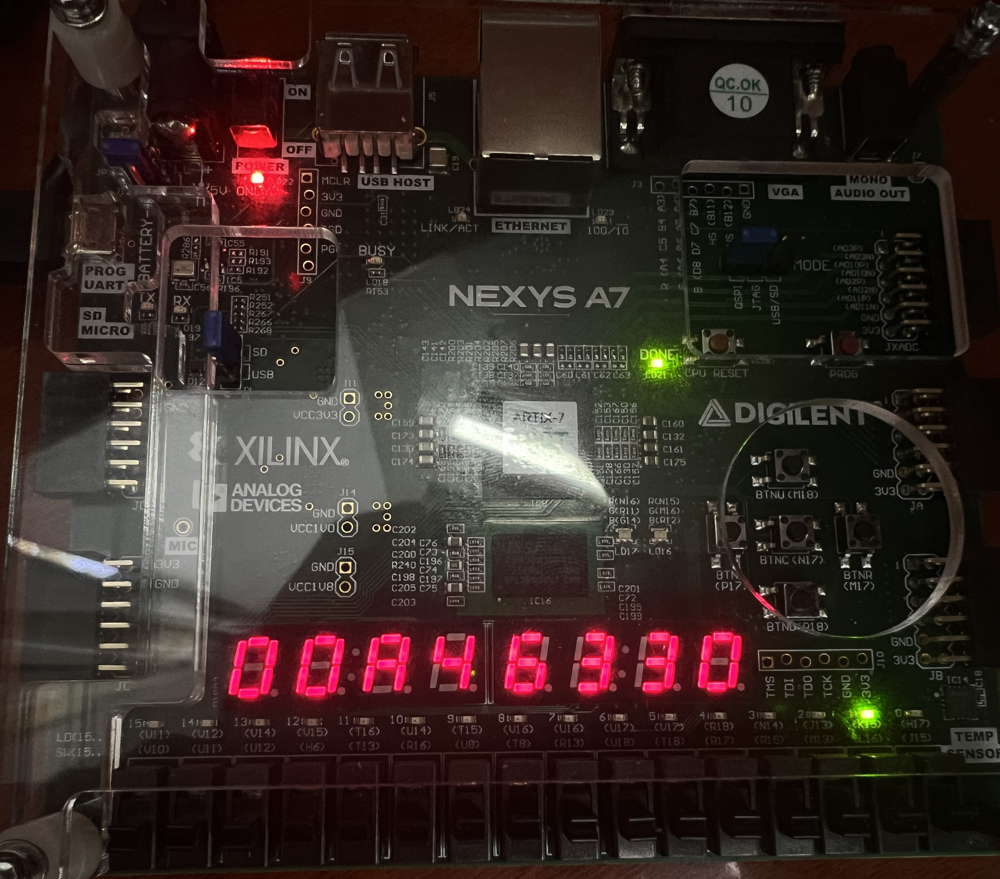 | 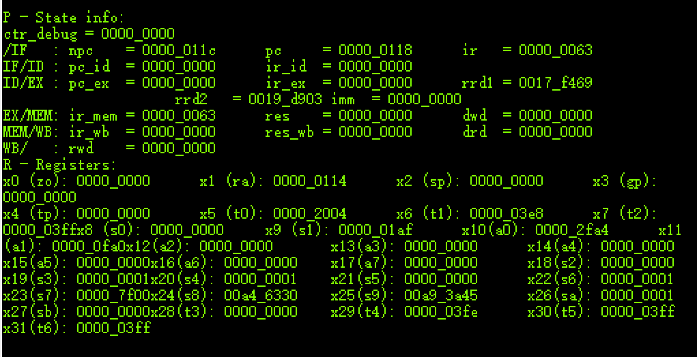 |

  > **cache命中率：**$\frac{17f469(H)}{19d903(H)}\times100\%=92.68\%$

  * **两路组相连**

  |                       排序周期数                       |                       cache命中率                       |
  | :----------------------------------------------------: | :-----------------------------------------------------: |
  | 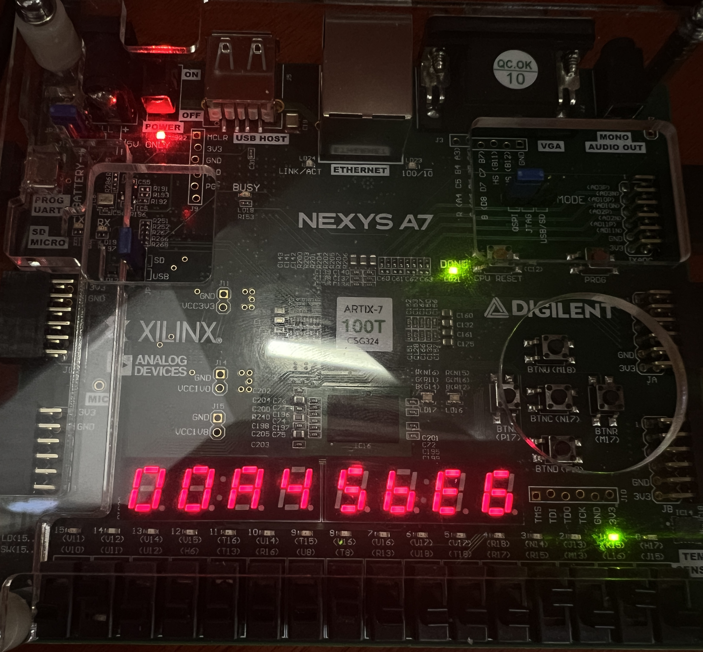 | 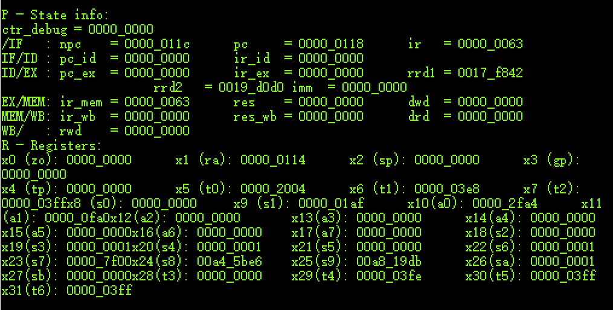 |

  > **cache命中率：**$\frac{17f842(H)}{19d0d0(H)}\times100\%=92.85\%$

> 可以看到在cache总容量不变时，块大小为8字的cache性能(排序周期数、cache命中率)明显优于块大小为4字的cache性能。
>
> 在cache总容量、块大小不变时，二路组相联的cache性能略优于直接映射的cache。
>
> 这里认为cache性能不仅与**cpu**的实现有关，还与汇编程序有关(比如汇编程序的局部性原理，排序算法的选择，随机数生成的算法以及生成的数组元素不同)，但是可以看到实验结果还是符合预期的。

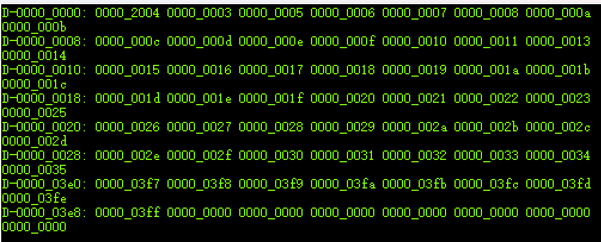

> 观察到寄存器**t1**都是**3e8**(开始输入的数组大小为3e8)，同时以上截图数据的有序，说明实验结果的正确性

## 实验总结

> **本次实验遇到的困难很多**

* **首先是vivado的问题**

  * 相同的代码在一个工程里综合不报错被卡死，不能生成bit文件；在新开的一个工程里可以成功综合，并生成bit文件
  * 相同的代码放在不同的机器上生成的bit文件表现与预期不同

  > 个人认为这是vivado本身的问题(没错vivado就是依托xx)，在这上面浪费了很长的时间，甚至让我一度怀疑**机器永远是对的这件事**

* **对cache与主存交互的理解有误**

  > 看完ppt之后我以为老师的意思是读4个字的首字延迟是16clk，于是我引申出读8个字的首字延迟是32clk。问过之后才知道不管读多少字首字延迟都是16clk，来模拟读主存的延迟

* **block memory读延迟造成的一些问题**

  > 在处理cache与主存的读写时，需要注意bram的读是延迟一个clk读出的，所以要在主存进行相关的处理(也就是在读写FIFO的时候注意什么时候赋值)
